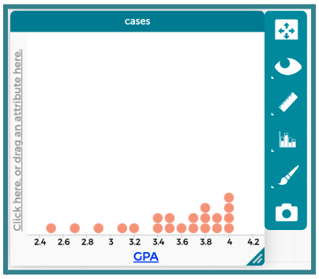
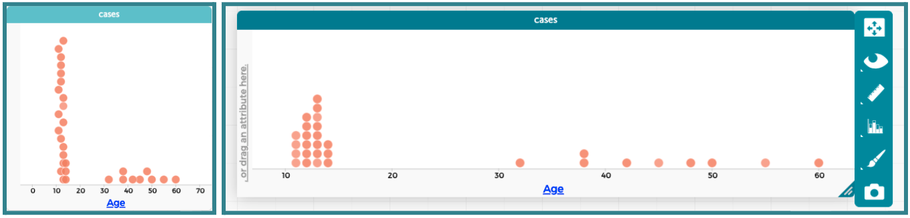
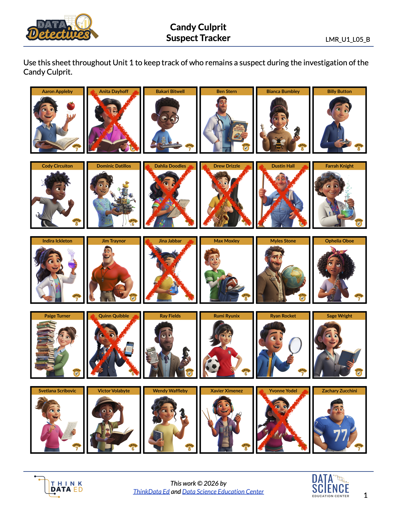

##**<u>Lesson 10: Connecting the Dots</u>**

###**Objective:**
Students will be able to construct and analyze dot plots of numerical data. They will understand that each dot represents one observation from a dataset, and be able to identify the maximum and minimum values.

###**Materials:**
1. Sticky Notes (Small ones, 1 per student) - will be used in [Lesson 11](lesson11.md) as well

2. Whiteboard with a horizontal number line drawn on it (add labels for the values 0-15)

    ***Advanced preparation required.*** *See Class Setup section for additional details.*

3. Candy Culprit Clues [Clue #4] ([LMR_U1_L02_A_Candy_Culprit_Clues](../MSDS_Curriculum/2_MSDS_LMRs/MSDS_LMR_Unit_1/LMR_U1_L02_A.pdf))

4. CODAP Handout for Clue #4 ([LMR_U1_L10_A_Clue4_CODAP_Analysis](../MSDS_Curriculum/2_MSDS_LMRs/MSDS_LMR_Unit_1/LMR_U1_L10_A.pdf))

5. Candy Culprit Suspect Tracker ([LMR_U1_L05_B_Suspect_Tracker](../MSDS_Curriculum/2_MSDS_LMRs/MSDS_LMR_Unit_1/LMR_U1_L05_B.pdf))

6. Saved student CODAP files of the Suspect data OR link to the original [CODAP Suspect Data File](https://codap.concord.org/app/static/dg/en/cert/index.html#shared=https%3A%2F%2Fcfm-shared.concord.org%2FTtznsLR5Tw98ENyde2PN%2Ffile.json "https://codap.concord.org/app/static/dg/en/cert/index.html#shared=https%3A%2F%2Fcfm-shared.concord.org%2FTtznsLR5Tw98ENyde2PN%2Ffile.json"){:target="_blank"}

###**Vocabulary:**
[distribution](../../vocabulary/unit1/#distribution "a way to describe how a numerical variable's data points are spread out, organized, or arranged across the x-values"){ .md-button }
[maximum](../../vocabulary/unit1/#maximum "the highest numerical value"){ .md-button }
[minimum](../../vocabulary/unit1/#minimum "the lowest numerical value"){ .md-button }

###**Essential Concepts:**

!!! note "Essential Concepts: "
    Dot plots are used to visualize the distribution of numerical data. They use an ordered number line on the X-axis, where the order and spacing of values matter. Observations are represented by individual symbols (like dots, sticky notes, or other shapes) stacked vertically above their corresponding value on the number line. Each symbol represents one single data point. The minimum is the lowest numerical value in a dataset, and the maximum is the highest numerical value. These can be easily identified on a dot plot by looking at the far left and far right data points.

###**Lesson:**

<h3>Class Setup</h3>

- ***Advanced preparation required.***

     - Prior to class starting, draw a horizontal number line from 0 to 15 on the board. Include the prompt: “How many hours of sleep did you get last night? Round to the nearest whole number.”
     
     - Be sure to keep all sticky note responses after class to ensure they can be used during [Lesson 11](lesson11.md).

<h3>Opening</h3>

1. Lesson Hook: As students enter the classroom, hand each one a blank sticky note.

    100. Instruct students to write down the number of hours of sleep they got the previous night on their sticky note.

    100. Have each student place their sticky note on the board directly above the label that matches the number they wrote down.  
    ***NOTE***: If there is already a sticky note at their value, they should place theirs ABOVE it and try to keep the notes lined up vertically.

2. Once all students have arrived and placed their sticky note on the board, engage the class in a whole group discussion using the following questions:

    100. What type of variable is “number of hours of sleep”? *Answer: Numerical.*

    100. What plots are appropriate to use for this type of variable? Recalling the plot types from Lesson 8, what type of plot matches what we created? *Answer: Appropriate plots include dot plots, histograms, and boxplots. We created a dot plot.*  
    ***NOTE***: Even though sticky notes are square-shaped, we can consider them “dots” because they represent one person, or one observation. 

    100. What is different about the x-axis of this plot compared to the bar graph we created yesterday? Does the order matter? *Answer: The x-axis is an ordered number line, not categories. We cannot move the labels for 5 hours and 8 hours because the order would no longer make sense.*

    100. What value appeared the most in our graph? *Answers will vary by class.*

    100. Were there any students who slept an usual amount, either way less or way more than the rest of the class? *Answers will vary by class.*

3. Introduce the term **distribution**, which is simply a way to describe how a numerical variable’s data points are spread out, organized, or arranged across the x-values. 

    100. A distribution defines the shape, center, and variability of data, and tells us how frequently specific values occur. We will learn about these specific terms in later lessons.

    100. It is fundamental for identifying patterns, trends, and oddities in the data.

    
<h3>Concept Development</h3>

    <b><i>Part 1: From Sticky Notes to Dots</b></i>

4. Have students redraw the “hours of sleep” dot plot by hand in their notebooks. Explain that they can make the drawing easier by simply using a dot to represent each sticky note. Ask:

    100. Does changing the observations from sticky notes to dots change the actual data in our plot? *Answer: No. The shape of each “dot” does not matter. As long as one observation is represented by one “dot,” the data remains the same.* 

    100. What other symbols or items could we use and still call this plot a dot plot? *Sample answer: We could use a drawing of any shape (square, circle, triangle, etc.) to represent each observation. If we were using poster paper, we could use stickers or dot markers. If we wanted to create a physical version, we could use a pillow to represent each person.*

5. After students have copied their plots into their notebooks, ask them to participate in a Think-Ink-Pair-Share (TIPS) to discuss what makes dot plots easy to use. They should consider the following questions:

    100. How many students were in class today? How many dots did we have to draw to represent them? *Answers will vary by class, but the values should be the same for # of students and # of dots.*

    100. What if our class had 100 students in it? Would we want to hand-draw a dot plot for them? *Sample answer: Probably not because that is a lot of dots!*

    <b><i>Part 2: Transitioning to CODAP - Using Our Digital Toolkit for Dot Plots</b></i>

6. Now that our detectives have recorded a dot plot by hand on paper, tell students that we will be transitioning to our digital toolkit, CODAP, to see how easily it can plot numerical data.

7. Lead students through guided instructions in CODAP to create a dot plot for the “`GPA`” variable.

    100. Instruct students to open their saved CODAP files of the Suspect data OR provide them with the link to the original [CODAP Suspect Data File](https://codap.concord.org/app/static/dg/en/cert/index.html#shared=https%3A%2F%2Fcfm-shared.concord.org%2FTtznsLR5Tw98ENyde2PN%2Ffile.json "https://codap.concord.org/app/static/dg/en/cert/index.html#shared=https%3A%2F%2Fcfm-shared.concord.org%2FTtznsLR5Tw98ENyde2PN%2Ffile.json"){:target="_blank"}.

    100. Next, click on the “Graph” icon and instruct students to drag the `GPA` attribute to the x-axis. Ask students to describe what happened. *Answer: CODAP created a dot plot by default for numerical data.*

        

8. Introduce the terms **minimum** and **maximum**. Ask students to share some ideas about what these terms mean. Then explain that the **minimum** is the lowest value in a set of data, and the **maximum** is the highest value.

9. Have students analyze the data in the dot plot by considering the following questions:

    100. What values of `GPA` have the most number of suspects above them? *Sample answer: The value with the most points above it is 4.0. In general, most of the suspects have GPAs that fall between 3.4 and 4.0.*

    100. Are there any GPAs that are not represented by a dot? In other words, are there any gaps in the plot? *Sample answer: Yes, there are a lot of values that do not have dots above them*.*

    100. What is the lowest GPA? *Answer: 2.5.*

    100. What is the highest GPA? *Answer: 4.0.*

    <b><i>Part 3: Using CODAP to Examine a New Clue</b></i>

10. Introduce the FOURTH CLUE of the Candy Culprit investigation. All of the clues can be found in the Candy Culprit Clues document ([LMR_U1_L02_A](../MSDS_Curriculum/2_MSDS_LMRs/MSDS_LMR_Unit_1/LMR_U1_L02_A.pdf)).

    
<iframe src="https://docs.google.com/viewerng/viewer?url=https://mscurriculum.thinkdataed.org/MSDS_Curriculum/2_MSDS_LMRs/MSDS_LMR_Unit_1/LMR_U1_L02_A.pdf&embedded=true" style=" width:420px;height:400px;" frameborder="0"></iframe> [LMR_U1_L02_A](../MSDS_Curriculum/2_MSDS_LMRs/MSDS_LMR_Unit_1/LMR_U1_L02_A.pdf)

11. Distribute the Clue 4 CODAP Analysis handout ([LMR_U1_L10_A](../MSDS_Curriculum/2_MSDS_LMRs/MSDS_LMR_Unit_1/LMR_U1_L10_A.pdf)), and instruct students to complete all steps to determine which suspects they can eliminate from our list.

    
<iframe src="https://docs.google.com/viewerng/viewer?url=https://mscurriculum.thinkdataed.org/MSDS_Curriculum/2_MSDS_LMRs/MSDS_LMR_Unit_1/LMR_U1_L10_A.pdf&embedded=true" style=" width:420px;height:400px;" frameborder="0"></iframe> [LMR_U1_L10_A](../MSDS_Curriculum/2_MSDS_LMRs/MSDS_LMR_Unit_1/LMR_U1_L10_A.pdf)

    
    
    <table class="ta" style="width:75%;margin:0 auto;">
    <tr>
    <th class="ta-88im" style="width:15%;">
    </th>
    <th class="ta-88nc" style="width:65%;"><b>ADDITIONAL SUPPORT: 
    <i>Partner Support for Diverse Learners</i></b>  
    Have students work in pairs. One student can be the “driver” (controlling the mouse) and the other can be the “navigator” (reading the steps). They can switch roles halfway through.</th>
    </tr>
    </table>

12. Circulate around the room to provide guidance and support as students work in CODAP. 

    100. During Step 2, students will likely need guidance to adjust the graph window so the dots align vertically. Below is an example of how CODAP automatically places the dots when the minimum and maximum values are far apart, as well as a more appropriate display for their analysis.

        

        
        
        <table class="ta" style="width:75%;margin:0 auto;">
        <tr>
        <th class="ta-88im" style="width:15%;">
        </th>
        <th class="ta-88nc" style="width:65%;"><b>ADDITIONAL SUPPORT: 
        <i>Supplemental CODAP Discussion</i></b>  
        Pose the following questions to students: <ul>
        <li>What do you notice about the placement of the dots? How is it similar or different to our hours of sleep dot plot? <i>Sample answer: The dots are not lined up in a straight line at each x-value. Instead, they are staggered, so it is not easy to see the exact `Age` values.</i> </li>
        <li>Can we somehow change the graph so taht the dots for specific values line up vertically? <i>Sample answer: Yes! We can expand the graphing window of our dot plot in CODAP. Drag the lower right corner of the window horizontally so it has more space along the x-axis.</i></li></ul></th>
        </tr>
        </table>

13. Once all students have completed their analysis, engage in a whole class discussion about the results.

    100. Which variable did you choose to analyze? *Answer: “Age”.* 

    100. What type of variable is “Age”? *Answer: Numerical.*

    100. What is an appropriate plot for that type of variable? *Answer: Boxplot, Dot Plot, or Histogram.*

    100. How many suspects are the youngest age? *Answer: 4 suspects.*

    100. Who are the youngest suspects? *Answer: Drew Drizzle, Jina Jabbar, Quinn Quibble, and Yvonne Yodel. We already eliminated Yvonne Yodel as a suspect while analyzing Clue #3, so now we have even more evidence that she is not the Candy Culprit.*

    100. How many suspects are the oldest age? *Answer: 1 suspect.*

    100. Who are the oldest suspects? *Answer: Anita Dayhoff. We can eliminate her as a suspect. We know that she is definitely NOT the Candy Culprit.*

14. Have students take out their Candy Culprit Suspect Tracker ([LMR_U1_L05_B](../MSDS_Curriculum/2_MSDS_LMRs/MSDS_LMR_Unit_1/LMR_U1_L05_B.pdf)) sheet so they can cross off the newly eliminated suspects. An example of the updated suspect tracker is provided below. 

    

    
<h3>Closing</h3>

15. Exit Ticket: Students should submit a slip of paper that correctly identifies the maximum and minimum values from the following dataset: **18, 25, 8, 13, 13, 2, 15, 24, 5, 10, 51, 5, 17, 23, 10**. Teachers are welcome to come up with their own set of values if they prefer.

16. Transition: Today, we looked at plots that include a dot for every single suspect. Ask students to consider a scenario where there are many more observations, perhaps even 1,000 suspects! If time allows, have students share their ideas about why a dot plot would or would not be practical in this case. 

17. In the next lesson, we will learn how to group these dots together to see the bigger picture and explore histograms.

