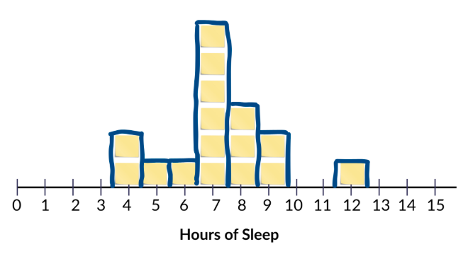
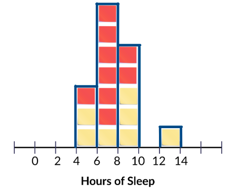
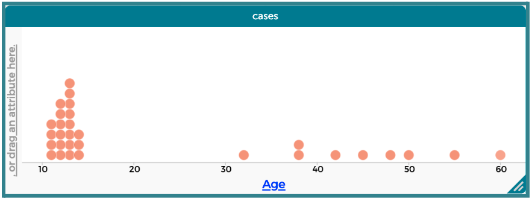
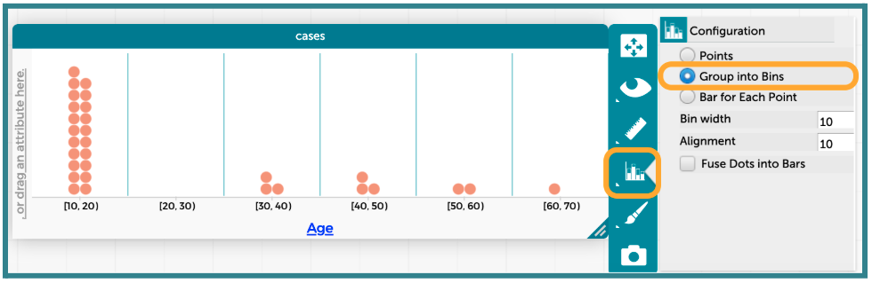
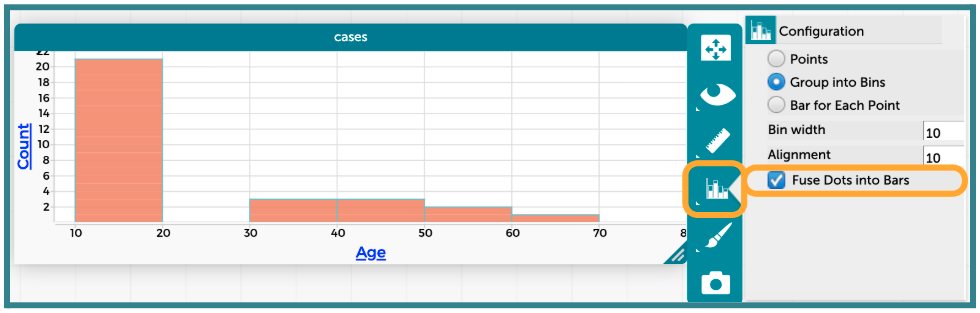
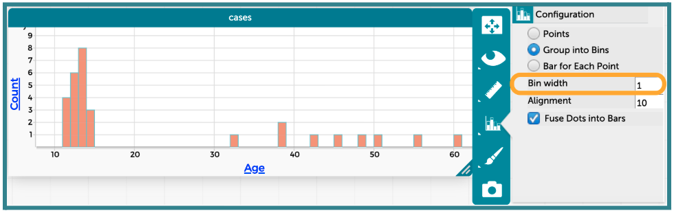
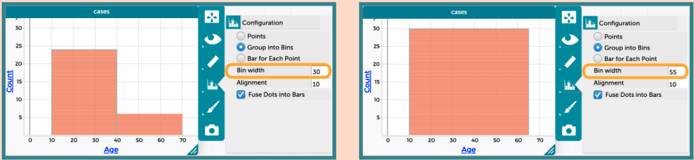
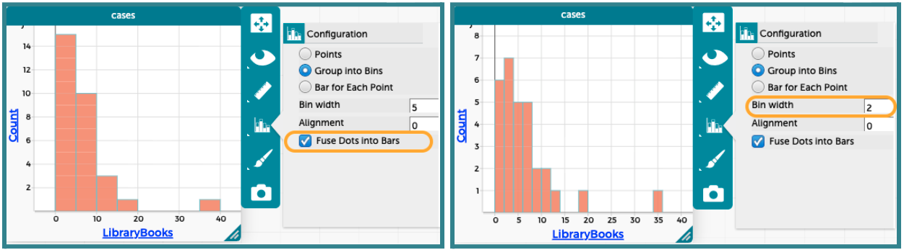
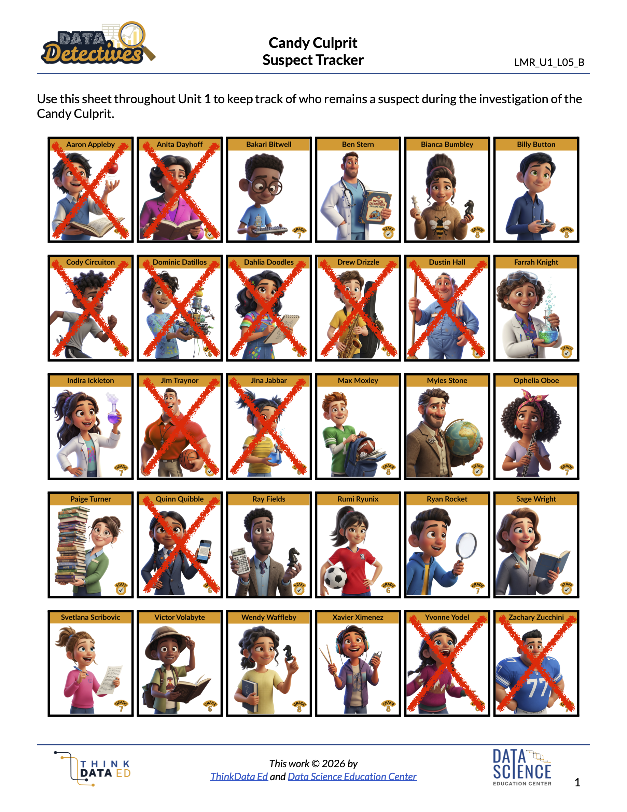

##**<u>Lesson 11: The Plot Thickens (or Thins)</u>**

###**Objective:**
Students will be able to define a histogram and explain its purpose for summarizing numerical data. They will be able to describe how changing the bin size affects the visual distribution of a histogram. Only left-bound histograms will be used.

###**Materials:**
1. Mystery Image Challenge ([LMR_U1_L11_A_Mystery_Image_Challenge](../MSDS_Curriculum/2_MSDS_LMRs/MSDS_LMR_Unit_1/LMR_U1_L11_A.pdf))

2. Sticky Notes from [Lesson 10](lesson10.md) that the students used to record the number of hours of sleep they got

3. Candy Culprit Clues [Clue #5] ([LMR_U1_L02_A_Candy_Culprit_Clues](../MSDS_Curriculum/2_MSDS_LMRs/MSDS_LMR_Unit_1/LMR_U1_L02_A.pdf))

4. CODAP Handout for Clue #5 ([LMR_U1_L11_B_Clue5_CODAP_Analysis](../MSDS_Curriculum/2_MSDS_LMRs/MSDS_LMR_Unit_1/LMR_U1_L11_B.pdf))

5. Candy Culprit Suspect Tracker ([LMR_U1_L05_B_Suspect_Tracker](../MSDS_Curriculum/2_MSDS_LMRs/MSDS_LMR_Unit_1/LMR_U1_L05_B.pdf))

6. Saved student CODAP files of the Suspect data OR link to the original [CODAP Suspect Data File](https://codap.concord.org/app/static/dg/en/cert/index.html#shared=https%3A%2F%2Fcfm-shared.concord.org%2FTtznsLR5Tw98ENyde2PN%2Ffile.json "https://codap.concord.org/app/static/dg/en/cert/index.html#shared=https%3A%2F%2Fcfm-shared.concord.org%2FTtznsLR5Tw98ENyde2PN%2Ffile.json"){:target="_blank"}

###**Vocabulary:**
[range](../../vocabulary/unit1/#range "the numerical difference between a minimum and maximum value"){ .md-button }
[bins](../../vocabulary/unit1/#bins "an interval of values for grouping data"){ .md-button }
[binning](../../vocabulary/unit1/#binning "the process of combining several possible values into one interval so we can see overall patterns in the data"){ .md-button }
[bin width](../../vocabulary/unit1/#bin-width "the length of each interval that defines a bin"){ .md-button }
[interval](../../vocabulary/unit1/#interval "a period covering two x-axis values"){ .md-button }
[left-bound rule](../../vocabulary/unit1/#left-bound-rule "when multiple data points can appear in more than one bin, observations would go in the bin on the left-hand side"){ .md-button }

###**Essential Concepts:**

!!! note "Essential Concepts: "
    Histograms are used to visualize the distribution of numerical data by grouping values into bins (intervals). When a variable has many unique numerical values, histograms are often more effective than dot plots because dot plots can become difficult to read. Adjusting the bin size allows us to group observations in meaningful ways relative to the data.

###**Lesson:**

<h3>Opening</h3>

1. Lesson Hook: The Mystery Image Challenge

    100. Project the zoomed-in version of the mystery image from page 1 of the Mystery Image Challenge document ([LMR_U1_L11_A](../MSDS_Curriculum/2_MSDS_LMRs/MSDS_LMR_Unit_1/LMR_U1_L11_A.pdf)). It should mostly look like a grouping of colored squares/dots.

    
<iframe src="https://docs.google.com/viewerng/viewer?url=https://mscurriculum.thinkdataed.org/MSDS_Curriculum/2_MSDS_LMRs/MSDS_LMR_Unit_1/LMR_U1_L11_A.pdf&embedded=true" style=" width:420px;height:400px;" frameborder="0"></iframe> [LMR_U1_L11_A](../MSDS_Curriculum/2_MSDS_LMRs/MSDS_LMR_Unit_1/LMR_U1_L11_A.pdf)

    100. Ask the student detectives to provide guesses as to what they think the image shows. *Sample answers: an umbrella, the bottom portion of a woman’s dress/gown, an igloo during sunrise, a pond, etc.*

    100. Project the zoomed-out version of the mystery image from page 2 of the document ([LMR_U1_L11_A](../MSDS_Curriculum/2_MSDS_LMRs/MSDS_LMR_Unit_1/LMR_U1_L11_A.pdf)), Allow students to examine the image and then engage them in a whole class discussion to compare the two images. 

        100. Explain that the image is a faithful photographic reproduction of Paul Signac’s 1905 oil painting titled Entrance to the Grand Canal, Venice. Signac was a French Neo-Impressionist painter who helped develop the pointillism technique.

        100. Now that we can see the entire image, what was actually depicted in the zoomed-in portion that was shown in part (a)? *Answer: the dome roof of the right-most building.*

        100. Which image provided a closer, more detailed view? *Answer: The zoomed-in image is more detailed because we can see every single paint stroke.*

        100. Which image provided a clearer picture of what was actually happening in the painting? overall picture? *Answer: The zoomed-out image gives a clearer picture of what is actually happening in the image because we are not focused on each individual brush stroke.*

2. Connect the activity to numerical data displays by explaining that the information in the images is the same, but they tell different stories. 

    100. The zoomed-in image is similar to a dot plot because we can see every single brush stroke as a square or dot. But, because there are so many dots in the full picture, it would be messy and difficult for us to examine every single one.

    100. By stepping back from viewing the brush strokes as individual dots, we are able to see the larger picture when the dots blend together. This is what we want to explore during today’s lesson when we dig deeper into histograms.

    
<h3>Concept Development</h3>

    <b><i>Part 1: Transitioning from Dot Plots to Histograms - Binning Values</b></i>

3. We just learned that when a dot plot gets too cluttered, detectives need a better tool to help them analyze data. This is where histograms come in! 

    100. Ask students to share what they remember about histograms. 

        100. What do histograms look like? How are the data displayed? *Sample answer: Instead of seeing each dot, we see bars/rectangles. The height of the bar tells us how many observations have that value.* 

        100. What is on the x-axis? *Sample answer: Numerical values that cover the range of our data values.*

        100. What does the y-axis represent? *Sample answer: A frequency, or count, of how many observations have a particular value.*

4. Take out the sticky notes from Lesson 10 where students recorded the number of hours of sleep they got the night before, and allow them to recreate the physical dot plot on the whiteboard. 

5. Ask students to suggest an easy way to make the data in the dot plot look more like a histogram. *Sample answer: Draw rectangles around the sticky notes at each value on the x-axis. See sample drawing below.*
    

6. Explain that, by grouping values together, we are turning our dots into **bins**.

    100. This process is called **binning**. 
        100. Grouping identical values is technically a form of binning, but in histograms, binning usually means combining several possible values into one interval so we can see overall patterns in the data.

        100. Connect back to Mystery Image Challenge from the Opening section: In practice, the term binning is used to describe a purposeful loss of resolution in order to reveal structure.

    100. We first decide how wide we want our bins to be. By drawing rectangles around the vertically aligned sticky notes, we created a **bin width** of 1.

7. Let students engage in a Think-Ink-Pair-Share activity with a partner and have them come up with one idea of how they could display this same data in a histogram with a bin width of 2. They should record their ideas and corresponding histograms in their notebooks.
    
    <table class="te" style="width:75%;margin:0 auto;">
    <tr>
    <th class="te-88im" style="width:15%;"></th>
    <th class="te-88nc" style="width:65%;"><b>Enrichment or Extension: 
    <i>Allow students to choose their bin widths</i></b>  
    Instead of requiring students to use a bin width of 2, leave the task open-ended and allow them to choose their own size. This will likely show different shapes in their histograms</th>
    </tr>
    </table>

8. Allow students to share their ideas with the class. If possible, project some of the histogram displays that they created.

9. Next, lead a whole class discussion about how CODAP and other technology tools deal with binning data in histograms. Use the sticky notes that are already on the whiteboard to show each step. 

    100. It’s important to consider the minimum and maximum values of our data. This helps to determine where we start our first bin. In the example above, the minimum is 4 hours and the maximum is 12 hours. 

    100. Determine the bin width and decide which values will be grouped together for each bin. Using the previous example and a bin width of 2, it makes sense to group 4 and 5 together, 6 and 7 together, 8 and 9 together, 10 and 11 together, and 12 and 13 together.  
    ***NOTE***: Even though there are no observations with a value of 13, we still need to include that value in our last group in order to keep our bin widths consistent across the entire histogram.

    100. Create a new x-axis with labels that correspond to the chosen bin width. In the example above, values of 0, 2, 4, 6, 8, 10, 12, and 14 are appropriate.

    100. Lastly, move the sticky notes into their new bins. To make it that there are 2 values in each bin, the yellow sticky notes represent the lower value of the bin and the red sticky notes represent the upper value of the bin. For example, in the left-most bin, there are two observations of 4 hours and one observation of 5 hours.

        

    100. Be sure to discuss the alignment of the data relative to the x-axis. 

        100. For dot plots, we are able to place each observation directly above its corresponding value on the axis. 

        100. But for histograms, the x-axis is covering an **interval** of values, so we use the x-axis to create the edges of our bins. 

        100. CODAP uses a **left-bound rule** when binning data in histograms, so we want to do the same. This is why the first bin has edges at 4 and 6, but the sticky notes inside the bin only represent values of 4 and 5. We will always align our histograms with the left bound of each bin.

    <b><i>Part 2: Analyzing with Histograms in CODAP</b></i>

10. Transition to our digital toolkit, CODAP! Tell students that CODAP can help us create and adjust histograms quickly. 

11. Instruct students to open their saved CODAP files of the Suspect data OR provide them with the link to the original [CODAP Suspect Data File](https://codap.concord.org/app/static/dg/en/cert/index.html#shared=https%3A%2F%2Fcfm-shared.concord.org%2FTtznsLR5Tw98ENyde2PN%2Ffile.json "https://codap.concord.org/app/static/dg/en/cert/index.html#shared=https%3A%2F%2Fcfm-shared.concord.org%2FTtznsLR5Tw98ENyde2PN%2Ffile.json"){:target="_blank"}.

12. Model how to create a histogram in CODAP. Use the `Age` variable for this initial exploration. Students should follow along and complete the steps in CODAP with you.
    
    <table class="ta" style="width:75%;margin:0 auto;">
    <tr>
    <th class="ta-88im" style="width:15%;">
    </th>
    <th class="ta-88nc" style="width:65%;"><b>ADDITIONAL SUPPORT: 
    <i>Watch & Repeat - Teacher Demonstration in CODAP</i></b>  
    If students need more guided computer and CODAP support, model the steps for creating a histogram and adjusting the bin width using the step-by-step instructions in the lesson. Students should watch.</th>
    </tr>
    </table>

    100. Start with a dotplot of the variable of interest (`Age`). The dot plot window will likely need to be stretched horizontally so that the data points show up correctly.
    

    100. Change the plot type by clicking on the “Chart” icon, and then selecting the option to “Group into Bins.” 
        100. This creates a similar plot to our first binned sticky notes plot on the white board. 

        100. Be sure to point out the labels on the x-axis at this point. 

        100. The first bin is labeled [0, 20), which tells us that values in that bin are greater than or equal to 0, but less than 20. 

        100. This matches our **left-bound rule** for binning.
        

    100. Replace the dots with bars by clicking on the “Chart” icon again, and then selecting the option to “Fuse Dots into Bars”.
        

        100. Students may notice that CODAP defaulted to a “Bin width” of 10. 

        100. We can adjust our bin width by typing a different value into the text box. Students can test out a few values to see how the plot changes. The example below has a bin width of 1.
        

        
        <table class="te" style="width:85%;margin:0 auto;">
        <tr>
        <th class="te-88im" style="width:15%;"></th>
        <th class="te-88nc" style="width:65%;"><b>Enrichment or Extension: 
        <i>Exploring bin widths in CODAP</i></b>  
        Have students create two additional histograms of the `Age` variable using a bin width of 30 and a bin width of 55.  
        
        Discuss what information is gained and lost with the different bin widths. Sample insights are provided here:<ul>
        <li>When the bin width is set to 30, the data is split into just 2 bars (one bar for when 10 &le; `Age` &lt; 40 and another for 40 &le; `Age` &lt; 70). The bars are very wide, so we cannot really see any patterns or variability in the data other than more suspects are less than 40 years old.</li>
        <li>When the bin width is set to 55, the data merges into just one bar since the range of `Age` is 51 years (minimum is 11 and maximum is 60). We can no longer see any patterns or variability in the data.</li></ul></th>
        </tr>
        </table>

    <b><i>Part 3: Introducing a New Clue and Discussing Hidden Meanings</b></i>

13. Introduce the FIFTH CLUE of the Candy Culprit investigation. All of the clues can be found in the Candy Culprit Clues document ([LMR_U1_L02_A](../MSDS_Curriculum/2_MSDS_LMRs/MSDS_LMR_Unit_1/LMR_U1_L02_A.pdf)). Have a student volunteer read it aloud.

    
<iframe src="https://docs.google.com/viewerng/viewer?url=https://mscurriculum.thinkdataed.org/MSDS_Curriculum/2_MSDS_LMRs/MSDS_LMR_Unit_1/LMR_U1_L02_A.pdf&embedded=true" style=" width:420px;height:400px;" frameborder="0"></iframe> [LMR_U1_L02_A](../MSDS_Curriculum/2_MSDS_LMRs/MSDS_LMR_Unit_1/LMR_U1_L02_A.pdf)

14. Point out that the Candy Culprit provided three very important hints in this clue about how to analyze our suspect data.

    100. “I read a lot, but to neither extreme.” – Ask students to interpret what the Candy Culprit means by the word “extreme”.

        100. Lower extreme: Should include people who have checked out the LEAST library books.

        100. Higher extreme: Should include people who have checked out the MOST library books.

        100. Non-extreme: Any suspect that falls in one of the middle bars in the histogram.

    100. “Use a histogram to see what I mean.” – Students are being told exactly which plot type to use.

    100. “To see the right bars use a bin width of 2.” – Once a histogram has been created, students need to make sure their bin width is set to 2. Otherwise, they might eliminate too many or too few suspects from our list.

15. Distribute the Clue 5 CODAP Analysis handout ([LMR_U1_L11_B](../MSDS_Curriculum/2_MSDS_LMRs/MSDS_LMR_Unit_1/LMR_U1_L11_B.pdf)), and instruct students to complete all steps to determine which suspects they can eliminate from our list.
    
    
<iframe src="https://docs.google.com/viewerng/viewer?url=https://mscurriculum.thinkdataed.org/MSDS_Curriculum/2_MSDS_LMRs/MSDS_LMR_Unit_1/LMR_U1_L11_B.pdf&embedded=true" style=" width:420px;height:400px;" frameborder="0"></iframe> [LMR_U1_L11_B](../MSDS_Curriculum/2_MSDS_LMRs/MSDS_LMR_Unit_1/LMR_U1_L11_B.pdf)
 

    
    <table class="ta" style="width:75%;margin:0 auto;">
    <tr>
    <th class="ta-88im" style="width:15%;">
    </th>
    <th class="ta-88nc" style="width:65%;"><b>ADDITIONAL SUPPORT: 
    <i>Partner Support for Diverse Learners</i></b>  
    Have students work in pairs. One student can be the “driver” (controlling the mouse) and the other can be the “navigator” (reading the steps). They can switch roles halfway through.</th>
    </tr>
    </table>

16. Circulate around the room to provide guidance and support as students work in CODAP.

17. Once all students have completed their analysis, engage in a whole class discussion about the results.
    

    100. How many suspects were in the bar for the “lower extreme” values for `LibraryBooks`? How many books did those people check out? *Answer: 6 suspects. They either checked out 0 books or 1 book.* 

    100. Whose `LibraryBooks` values fall within this bar, and therefore can be eliminated as suspects? *Answer: Cody Circuiton, Dominic Datillos, Drew Drizzle, Dustin Hall, Jim Traynor, and Zachary Zucchini. Drew and Dustin were eliminated from previous clues, so we have additional evidence that they are not the Candy Culprit.*

    100. How many suspects were in the bar for the “higher extreme” values for `LibraryBooks`? How many books did those people check out? *Answer: 1 suspect. They checked out 35 books.* 

    100. Whose `LibraryBooks` values fall within this bar, and therefore can be eliminated as suspects? *Answer: Aaron Appleby. We can eliminate him as a suspect. We know that he is definitely NOT the Candy Culprit.*

18. Have students take out their Candy Culprit Suspect Tracker ([LMR_U1_L05_B](../MSDS_Curriculum/2_MSDS_LMRs/MSDS_LMR_Unit_1/LMR_U1_L05_B.pdf)) sheet so they can cross off the newly eliminated suspects. An example of the updated suspect tracker is provided below. 
    

    
<h3>Closing</h3>

19. Exit Ticket: For each scenario below, determine if a dot plot or a histogram would be more appropriate. Explain your reasoning.

    100. Scenario 1: The height of 1,000 sunflowers grown across the United States. *Answer: A histogram is more appropriate because the sample size is very large.*

    100. Scenario 2: The number of petals on 12 different sunflowers. *Answer: A dot plot is more appropriate because the sample size is quite small.*

20. Transition: Announce that in the next lesson, the student detectives will learn how to describe the overall shape of a histogram and what that tells us about how the observations are distributed across the x-values.
