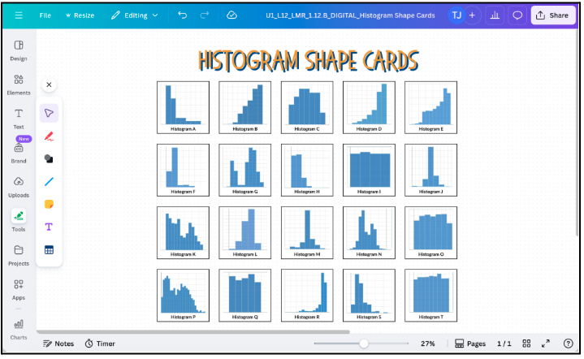
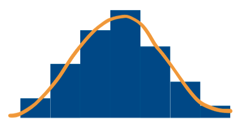
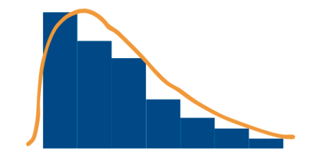
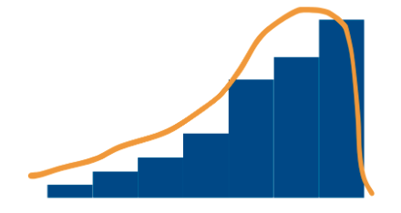
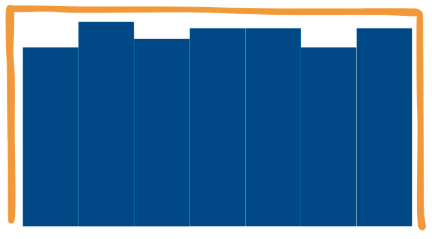
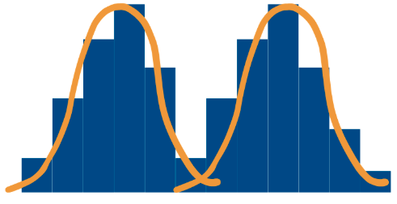
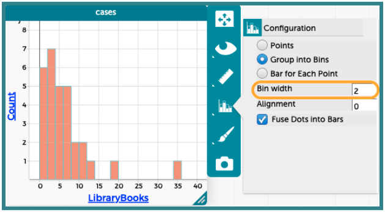
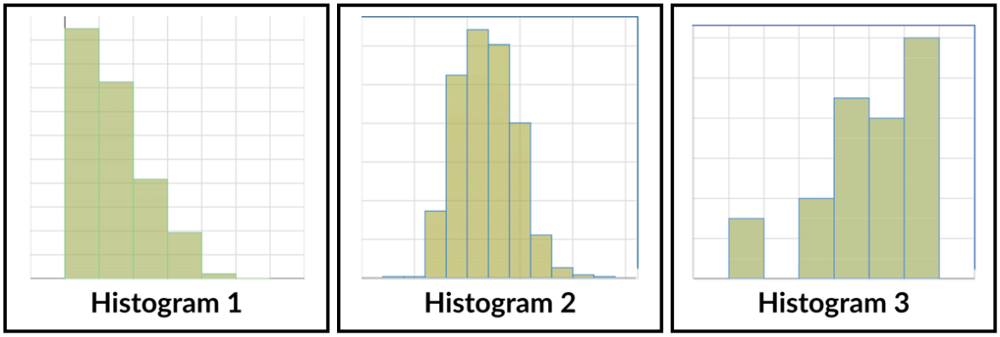

##**<u>Lesson 12: The Shape of Data</u>**

###**Objective:**
Students will be able to identify and describe common shapes of numerical distributions (symmetric, skewed right, skewed left, bimodal, unimodal) using their own descriptive language initially, and then connect to formal statistical terms. They will understand that the shape is a key feature to observe when analyzing numerical data.

###**Materials:**
1. Histogram Shape Cards

    ***Advanced preparation required.*** *See Class Setup section for additional details.*

    100. **Print Option**: ([LMR_U1_L12_A_Histogram_Shape_Cards](../MSDS_Curriculum/2_MSDS_LMRs/MSDS_LMR_Unit_1/LMR_U1_L12_A.pdf))

    100. **Digital Option**: ([LMR_U1_L12_B_DIGITAL_Histogram_Shape_Cards](https://canva.link/ytjc6pycxdtogcg "https://canva.link/ytjc6pycxdtogcg"){:target="_blank"}) 

2. 10 cardboard boxes of various shapes and sizes (ex. cereal box, oatmeal canister, shoe box, etc.)

3. ***OPTIONAL***: Reference Sheet for Distribution Shapes ([LMR_U1_L12_C_Distribution_Shapes_Reference_Sheet](../MSDS_Curriculum/2_MSDS_LMRs/MSDS_LMR_Unit_1/LMR_U1_L12_C.pdf))

###**Vocabulary:**
[shape](../../vocabulary/unit1/#shape "a common profile that numerical data can take visually"){ .md-button }
[symmetric](../../vocabulary/unit1/#symmetric "a type of distribution where you can draw a line down the middle and it looks roughly the same on both sides; the shape is often called bell-shaped"){ .md-button }
[skewed right](../../vocabulary/unit1/#skewed-right "the shape when a lot of data is on the left side of the graph, and much less data on the right; this shape has a &quot;tail&quot; that tapers as you move to the right"){ .md-button }
[skewed left](../../vocabulary/unit1/#skewed-left "the shape when a lot of data is on the right side of the graph, and much less data on the left; this shape has a &quot;tail&quot; that tapers as you move to the left"){ .md-button }
[uniform](../../vocabulary/unit1/#uniform "a type of distribution where there are no clear peaks and the data is spread out evenly across x-values; the shape forms a rectangle or box-like shape"){ .md-button }
[bimodal](../../vocabulary/unit1/#bimodal "a graph which has two separate peaks/ modes"){ .md-button }
[unimodal](../../vocabulary/unit1/#unimodal "a graph which has a single peak"){ .md-button }

###**Essential Concepts:**

!!! note "Essential Concepts: "
    The shape of a graph of numerical data provides important information about its distribution. Data distributions can be described by common shapes, such as symmetric (bell-shaped), skewed (left or right), and bimodal. Recognizing the shape is an early step in analyzing and interpreting numerical data. Developing a common language to describe shapes helps in communicating findings.

###**Lesson:**

<h3>Class Setup</h3>

- ***Advanced preparation required.***

    - Prior to class starting, decide whether your class will use the print or digital option of the Histogram Shape Cards.  
    ***NOTE***: The plots do NOT have axis labels or scales since we do not want students to get distracted by the variables themselves.

    - **Print Option**: ([LMR_U1_L12_A](../MSDS_Curriculum/2_MSDS_LMRs/MSDS_LMR_Unit_1/LMR_U1_L12_A.pdf))  
    Print and cut out enough sets of cards so that each group of 3 to 4 students gets their own set. As an example, if there are 20 students in the class and they are placed into groups of 4, you will need to prepare 5 sets of the Histogram Shape Cards. The card sets can be stored in zipper bags or envelopes for easy distribution.

    
<iframe src="https://docs.google.com/viewerng/viewer?url=https://mscurriculum.thinkdataed.org/MSDS_Curriculum/2_MSDS_LMRs/MSDS_LMR_Unit_1/LMR_U1_L12_A.pdf&embedded=true" style=" width:420px;height:400px;" frameborder="0"></iframe> [LMR_U1_L12_A](../MSDS_Curriculum/2_MSDS_LMRs/MSDS_LMR_Unit_1/LMR_U1_L12_A.pdf)

    - **Digital Option**: ([LMR_U1_L12_B](https://canva.link/ytjc6pycxdtogcg "https://canva.link/ytjc6pycxdtogcg"))  
    A Canva whiteboard template has been created for you to copy. Each group would need access to their own whiteboard.

    

<h3>Opening</h3>

1. Remind students that they have explored plots of numerical data using dots (in dot plots) and bins (in histograms). 

2. Introduce today’s lesson by telling students that, in order to solve a case, detectives must first “profile” their numerical data. Today’s mission is to learn the common profiles, or **shapes**, that data can take. Just like a suspect has a physical profile (height, hair color, eye color, etc.), a data distribution has a shape.

    100. Explain that, just like objects have different shapes, data displayed in a histogram (or dot plot) have a shape too, and that shape tells us a story.

    100. Introduce the idea of shapes telling us stories with an example using cardboard boxes. Ideas for discussion are included here:

        100. They all have the same general function (to store or ship things in).

        100. They come in many different shapes and sizes (rectangular, square, large, small, heavy, light, etc.).

        100. The different cardboard box shapes might tell us something about what is inside. 
            - *Example 1: A lightweight, large rectangular box might contain a wall calendar.* 

            - *Example 2: A small, heavy box could contain batteries or a candle in a thick glass jar.*

        
        <table class="ta" style="width:75%;margin:0 auto;">
        <tr>
        <th class="ta-88im" style="width:15%;">
        </th>
        <th class="ta-88nc" style="width:65%;"><b>ADDITIONAL SUPPORT: 
        <i>Tangible Guessing Game for Diverse Learners</i></b>  
        Prepare 4 or 5 packages of different shapes, weights, and sizes. Then, have groups guess the contents of the packages. They should justify their answers.<ul>
        <li><i>Example 1</i>: Two of the packages could be the same shape (rectangular), but have different sizes and/or weights. This is analogous to two plots being unimodal and symmetric, but having different spreads.</li>
        <li><i>Example 2</i>: A box with 20-30 ping pong balls that rattle when the box is shaken would tell a story that there is more than one item in the box. This is analogous to the dots on a dot plot that tell us the number of data points.</li></ul></th>
        </tr>
        </table>

    100. Invite students to come up with their own examples of objects that are functionally the same, but have different shapes. 
        100. *Example 1: plants*

        100. *Example 2: houses*

        100. *Example 3: chairs / things you can sit on*

        100. *Example 4: spoons (or more generally, utensils)*
        enrich

        
        <table class="te" style="width:75%;margin:0 auto;">
        <tr>
        <th class="te-88im" style="width:15%;"></th>
        <th class="te-88nc" style="width:65%;"><b>Enrichment or Extension: 
        <i>Create a Collage</i></b>  
        Have students do a Google image search to create a collage of pictures showing items that are functionally the same, but have different shapes.</th>
        </tr>
        </table>

    
<h3>Concept Development</h3>

    <b><i>Part 1: Exploring Shapes with Creative Naming (Language Experience Approach)</b></i>

3. Explain that we can think of histograms kind of like these cardboard boxes. They have a general purpose to visually display numerical data, but they do not always look the same (or have the same shape). We are going to explore this concept today!

4. Divide the class into small groups of 3 to 4 students and distribute one set of the Histogram Shape Cards ([LMR_U1_L12_A](../MSDS_Curriculum/2_MSDS_LMRs/MSDS_LMR_Unit_1/LMR_U1_L12_A.pdf)) to each group. You can also provide a large sheet of paper and tape for them to display the cards.

5. Display the instructions below for students to reference during the activity. Emphasize that students should focus ONLY on the visual shape and not try to guess what the underlying data is about. 

    100. Explore all the plot cards and focus on the overall visual **shape** of each graph. Things to consider: 
        100. Where are the tallest bars? 

        100. Where are the shortest bars?

        100. Are there a lot of bars or just a few?

    100. Your first task is to sort these plots into groups based on their shapes. Which graphs look similar? What features do they share?
        100. There is no right or wrong sorting method. 

        100. You should sort the graphs in any way that makes sense to you and your teammates. 

        100. Just be sure you can explain why you grouped the plots in that way, and justify why each plot is included in the group.

    100. Once your team has sorted the Histogram Shape Cards, come up with a creative and descriptive name for each shape type. 

    100. Write these names down on your poster paper and tape or stick the matching Histogram Shape Cards under each heading.

6. During the activity, circulate and observe the groups. As student detectives work, listen to their discussions and the names they are generating. Encourage descriptive language.   

    <b><i>Part 2: Sharing and Discussing Creative Names</b></i>

7. Gallery Walk (Optional) or Group Presentations: If time allows, have teams display and/or present their sorted cards along with their creative names. 

    100. Students can do a quick Gallery Walk to see how other teams organized the Shape Cards together, as well as the names they came up with. 

    100. Alternatively, each group can briefly share one of their shape categories and the creative name they assigned to it. Be sure students explain their reasoning.

8. On the board or on chart paper, draw or display the 5 main distribution shapes and record the creative names the students shared for each one. Below are example drawings of the shapes, as well as some shape names that students have come up with in the past.  
***NOTE***: You may also distribute the Reference Sheet handout for Shapes of Distributions ([LMR_U1_L12_C](../MSDS_Curriculum/2_MSDS_LMRs/MSDS_LMR_Unit_1/LMR_U1_L12_C.pdf)) if you would prefer a more structured format for students.
    
<iframe src="https://docs.google.com/viewerng/viewer?url=https://mscurriculum.thinkdataed.org/MSDS_Curriculum/2_MSDS_LMRs/MSDS_LMR_Unit_1/LMR_U1_L12_C.pdf&embedded=true" style=" width:420px;height:400px;" frameborder="0"></iframe> [LMR_U1_L12_C](../MSDS_Curriculum/2_MSDS_LMRs/MSDS_LMR_Unit_1/LMR_U1_L12_C.pdf)
 
    
    <table class="ta" style="width:75%;margin:0 auto;">
    <tr>
    <th class="ta-88im" style="width:15%;">
    </th>
    <th class="ta-88nc" style="width:65%;"><b>ADDITIONAL SUPPORT: 
    <i>Reference Sheet with Drawings Included</i></b>  
    If students need more visual or guided support for synthesizing the shape types, you can distribute Page 2 of the Reference Sheet handout (<a href="../MSDS_Curriculum/2_MSDS_LMRs/MSDS_LMR_Unit_1/LMR_U1_L12_C">LMR_U1_L12_C</a>) instead. The “Drawing/Sketch” column is completed already with images for the five plot shapes.</th>
    </tr>
    </table>
    
    100. Distribution Shape 1: [tallest bar(s) in the middle, shorter bars on the edges]
        100. Likely Shape Cards that match this shape type: **C, J, L, M**

        100. *Example Names: bell, hill, bump, even, mountain, middle, pyramid, bridge*
        

    100. Distribution Shape 2: [tallest bars on the left side, shortest bars on the right side]
        100. Likely Shape Cards that match this shape type: **A, F, H, S**

        100. *Example Names: to negative infinity and beyond, downstairs, slide to the right, downhill rollercoaster*
        

    100. Distribution Shape 3: [tallest bars on the right side, shortest bars on the left side]
        100. Likely Shape Cards that match this shape type: **B, D, E, R**

        100. *Example Names: to infinity and beyond, upstairs, slide to the left, uphill rollercoaster, “started from the bottom, now we’re here”*
        

    100. Distribution Shape 4: [all bars are about the same height]
        100. Likely Shape Cards that match this shape type: **I, O, Q, T**

        100. *Example Names: rectangle, flat top, plateau, car battery, Lego brick*
        

    100. Distribution Shape 5: [there are 2 distinct locations for the tallest bars]
        100. Likely Shape Cards that match this shape type: **G, K, N, P**

        100. *Example Names: two hills, camel humps, rock on, banana split, quiet coyote/silent fox*
        

9. Lead a class discussion that addresses the following questions:

    100. What similarities did you notice in how different groups sorted the cards?

    100. Which shapes were easiest to name? Which were trickier?

    100. Why did you choose the names you did for certain shapes?   

    <b><i>Part 3: Introducing Formal Statistical Names to Plot Shapes</b></i>

10. Explain that the creative shape names they shared were helpful in determining the overall patterns in numerical distributions. However, they need to be able to communicate with and understand other data scientists too, so they will be introduced to the more common names for each shape.

11. Using the drawings from Step 8, add the vocabulary below to each shape: 
    
    <table class="ta" style="width:75%;margin:0 auto;">
    <tr>
    <th class="ta-88im" style="width:15%;">
    </th>
    <th class="ta-88nc" style="width:65%;"><b>ADDITIONAL SUPPORT: 
    <i>Guided Labeling to Match Distributions to Vocabulary</i></b>  
    On the board or chart paper, sketch the five main distribution shapes and add the formal statistical vocabulary. Be sure to reference the students' creative names so they can connect the data science terminology to their original thoughts.</th>
    </tr>
    </table>
    100. Distribution Shape 1: **Symmetric** 
        100. If you can draw a line down the middle and it looks roughly the same on both sides, or if you can fold the plot onto itself, it is symmetric. 

        100. A common symmetric shape looks like a bell, so it's often called bell-shaped. 

    100. Distribution Shape 2: **Skewed Right**
        100. There is usually a lot of data on the left side of the graph, and much less data on the right.

        100. This shape has a “tail” that tapers off as you move to the right, so we call it right-skewed, or skewed right.

    100. Distribution Shape 3: **Skewed Left**
        100. There is usually a lot of data on the right side of the graph, and much less data on the left.

        100. This shape has a “tail” that tapers off as you move to the left, so we call it left-skewed, or skewed left.

    100. Distribution Shape 4: **Uniform**
        100. There are no clear peaks and the data is spread out evenly across x-values.

        100. The distribution forms a rectangle or a box-like shape, where the frequency of each value is roughly the same.

    100. Distribution Shape 5: **Bimodal**
        100. There are usually 2 clear and separate peaks in the graph. We can also think of these peaks as modes since that’s where most of the data lies. 

        100. The prefix “bi-”means 2, so it helps us identify that there are 2 different peaks. Note that bimodal distributions can be symmetric or non-symmetric.

    
    <table class="ta" style="width:75%;margin:0 auto;">
    <tr>
    <th class="ta-88im" style="width:15%;">
    </th>
    <th class="ta-88nc" style="width:65%;"><b>ADDITIONAL SUPPORT: 
    <i>Vocabulary Support for Diverse Learners</i></b>  
    If students are unfamiliar with the term “mode,” a sound-related mnemonic device can be helpful to connect the term to its definition. Students can say “MoMo” to remind them that the MOde means MOst.</th>
    </tr>
    </table>

12. Introduce an additional shape name that we can apply to many distributions: **Unimodal**.

    100. Ask students to come up with their own definition for this shape name.

    100. Guide students to consider what **bimodal** meant, and how that might relate to **unimodal** given that the prefix “uni-” means 1.

    100. Ask: Which of the previous shape names could also be described as unimodal based on the drawings? *Sample answer: symmetric, skewed right, and skewed left.*

13. Allow students to add these more formal name labels to their poster papers next to the creative names they had come up with

    <b><i>Part 4: Connecting Back to the Case</b></i>

14. Display the dot plot students should have created during the previous lesson related to `LibraryBooks`, and ask them to analyze and name the shape of the distribution based on what they learned today. *Sample answers: The distribution is skewed right. There are only a lot of people who do not read many books, but much fewer people who read more than 15 books, so there is a tail in the right side of the histogram.*
    

    
<h3>Closing</h3>

15. Quick Shape Check: Briefly display one histogram (not from the Shape Cards) and ask the class to call out which statistical shape it most closely resembles. Repeat with 2 to 3 examples. 3 example histograms have been provided here:

    

