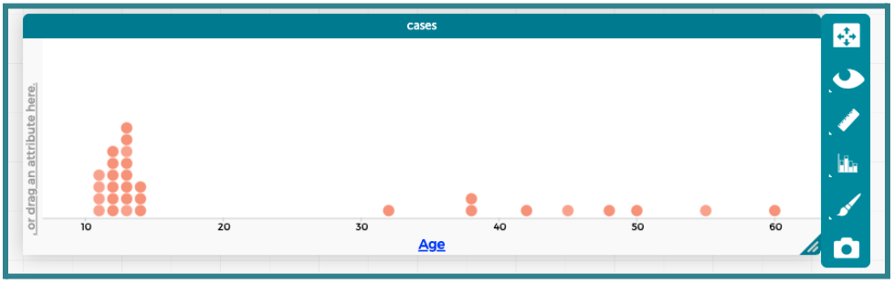
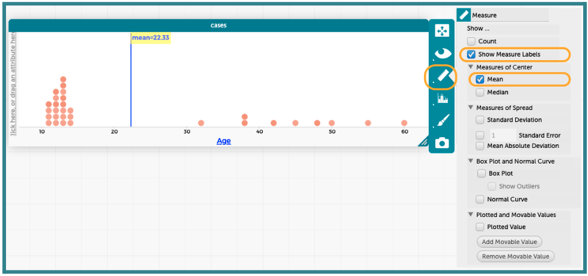
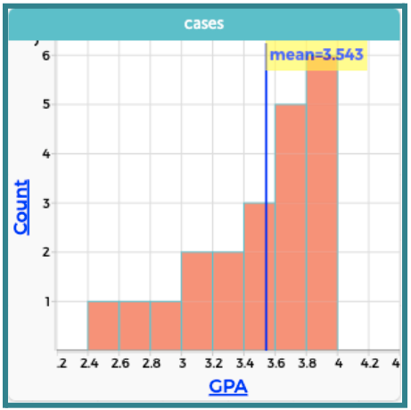
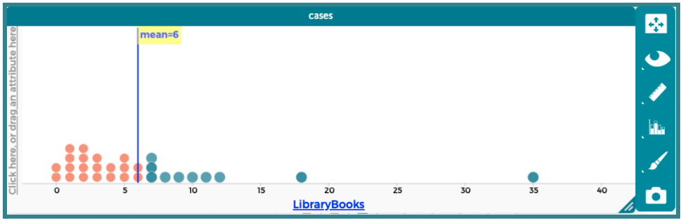
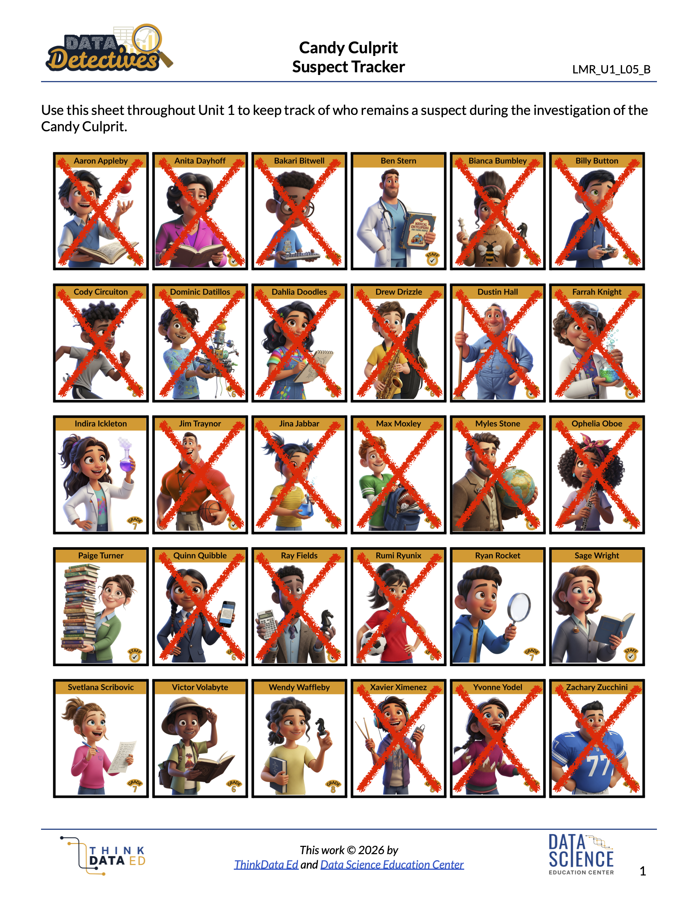

##**<u>Lesson 13: The Average Suspect</u>**

###**Objective:**
Students will be able to define the mean as a “fair share” value by redistributing the data. They will calculate the mean using the standard formula (sum divided by count) and use CODAP to find the mean with technology.

###**Materials:**
1. 5 paper plates with labels

    ***Advanced preparation required.*** *See Class Setup section for additional details.*

2. 25 small items like erasers, cubes, etc. (can be individually wrapped candies if approved by school)

    ***Advanced preparation required.*** *See Class Setup section for additional details.*

3. Data Cycle poster [page 5] ([LMR_U1_L01_B_The_Data_Cycle](../MSDS_Curriculum/2_MSDS_LMRs/MSDS_LMR_Unit_1/LMR_U1_L01_B.pdf))

4. Data Cycle Entrance Ticket ([LMR_U1_L13_A_Data_Cycle_Entrance_Ticket](../MSDS_Curriculum/2_MSDS_LMRs/MSDS_LMR_Unit_1/LMR_U1_L13_A.pdf))

5. Candy Culprit Clues [Clue #6] ([LMR_U1_L02_A_Candy_Culprit_Clues](../MSDS_Curriculum/2_MSDS_LMRs/MSDS_LMR_Unit_1/LMR_U1_L02_A.pdf))

6. CODAP Handout for Clue #6 ([LMR_U1_L13_B_Clue6_CODAP_Analysis](../MSDS_Curriculum/2_MSDS_LMRs/MSDS_LMR_Unit_1/LMR_U1_L13_B.pdf))

7. Candy Culprit Suspect Tracker ([LMR_U1_L05_B_Suspect_Tracker](../MSDS_Curriculum/2_MSDS_LMRs/MSDS_LMR_Unit_1/LMR_U1_L05_B.pdf))

8. Saved student CODAP files of the Suspect data OR link to the original [CODAP Suspect Data File](https://codap.concord.org/app/static/dg/en/cert/index.html#shared=https%3A%2F%2Fcfm-shared.concord.org%2FTtznsLR5Tw98ENyde2PN%2Ffile.json "https://codap.concord.org/app/static/dg/en/cert/index.html#shared=https%3A%2F%2Fcfm-shared.concord.org%2FTtznsLR5Tw98ENyde2PN%2Ffile.json"){:target="_blank"}

###**Vocabulary:**
[center](../../vocabulary/unit1/#center "useful for numerical variables, the center of the distribution often corresponds to our notion of ‘fair share’"){ .md-button }
[fair share](../../vocabulary/unit1/#fair-share "the value that every observation would have if the total were distributed, or divided, equally"){ .md-button }
[mean](../../vocabulary/unit1/#mean "the value that every observation would have if the total were distributed, or divided, equally; also known as the average"){ .md-button }
[average](../../vocabulary/unit1/#average "the value that every observation would have if the total were distributed, or divided, equally; also known as the mean"){ .md-button }

###**Essential Concepts:**

!!! note "Essential Concepts: "
    The mean is a measure of center that represents the “fair share” value if all data points were redistributed equally among the observations. To calculate the mean, we use an algorithm: sum all the values and divide by the total number of observations.

###**Lesson:**

<h3>Class Setup</h3>

- ***Advanced preparation required.***

    - Label 5 paper plates with generic names such as “Student A,” “Student B,” “Student C,” “Student D,” and “Student E.”
    
    - Distribute the 25 small items onto the 5 plates as follows:

        &nbsp;&nbsp;&nbsp;&nbsp;&nbsp;❏  Student A: 1 item 
        &nbsp;&nbsp;&nbsp;&nbsp;&nbsp;❏  Student B: 2 items 
        &nbsp;&nbsp;&nbsp;&nbsp;&nbsp;❏  Student C: 4 items 
        &nbsp;&nbsp;&nbsp;&nbsp;&nbsp;❏  Student D: 8 items 
        &nbsp;&nbsp;&nbsp;&nbsp;&nbsp;❏  Student E: 10 items 

<h3>Opening</h3>

1. Display the full Data Cycle with all phases shown ([LMR_U1_L01_B](../MSDS_Curriculum/2_MSDS_LMRs/MSDS_LMR_Unit_1/LMR_U1_L01_B.pdf), page 5) for students to reference.

    
<iframe src="https://docs.google.com/viewerng/viewer?url=https://mscurriculum.thinkdataed.org/MSDS_Curriculum/2_MSDS_LMRs/MSDS_LMR_Unit_1/LMR_U1_L01_B.pdf&embedded=true" style=" width:420px;height:400px;" frameborder="0"></iframe> [LMR_U1_L01_B](../MSDS_Curriculum/2_MSDS_LMRs/MSDS_LMR_Unit_1/LMR_U1_L01_B.pdf)

2. Entrance Ticket: Distribute the Data Cycle Entrance Ticket ([LMR_U1_L13_A](../MSDS_Curriculum/2_MSDS_LMRs/MSDS_LMR_Unit_1/LMR_U1_L13_A.pdf)) and allow up to 10 minutes for students to complete it.

    
<iframe src="https://docs.google.com/viewerng/viewer?url=https://mscurriculum.thinkdataed.org/MSDS_Curriculum/2_MSDS_LMRs/MSDS_LMR_Unit_1/LMR_U1_L13_A.pdf&embedded=true" style=" width:420px;height:400px;" frameborder="0"></iframe> [LMR_U1_L13_A](../MSDS_Curriculum/2_MSDS_LMRs/MSDS_LMR_Unit_1/LMR_U1_L13_A.pdf)

3. Once students have submitted their completed tickets, explain that we will be diving deeper into the Analyze Data and Interpret Data phases with numerical summaries. 

4. If needed, review and discuss each phase:

    100. **Pose Questions**: Start an investigation by creating a statistical question. Statistical questions address variability and can be answered with data.

    100. **Consider Data**: Collect and compile evidence (from primary or secondary data sources). Data detectives should determine what data they already have, what data they still need, and what they should do to acquire such data.

    100. **Analyze Data**: Create graphical and numerical summaries that can provide evidence to answer statistical question(s). Data detectives look for patterns and trends in the data.

    100. **Interpret Data**: Data detectives answer their statistical question(s). They must use evidence from their analysis to support their interpretations. The goal is to tell the story of the data. Findings need to be communicated or presented in a report, letter, slideshow, or other final product. 

    
<h3>Concept Development</h3>

    <b><i>Part 1: Deciding What's Fair</b></i>

5. Remind students that they have previously learned how to describe numerical distributions by their shapes (symmetric, skewed, etc.). As a data detective, we want to describe distributions with more than just words; we need numbers to back up our statements as well. Today, we will explore a measure of **center**.
 
6. Call 5 student volunteers to the front of the classroom and give each of them one of the 5 paper plates with the small items on them.

7. Have the 5 student volunteers count and share aloud the number of items on their plates.

8. Pose the following questions to the entire class:

    100. Is this fair? What does it mean to be fair?

    100. Does everyone have a **fair share** of items?

    100. Who has the most?

    100. Who has the least?

    100. How could we make this more fair?
    
    <table class="ta" style="width:75%;margin:0 auto;">
    <tr>
    <th class="ta-88im" style="width:15%;">
    </th>
    <th class="ta-88nc" style="width:65%;"><b>ADDITIONAL SUPPORT: 
    <i>Vocabulary Exploration for Diverse Learners</i></b>  
    Ask students to come up with synonyms for the word “fair.” As they share, write these words on the board for everyone to see and reference throughout the lesson. Sample list of synonyms: <ul>
    <li>equal</li>
    <li>even</li>
    <li>unbiased</li>
    <li>same</li></ul></th>
    </tr>
    </table>

9. Allow students to share ideas about how they could move around the items on each plate to make sure everyone has a fair share. Students need to be explicit in their instructions so the 5 volunteers can test out the method. Responses will vary by class, but some sample ideas are provided here:

    100. *Example 1: The people with the most items should give some of theirs to the people with the least items.* 

    100. *Example 2: Place all of the items in one big pile. Then, have the 5 volunteers take 1 piece each from the pile. If there are still pieces left, have them each take 1 more piece from the pile. Continue this until there are no items left.* 

10. Engage the class in a discussion about the **fair share**. 

    100. How many total items did our 5 volunteers have at the beginning of the activity? Explain your answer. *Answer: 25 items. I added the amount of items that each volunteer had at the beginning: 1 + 2 + 4 + 8 + 10 = 25.* 

    100. How many items did each volunteer end up with once we made it fair? *Answer: 5 items.*

    100. Will the method that we came up with always work to make sure each person has a fair amount? *Answers will vary.* 

11. Explain that in data science, we have a specific name for this **fair share** value: the **mean**. The **mean** is the value that every observation *WOULD* have if the total were distributed, or divided, equally. 

    100. It is a common way for data detectives to measure the **center** of a distribution.

    100. Students might have heard the term **average** to describe this value as well. 

    <b><i>Part 2: Calculating the Mean Mathematically</b></i>

12. Remind students that the 5 volunteers only had 25 items in total to share, so it was easy for them to redistribute them to each other by hand. Propose the scenario that each volunteer was given 10 times the amount of items they started with. 

    100. This would mean Student A had 10, Student B had 20, Student C had 40, Student D had 80, and Student E had 100. 

    100. That adds up to 250 items in total. 

    100. Would we want to sort 250 items out by hand to give everyone their fair share? *Sample answer: Probably not. Each person would need 50 items to get their fair share and that would take a really long time using our method from Step 9.*

13. Instead, we should use a mathematical method to find the mean value. 

    100. Ask: Can we come up with a mathematical rule for calculating the mean?

        100. What information did we know originally? *Answer: There were 25 items in total that needed to be shared between 5 people.* 

        100. What was the fair share amount? *Answer: 5 items.* 
        
        100. How can we relate these values to each other? *Sample answer: 25 divided by 5 is 5, so we could take the total number of items and divide that by the number of people.* 

    100. Display the formula for the mean:
        

    100. Relate the formula back to the opening activity by explaining that the numerator sum is the same as if we combined all the items into one big pile.
        

    100. Similarly, connect the denominator total to the number of volunteers.
        

    100. Combine all parts of the formula to the opening example and have students record it in their notebooks. Connect the last step of calculating the mean to division, a mathematical concept they are likely very familiar with. Division is about dividing equally, and that's what we do with the mean.
        

        

    100. Make a statement about what this mean value means in the context of the data. *Sample answer: If all students have 5 items on their plates, then everyone has a fair share of the total number of items.*

14. Allow teams of 3 to practice calculating the mean using the 3 datasets provided below. For each scenario, they should record their answers and calculation steps in their notebooks, as well as write a statement about the mean value in the context of the data.

    100. ***Scenario 1: The Mega-Coaster Drop*** – A group of thrill-seekers decides to test out the five biggest roller coasters at a popular amusement park. They want to track how much suspense each ride builds, so they use a stopwatch to measure the exact number of seconds each coaster hangs at the very top of its vertical drop before plunging down.

        100. The Data (Seconds of suspense): **2, 10, 11, 12, 15**

        100. Your Mission: Find and interpret the mean number of seconds a rider hangs at the top of a roller coaster drop. *Answer: Mean = 10. Roller coasters have riders hang at the top of a big drop an average of 10 seconds before the ride releases.* 

    100. ***Scenario 2: Snack Attack*** – After walking around an amusement park all morning, seven friends stop at the main food court for lunch. Because theme park food can be expensive, they each track how much money (rounded to the nearest dollar) they spent on their individual lunches and snacks.

        100. The Data (Dollars spent per person): **7, 8, 10, 13, 6, 8, 4**

        100. Your Mission: Find and interpret the mean amount of money the friends spent on lunch. *Answer: Mean = 8. Each friend spent an average of $8 at the food court for lunch.*

    100. ***Scenario 3: The Virtual Reality Rush*** – The park just opened a brand-new Virtual Reality Simulator ride. Because the line changes constantly throughout the day, the park app updates the estimated wait time every half hour. Over a five-hour period, the app records 10 different wait times (in minutes).

        100. The Data (Wait times in minutes): **15, 45, 20, 35, 50, 25, 40, 15, 30, 45**

        100. Your Mission: Find and interpret the mean wait time for the Virtual Reality Simulator. *Answer: Mean = 32. During a typical five-hour period, people can expect to wait an average of 32 minutes for the Virtual Reality Simulator.*
            
            <table class="ta" style="width:75%;margin:0 auto;">
            <tr>
            <th class="ta-88im" style="width:15%;">
            </th>
            <th class="ta-88nc" style="width:65%;"><b>ADDITIONAL SUPPORT: 
            <i>Pre-Printed Calculation Grids for Diverse Learners</i></b>  
            Provide a handout with empty boxes for Sum, Number of Observations, and Mean to guide students through the work.   

            <b><i>Peer Checks for Diverse Learners</b></i>  
            Allow students to work in pairs to check each other's work.</th>
            </tr>
            </table>

    <b><i>Part 3: Exploring Means in CODAP</b></i>

15. Transition to our digital toolkit, CODAP! Tell students that CODAP uses the exact formula we came up with earlier to calculate mean values instantly. 

16. Instruct students to open their saved CODAP files of the Suspect data OR provide them with the link to the original [CODAP Suspect Data File](https://codap.concord.org/app/static/dg/en/cert/index.html#shared=https%3A%2F%2Fcfm-shared.concord.org%2FTtznsLR5Tw98ENyde2PN%2Ffile.json "https://codap.concord.org/app/static/dg/en/cert/index.html#shared=https%3A%2F%2Fcfm-shared.concord.org%2FTtznsLR5Tw98ENyde2PN%2Ffile.json"){:target="_blank"}.

17. Model how to add a mean value to a histogram or dot plot in CODAP. Use the `Age` variable for this initial exploration. Students should follow along and complete the steps in CODAP with you.

    100. Start with a dot plot or histogram of the variable of interest (`Age`). The dot plot window will likely need to be stretched horizontally so that the data points show up correctly.
    

    100. Click the ruler icon next to the plot. This will open a pop-up menu of measures that CODAP can calculate and display. Select the “Show Measure Labels” option and then select the “Mean” option under “Measures of Center.” This will add a vertical line to the plot at the mean value, as well as a label with the exact measurement. 
    

18. Allow students to practice finding the mean in CODAP using the `GPA` variable. The resulting histogram is provided here.
    

19. Introduce the SIXTH CLUE of the Candy Culprit investigation. All of the clues can be found in the Candy Culprit Clues document ([LMR_U1_L02_A](../MSDS_Curriculum/2_MSDS_LMRs/MSDS_LMR_Unit_1/LMR_U1_L02_A.pdf)). Have a student volunteer read it aloud.
    
<iframe src="https://docs.google.com/viewerng/viewer?url=https://mscurriculum.thinkdataed.org/MSDS_Curriculum/2_MSDS_LMRs/MSDS_LMR_Unit_1/LMR_U1_L02_A.pdf&embedded=true" style=" width:420px;height:400px;" frameborder="0"></iframe> [LMR_U1_L02_A](../MSDS_Curriculum/2_MSDS_LMRs/MSDS_LMR_Unit_1/LMR_U1_L02_A.pdf)

20. Distribute the Clue 6 CODAP Analysis handout ([LMR_U1_L13_B](../MSDS_Curriculum/2_MSDS_LMRs/MSDS_LMR_Unit_1/LMR_U1_L13_B.pdf)), and instruct students to complete all steps to determine which suspects they can eliminate from our list. 
    
<iframe src="https://docs.google.com/viewerng/viewer?url=https://mscurriculum.thinkdataed.org/MSDS_Curriculum/2_MSDS_LMRs/MSDS_LMR_Unit_1/LMR_U1_L13_B.pdf&embedded=true" style=" width:420px;height:400px;" frameborder="0"></iframe> [LMR_U1_L13_B](../MSDS_Curriculum/2_MSDS_LMRs/MSDS_LMR_Unit_1/LMR_U1_L13_B.pdf)

    
    <table class="ta" style="width:75%;margin:0 auto;">
    <tr>
    <th class="ta-88im" style="width:15%;">
    </th>
    <th class="ta-88nc" style="width:65%;"><b>ADDITIONAL SUPPORT: 
    <i>Partner Support for Diverse Learners</i></b>  
    Have students work in pairs. One student can be the “driver” (controlling the mouse) and the other can be the “navigator” (reading the steps). They can switch roles halfway through.</th>
    </tr>
    </table>

21. Circulate around the room to provide guidance and support as students work in CODAP.

22. Once all students have completed their analysis, engage in a whole class discussion about the results.
    

    100. What value did you calculate as the mean number of `LibraryBooks`? *Answer: 6 books.* 

    100. Based on the Candy Culprit’s clue, what values of `LibraryBooks` are NOT above the fair share/mean value? How many suspects fit this criteria? *Answer: Values at or below 6 books are not above the mean. There are 20 suspects who match this criteria.* 

    100. Based on the Candy Culprit’s clue, what values of `LibraryBooks` ARE above the fair share/mean value? How many suspects fit this criteria? *Answer: Values of 7 books or more are above the mean. There are 10 suspects who match this criteria.* 

    100. Which group of values will you use to eliminate suspects, values that are NOT above the mean or values that ARE above the mean? Explain your reasoning by connecting back to the wording of the clue. *Answer: Any suspect with a `LibraryBooks` value that is NOT above the mean can be eliminated. They are NOT the Candy Culprit.* 

    100. How many NEW suspects can you eliminate after this clue? Who are they? *Answer: There are 10 new suspects to eliminate – Bakari Bitwell, Bianca Bumbley, Billy Button, Farrah Knight, Max Mosely, Myles Stone, Ophelia Oboe, Ray Fields, Rumi Ryunix, and Xavier Ximenez.*  
    ***NOTE***: If you crossed out a suspect based on a previous clue, you do not have to include their name in this list.

    100. How many suspects remain as potential Candy Culprits? Who are they? *Answer: There are 8 remaining suspects – Ben Stern, Indira Ickleton, Paige Turner, Ryan Rocket, Sage Wright, Svetlana Scribovic, Victor Volabyte, and Wendy Waffleby.* 

23. Have students take out their Candy Culprit Suspect Tracker ([LMR_U1_L05_B](../MSDS_Curriculum/2_MSDS_LMRs/MSDS_LMR_Unit_1/LMR_U1_L05_B.pdf)) sheet so they can cross off the newly eliminated suspects. An example of the updated suspect tracker is provided below. 
    

    
<h3>Closing</h3>

24. Exit Ticket: Calculate and interpret the mean for the given scenario.

    100. The Water Park Splash Zone – A local water park tracks the water temperature (in degrees Fahrenheit) of its main wave pool at noon every day for 12 days during early summer.

    100. The Data (Water temperature in °F): **72, 75, 88, 68, 70, 70, 85, 84, 80, 65, 66, 73**

    100. Your Mission: Find the mean wave pool temperature over these 12 days. *Answer: 896/12 = 74.67°F (rounds to 75°F if your students are practicing rounding to the nearest whole number).*

25. Transition: Tomorrow, we will try to determine what it means for values to be close to or far away from the mean.
