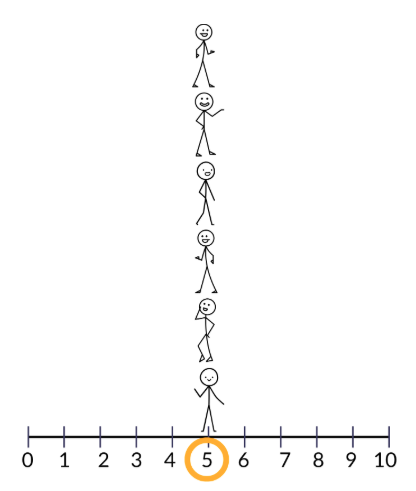
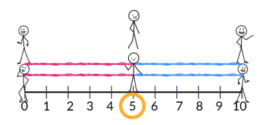
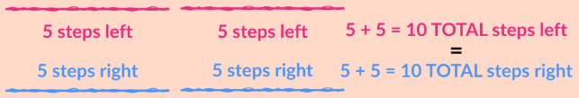
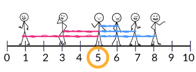
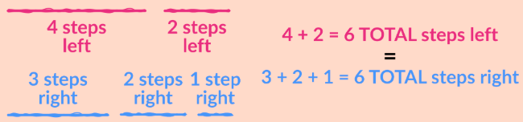
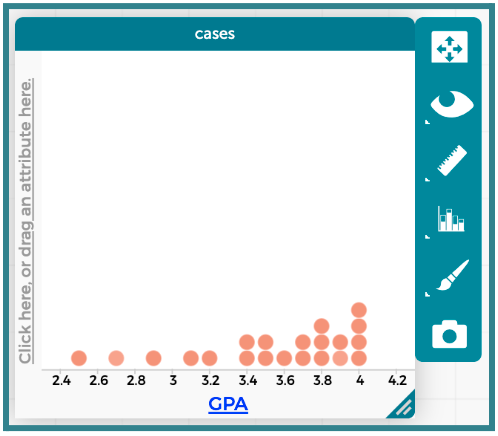
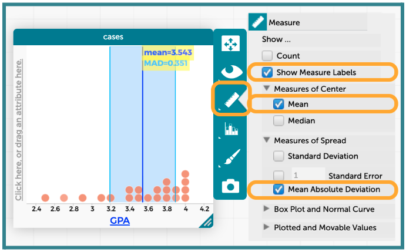
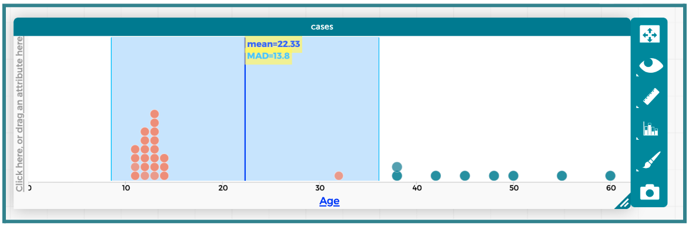
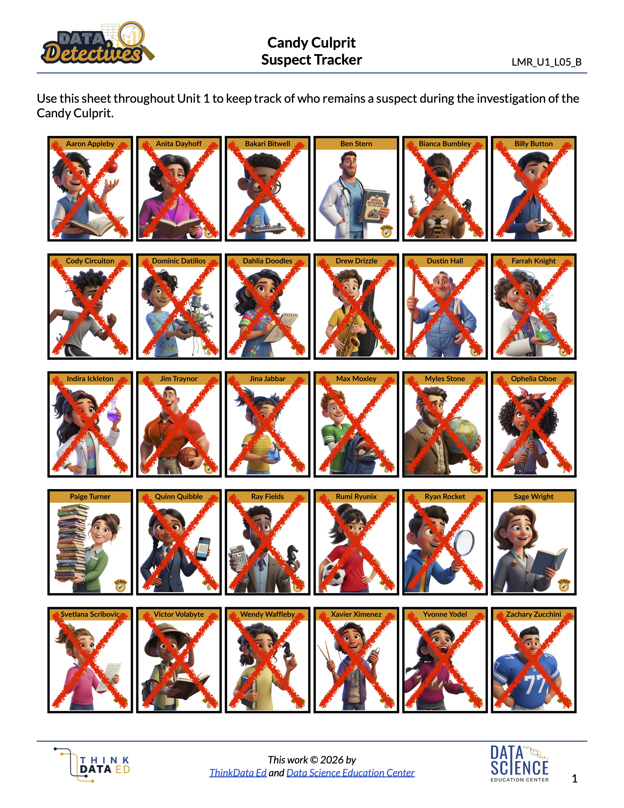

##**<u>Lesson 14: Getting MAD About It</u>**

###**Objective:**
Students will be able to calculate the Mean Absolute Deviation (MAD) to quantify the variability (spread) of a dataset. They will interpret MAD as the “average distance from the mean” and use this measure to eliminate suspects who are “too average” (too close to the mean).

###**Materials:**
1. Painter's Tape (to mark the "Mean Line" on the floor)

    ***Advanced preparation required.*** *See Class Setup section for additional details.*

2. String or Yarn in 2 colors

3. Calculators

4. Candy Culprit Clues [Clue #7] ([LMR_U1_L02_A_Candy_Culprit_Clues](../MSDS_Curriculum/2_MSDS_LMRs/MSDS_LMR_Unit_1/LMR_U1_L02_A.pdf))

5. CODAP Handout for Clue #7 ([LMR_U1_L14_A_Clue7_CODAP_Analysis](../MSDS_Curriculum/2_MSDS_LMRs/MSDS_LMR_Unit_1/LMR_U1_L14_A.pdf))

6. Candy Culprit Suspect Tracker ([LMR_U1_L05_B_Suspect_Tracker](../MSDS_Curriculum/2_MSDS_LMRs/MSDS_LMR_Unit_1/LMR_U1_L05_B.pdf))

7. Saved student CODAP files of the Suspect data OR link to the original [CODAP Suspect Data File](https://codap.concord.org/app/static/dg/en/cert/index.html#shared=https%3A%2F%2Fcfm-shared.concord.org%2FTtznsLR5Tw98ENyde2PN%2Ffile.json "https://codap.concord.org/app/static/dg/en/cert/index.html#shared=https%3A%2F%2Fcfm-shared.concord.org%2FTtznsLR5Tw98ENyde2PN%2Ffile.json"){:target="_blank"}

###**Vocabulary:**
[spread](../../vocabulary/unit1/#spread "how the data values are scattered from the mean; it measures how far data points are from each other and from the center, which is another way of saying it measures variability"){ .md-button }
[deviation](../../vocabulary/unit1/#deviation "the distance, or difference, between an individual data point and a reference value/ anchor point (usually the mean)"){ .md-button }
[absolute value](../../vocabulary/unit1/#absolute-value "the distance a number is from zero on a number line; it is always a positive value"){ .md-button }
[MAD (mean absolute deviation)](../../vocabulary/unit1/#mad-mean-absolute-value "the measure of spread that represents the typical deviation from the mean"){ .md-button }

###**Essential Concepts:**

!!! note "Essential Concepts: "
    The mean tells us the center of a numerical distribution, but it does not tell the whole story. Two datasets can have the same mean but look very different. MAD measures variability: how spread out the data points are from the mean. When data are clumped together, the MAD will be low; when data are spread far apart, the MAD will be high.

###**Lesson:**

<h3>Class Setup</h3>

- ***Advanced preparation required.***

    - Place a long strip of tape horizontally on the floor, and draw a mark at the center of it with the label “Mean = 5.”

    - Label the tape on the floor as a number line by marking positions for the values 0, 5, and 10. They should be ***evenly*** spaced 5 feet apart. Alternatively, you may choose to place markers at each integer value between 0 and 10; they would need to be 1 foot apart from each other.

<h3>Opening</h3>

1. Lesson Hook: Video Gamers

    100. Propose the following scenario to the class: Three friends love playing video games and want to compare their playing habits. They record the number of matches they play every day for 5 days and share their results.

        100. Gilbert’s nickname is *“Mr. Predictable”* because he plays exactly 5 matches every day. Here is the data:

            &nbsp;&nbsp;&nbsp;&nbsp;&nbsp;&nbsp;&nbsp;&nbsp;&nbsp;&nbsp;Wednesday – 5 matches played  
            &nbsp;&nbsp;&nbsp;&nbsp;&nbsp;&nbsp;&nbsp;&nbsp;&nbsp;&nbsp;Thursday – 5 matches played   
            &nbsp;&nbsp;&nbsp;&nbsp;&nbsp;&nbsp;&nbsp;&nbsp;&nbsp;&nbsp;Friday – 5 matches played   
            &nbsp;&nbsp;&nbsp;&nbsp;&nbsp;&nbsp;&nbsp;&nbsp;&nbsp;&nbsp;Saturday – 5 matches played   
            &nbsp;&nbsp;&nbsp;&nbsp;&nbsp;&nbsp;&nbsp;&nbsp;&nbsp;&nbsp;Sunday – 5 matches played  

        100. Amy calls herself *“The Weekend Warrior”* because she has no time to play during busy school days, but makes up for it on weekends. Here is the data: 

            &nbsp;&nbsp;&nbsp;&nbsp;&nbsp;&nbsp;&nbsp;&nbsp;&nbsp;&nbsp;Wednesday – 0 matches played   
            &nbsp;&nbsp;&nbsp;&nbsp;&nbsp;&nbsp;&nbsp;&nbsp;&nbsp;&nbsp;Thursday – 0 matches played   
            &nbsp;&nbsp;&nbsp;&nbsp;&nbsp;&nbsp;&nbsp;&nbsp;&nbsp;&nbsp;Friday – 5 matches played   
            &nbsp;&nbsp;&nbsp;&nbsp;&nbsp;&nbsp;&nbsp;&nbsp;&nbsp;&nbsp;Saturday – 10 matches played   
            &nbsp;&nbsp;&nbsp;&nbsp;&nbsp;&nbsp;&nbsp;&nbsp;&nbsp;&nbsp;Sunday – 10 matches played   

        100. Shōta’s nickname is *“The Wildcard”* because his data is all over the place; he never plays the same number of matches two days in a row. Here is the data:

            &nbsp;&nbsp;&nbsp;&nbsp;&nbsp;&nbsp;&nbsp;&nbsp;&nbsp;&nbsp;Wednesday – 1 matches played   
            &nbsp;&nbsp;&nbsp;&nbsp;&nbsp;&nbsp;&nbsp;&nbsp;&nbsp;&nbsp;Thursday – 6 matches played   
            &nbsp;&nbsp;&nbsp;&nbsp;&nbsp;&nbsp;&nbsp;&nbsp;&nbsp;&nbsp;Friday – 8 matches played   
            &nbsp;&nbsp;&nbsp;&nbsp;&nbsp;&nbsp;&nbsp;&nbsp;&nbsp;&nbsp;Saturday – 7 matches played   
            &nbsp;&nbsp;&nbsp;&nbsp;&nbsp;&nbsp;&nbsp;&nbsp;&nbsp;&nbsp;Sunday – 3 matches played   

    100. Have students calculate the mean number of matches Gilbert, Amy, and Shōta played during this time period. 

        100. On average, how many matches does Gilbert play each day? *Answer: Mean = 5.* 

        100. On average, how many matches does Amy play each day? *Answer: Mean = 5.* 

        100. On average, how many matches does Shōta play each day? *Answer: Mean = 5.* 

2. Discuss: Interestingly, we calculated the exact same mean value for all three gamers. 

    100. Discuss what a mean of 5 means in this context, and relate it back to the idea of “fair share.”

        100. A mean value of 5 tells us that, during the week the players recorded data, each of them typically played for 5 hours per day. 

        100. Although the players’ individual data varied depending on the day of the week, their averages evened out to be the same. 

        100. <u>Connect to the real-world</u>: Ask students to reimagine the scenario with the three players being siblings. Suppose Gilbert and Shōta complain to their mom that life is unfair because Amy gets to play more matches on the weekend. By averaging out their gameplay over the course of a week, their mom shows that they were all treated fairly. 

    100. Would you say they have similar playing habits? Why or why not? *Sample answer: Although all three friends average the same number of matches per day, their habits vary greatly depending on what day of the week it is.* 

    100. Which gamer plays for a more consistent amount of time each day? *Explain your reasoning. Sample answer: Gilbert is the more consistent player because their values are the same every day. Amy and Shōta are less consistent players because their values are more scattered from day to day; they have more variation in how many matches they play each day.* 

    
<h3>Concept Development</h3>

    <b><i>Part 1: The MAD Scramble - Physically Deriving the MAD Formula</b></i>

3. Inform students that we will be exploring a way to measure the consistency of each player by looking at how the data values are scattered from the mean. This will help us better explain the differences between Gilbert, Amy, and Shōta’s playing habits. 

    100. In data science, we refer to this concept as the **spread** of a distribution. 

    100. The **spread** measures how far data points are from each other and from the center, which is another way of saying it measures variability.

4. We will first conceptualize this idea of spread by “plotting” Gilbert’s data {5, 5, 5, 5, 5 – mean = 5} on the tape number line. 

    100. Choose ONE student to stand on the tape line at the mean value of 5. This student represents our measure of center and will act as the anchor point for our next activity.

    100. Select 5 students to act as the “Days of the Week” for Gilbert (*Mr. Predictable*), and assign the values 5, 5, 5, 5, and 5. For clarity, have each student hold or wear a sign to indicate which day of the week they are.

    100. Each student should stand on the number line on the floor at their designated value. Since all 5 students have the same value, they should line up vertically one behind the other.
        

    100. Ask the class: How far is each person from the mean? How can we quantify that?

        100. Introduce the term **deviation**. Allow students to share their ideas for what this word means.
            
            <table class="ta" style="width:75%;margin:0 auto;">
            <tr>
            <th class="ta-88im" style="width:15%;">
            </th>
            <th class="ta-88nc" style="width:65%;"><b>ADDITIONAL SUPPORT: 
            <i>Vocabulary Exploration for Diverse Learners</i></b>  
            Ask students to come up with synonyms for the word “deviation.” As they share, write these words on the board for everyone to see and reference throughout the lesson. Sample list of synonyms:  <ul>
            <li><i>difference</li>
            <li>variation</li>
            <li>divergence</li>
            <li>change</li>
            <li>distance</i></li></th>
            </tr>
            </table>

        100. Explain that, in data science, **deviation** measures the distance, or difference, between an individual data point and a reference value/anchor point (usually the mean).

    100. Pose the following questions to the class to elicit discussion:

        100. How far away is Gilbert’s Wednesday data point from the mean of 5? *Answer: 0.* 

        100. How far away is Gilbert’s Thursday data point from the mean of 5? *Answer: 0.* 

        100. If every single data point is exactly 0 steps away from the center, what is the average distance? *Answer: 0.* 

    100. Define Gilbert as being perfectly consistent. Gilbert’s data values do not vary at all, so we can say they have zero variability, or zero spread.

5. Ask the 5 students who are representing Gilbert’s data to return to their seats. The anchor student should remain standing on the tape number line.

6. Next, we will explore Amy’s data by inviting 5 new volunteers to act as the “Days of the Week” for Amy (*The Weekend Warrior*), and assign them the values 0, 0, 5, 10, and 10. 

    100. Provide the anchor student with 2 colors of string or yarn. We will be using this to illustrate how far each of Amy’s data values are from the mean of 5.

    100. To begin, instruct the other 5 students to stand behind the anchor student on the tape number line. 

    100. One at a time, each student will step away from the mean value and walk to their designated spot while holding one end of the string/yarn. Use one color of string/yarn for any data values that fall below the mean and another color for values that fall above the mean. An example illustration is provided below.
        

    100. Explain that the length of each piece of string/yarn represents that data point’s **deviation** from the mean.

    100. Measure the length of the string for each person. If the number line was set up in 1 foot intervals, we should get the following measures:

        100. Wednesday’s value of 0 hours is 5 steps away from the mean value of 5.

        100. Thursday’s value of 0 hours is 5 steps away from the mean value of 5.

        100. Friday’s value of 5 hours is 0 steps away from the mean value of 5.

        100. Saturday’s value of 10 hours is 5 steps away from the mean value of 5.

        100. Sunday’s value of 10 hours is 5 steps away from the mean value of 5.

    100. Point out that the students standing at 0 and 10 both have the same length of string, so they have the same **deviation** from the mean. Discuss the reasoning behind not using any negative values for the points that were lower than the mean: 

        100. Distance is always positive. 

        100. So **deviations** are positive. 

        100. Positive values are also called **absolute values**.

        100. Therefore, each piece of string represents the **absolute deviation** from the mean value.
            
            <table class="te" style="width:75%;margin:0 auto;">
            <tr>
            <th class="te-88im" style="width:15%;"></th>
            <th class="te-88nc" style="width:65%;"><b>Enrichment or Extension: 
            <i>Additional Discussion About Deviations (Amy)</i></b>  
            Let students explore the relationship between the lengths of the strings below the mean and above the mean. What do they notice about the TOTAL length of the pink strings versus the blue strings? <ul>
            <li>TAKEAWAY: The sum of deviations on teh left equals the sum of deviations on the right (total length of pink strings = total length of blue strings)</li></ul>
            

</th>
            </tr>
            </table>

    100. Remind students that we are trying to create a measurement to represent the spread of a distribution. 
        100. If we want to find the typical deviation from the mean, what might we want to do with all of our string lengths?

        100. Lead the discussion toward finding the average lengths of the 5 pieces of string. *Sample answer: We have 5 distances: {5, 5, 0, 5, 5}. What is the average distance? 20/5 = 4.* 

        100. In other words, we want to find the mean deviation for each data point. This measure of spread has a special name: the **MAD**, or the **mean absolute deviation**. 

            - For Amy’s data, the MAD = 4. 

            - In context: On average, the number of matches Amy plays on any given day is 4 matches away from the mean.

7. Ask the 5 students who are representing Amy’s data to return to their seats. The anchor student should remain standing on the tape number line.

8. Repeat all parts of Step 6 for Shōta’s data by inviting 5 new volunteers to act as the “Days of the Week” for him (*The Wildcard*), and assign them the values 1, 6, 8, 7, and 3. An example illustration is provided below.
    

    100. Measure the length of the string for each person. If the number line was set up in 1 foot intervals, we should get the following measures:

        100. Wednesday’s value of 1 hour is 4 steps away from the mean value of 5.

        100. Thursday’s value of 6 hours is 1 step away from the mean value of 5.

        100. Friday’s value of 8 hours is 3 steps away from the mean value of 5.

        100. Saturday’s value of 7 hours is 2 steps away from the mean value of 5.

        100. Sunday’s value of 3 hours is 2 steps away from the mean value of 5.

    100. Task students with calculating the MAD for Shōta’s data by averaging the lengths of all 5 strings. 

        100. For Shōta’s data, the MAD = (4+1+3+2+2)/5 = 12/5 = 2.4. 

        100. In context: On average, the number of matches Shōta plays on any given day is 2.4 matches away from the mean.
            
            <table class="te" style="width:75%;margin:0 auto;">
            <tr>
            <th class="te-88im" style="width:15%;"></th>
            <th class="te-88nc" style="width:65%;"><b>Enrichment or Extension: 
            <i>Additional Discussion About Deviations (Shōta)</i></b>  
            Let students explore the relationship between the lengths of the strings below the mean and above the mean. What do they notice about the TOTAL length of the pink strings versus the blue strings? <ul>
            <li>TAKEAWAY: The sum of deviations on teh left equals the sum of deviations on the right (total length of pink strings = total length of blue strings)</li></ul>
            

</th>
            </tr>
            </table>

9. Synthesize the ideas by having students write the 3-step process for calculating the **MAD** in their notebooks:

    100. ***<u>Step 1</u>***: Find the Mean.

    100. ***<u>Step 2</u>***: Find the Deviations (Distances) of each point from the Mean (Subtraction).

    100. ***<u>Step 3</u>***: Find the Average of those Deviations

    <b><i>Part 2: Exploring the MAD in CODAP</b></i>

10. Lead students through guided instructions in CODAP to calculate and analyze the MAD value using the `GPA` variable.

    100. Instruct students to open their saved CODAP files of the Suspect data OR provide them with the link to the original [CODAP Suspect Data File](https://codap.concord.org/app/static/dg/en/cert/index.html#shared=https%3A%2F%2Fcfm-shared.concord.org%2FTtznsLR5Tw98ENyde2PN%2Ffile.json "https://codap.concord.org/app/static/dg/en/cert/index.html#shared=https%3A%2F%2Fcfm-shared.concord.org%2FTtznsLR5Tw98ENyde2PN%2Ffile.json"){:target="_blank"}.

    100. Next, click on the “Graph” icon and instruct students to drag the `GPA` attribute to the X-axis.
        

    100. Click the Ruler icon on the right side of the graph and select the following check boxes:

        100. “Show Measure Labels”

        100. “Mean”

        100. “Mean Absolute Deviation”
            

11. Have students analyze and discuss the resulting plot by considering the mean and MAD values and how they are represented in CODAP.

    100. The mean `GPA` is represented by a dark blue vertical line at the value 3.543. 

    100. Notice that a light blue rectangle surrounds the mean. 

        100. The edges of this rectangle represent one MAD below the mean and one MAD above the mean.

            - The left edge of the light blue rectangle can be calculated by subtracting 1 MAD from the Mean. In this case, *Mean - MAD = 3.543 - 0.351 = 3.192.* 

            - The right edge of the light blue rectangle can be calculated by adding 1 MAD to the Mean. In this case, *Mean + MAD = 3.543 + 0.351 = 3.894.* 

        100. ***<u>Inside the Box</u>***: The dots that fall inside the shaded blue rectangle represent the suspects with GPAs that are similar to the average of 3.543. 

        100. ***<u>Outside the Box</u>***: The dots that fall outside the shaded blue rectangle represent suspects whose GPAs are not similar to the mean of 3.543. They vary significantly from the rest of the data.
        
        <table class="te" style="width:85%;margin:0 auto;">
        <tr>
        <th class="te-88im" style="width:15%;"></th>
        <th class="te-88nc" style="width:65%;"><b>Enrichment or Extension: 
        <i>Calculating MAD with Formulas in CODAP</i></b>  
        Advanced students can add columns and formulas to calculate the MAD directly.  
        <b>STEP 1</b> <ul> 
        <li>Click the grey `+` button in the upper right corner of the case table to add a new column. Rename the column to `absDeviation`.</li>
        <li>Click the column name and select “Edit Formula” from the drop-down menu.</li>
        <li>Type the following formula into the pop-up window: `abs(GPA - mean(GPA))` and click “Apply.” The column will populate with different values for each row.</li></ul>
        <b>STEP 2</b> <ul> 
        <li>Click the grey `+` button in the upper right corner of the case table to add another new column. Rename the column to `MAD`.</li>
        <li>Click the column name and select “Edit Formula” from the drop-down menu.</li>
        <li>Type the following formula into the pop-up window: `mean(absDeviation)` and click “Apply.” Every row in the column should come out to the same value for MAD.</li></ul></th>
        </tr>
        </table>

    <b><i>Part 3: Introducing a New Clue</b></i>

12. Introduce the SEVENTH CLUE of the Candy Culprit investigation. All of the clues can be found in the Candy Culprit Clues document ([LMR_U1_L02_A](../MSDS_Curriculum/2_MSDS_LMRs/MSDS_LMR_Unit_1/LMR_U1_L02_A.pdf)). Have a student volunteer read it aloud.
    
<iframe src="https://docs.google.com/viewerng/viewer?url=https://mscurriculum.thinkdataed.org/MSDS_Curriculum/2_MSDS_LMRs/MSDS_LMR_Unit_1/LMR_U1_L02_A.pdf&embedded=true" style=" width:420px;height:400px;" frameborder="0"></iframe> [LMR_U1_L02_A](../MSDS_Curriculum/2_MSDS_LMRs/MSDS_LMR_Unit_1/LMR_U1_L02_A.pdf)

13. Distribute the Clue 7 CODAP Analysis handout ([LMR_U1_L14_A](../MSDS_Curriculum/2_MSDS_LMRs/MSDS_LMR_Unit_1/LMR_U1_L14_A.pdf)), and instruct students to complete all steps to determine which suspects they can eliminate from our list. 
    
<iframe src="https://docs.google.com/viewerng/viewer?url=https://mscurriculum.thinkdataed.org/MSDS_Curriculum/2_MSDS_LMRs/MSDS_LMR_Unit_1/LMR_U1_L14_A.pdf&embedded=true" style=" width:420px;height:400px;" frameborder="0"></iframe> [LMR_U1_L14_A](../MSDS_Curriculum/2_MSDS_LMRs/MSDS_LMR_Unit_1/LMR_U1_L14_A.pdf)

    
    <table class="ta" style="width:75%;margin:0 auto;">
    <tr>
    <th class="ta-88im" style="width:15%;">
    </th>
    <th class="ta-88nc" style="width:65%;"><b>ADDITIONAL SUPPORT: 
    <i>Partner Support for Diverse Learners</i></b>  
    Have students work in pairs. One student can be the “driver” (controlling the mouse) and the other can be the “navigator” (reading the steps). They can switch roles halfway through.</th>
    </tr>
    </table>

14. Circulate around the room to provide guidance and support as students work in CODAP. 

15. Once all students have completed their analysis, engage in a whole class discussion about the results.
    

    100. Which variable did you analyze for this clue? *Answer: `Age`.* 

    100. Which numerical summaries did you calculate, and what were their values? *Answer: Mean and MAD. The mean age is 22.33. The MAD is 13.8.* 

    100. The Candy Culprit tells us to “find the mean suspect age, and add on one MAD.” What calculation should we perform to analyze this clue? Report the value. *Answer: We need to calculate Mean + MAD, which comes out to 22.33 + 13.8 = 36.13.* 

    100. The clue also says that the Candy Culprit is “just slightly older” than that value. How do we relate this statement to the value from (c), and what does that mean about who remains a suspect? *Answer: It means that the Candy Culprit is older than 36.13 years old, so only staff members should remain as suspects.* 

    100. How many NEW suspects can you eliminate after this clue? Who are they? *Answer: There are 5 new suspects to eliminate – Indira Ickleton, Ryan Rocket, Svetlana Scribovic, Victor Volabyte, Wendy Waffleby.*  
    ***NOTE***: If you crossed out a suspect based on a previous clue, you do not have to include their name in this list.

    100. How many people remain as potential Candy Culprit suspects? Who are they? *Answer: There are 3 remaining suspects – Ben Stern, Paige Turner, Sage Wright.* 

16. Have students take out their Candy Culprit Suspect Tracker ([LMR_U1_L05_B](../MSDS_Curriculum/2_MSDS_LMRs/MSDS_LMR_Unit_1/LMR_U1_L05_B.pdf)) sheet so they can cross off the newly eliminated suspects. An example of the updated suspect tracker is provided below. 
    

    
<h3>Closing</h3>

17. Exit Ticket: Use the 3-step algorithm to calculate the MAD of the given dataset. Show your work.

    100. The Lazy River Tube Stack – At a water park, lifeguards work at the entrances of the Lazy River to make sure there are enough inflatable tubes for all the guests. A lifeguard counts how many extra tubes are stacked up and waiting at three different entry stations.

    100. The Data (Number of tubes): **3, 5, 10**

    100. Your Mission: Calculate the Mean Absolute Deviation (MAD) of the dataset to find out how much the tube stacks vary from station to station.   
    *Answer:* 

        100. ***<u>Step 1</u>** (Mean)*:   

            &nbsp;&nbsp;&nbsp;&nbsp;&nbsp;&nbsp;&nbsp;&nbsp;&nbsp;&nbsp;&nbsp;&nbsp;&nbsp;&nbsp;&nbsp;

            On average, there are 6 extra tubes at each Lazy River entry station.

        100. ***<u>Step 2</u>** (Deviances)*:   

            &nbsp;&nbsp;&nbsp;&nbsp;&nbsp;&nbsp;&nbsp;&nbsp;&nbsp;&nbsp;&nbsp;&nbsp;&nbsp;&nbsp;&nbsp;
            
            &nbsp;&nbsp;&nbsp;&nbsp;&nbsp;&nbsp;&nbsp;&nbsp;&nbsp;&nbsp;&nbsp;&nbsp;&nbsp;&nbsp;&nbsp;
            
            &nbsp;&nbsp;&nbsp;&nbsp;&nbsp;&nbsp;&nbsp;&nbsp;&nbsp;&nbsp;&nbsp;&nbsp;&nbsp;&nbsp;&nbsp;

        100. ***<u>Step 3</u>** (Average of Deviances)*:

            &nbsp;&nbsp;&nbsp;&nbsp;&nbsp;&nbsp;&nbsp;&nbsp;&nbsp;&nbsp;&nbsp;&nbsp;&nbsp;&nbsp;&nbsp;

