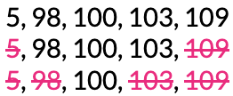
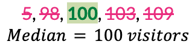
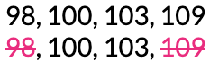
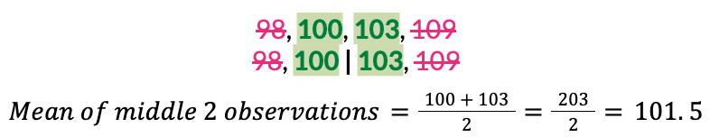
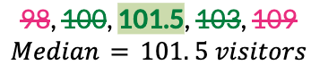

##**<u>Lesson 15: When the Mean is Unfair – Introducing the Median</u>**

###**Objective:**
Students will recognize how extreme values can disproportionately influence the mean, leading to a potentially “unfair” or misleading representation of the typical value. They will learn to identify the median as another measure of center, and will understand the median is not affected by extreme values.

###**Materials:**
1. Carnival Cards [cards A, B, C, D, E] ([LMR_U1_L15_A_Carnival_Cards](../MSDS_Curriculum/2_MSDS_LMRs/MSDS_LMR_Unit_1/LMR_U1_L15_A.pdf))

    ***Advanced preparation required.*** *See Class Setup section for additional details.*

###**Vocabulary:**
[extreme value](../../vocabulary/unit1/#extreme-value "a value that lies outside the typical range of values of the other data points"){ .md-button }
[median](../../vocabulary/unit1/#median "the middle value when the observations are sorted from lowest to highest"){ .md-button }

###**Essential Concepts:**

!!! note "Essential Concepts: "
    The mean does not always represent the typical value in a dataset. When a dataset includes extreme values, the mean can be pulled away from the majority of the data. The median, or middle value, is sometimes a more reliable measure of center because it is less affected by unusually large or small values.

###**Lesson:**

<h3>Class Setup</h3>

- ***Advanced preparation required.***

    - Prior to class, print and cut out one set of the Attractions A, B, C, D, E from the Carnival Cards document ([LMR_U1_L15_A](../MSDS_Curriculum/2_MSDS_LMRs/MSDS_LMR_Unit_1/LMR_U1_L15_A.pdf)).   
    ***NOTE***: Five additional Attraction cards (labeled as Attractions F, G, H, J, K) are provided and will be used during Lesson 16. However, teachers may also use them during this lesson to enhance or enrich the discussion. *See Step 5 below.*
doc preview
     

<h3>Opening</h3>

1. Remind students that, during the previous lessons, they learned about the **mean** and the **MAD** (Mean Absolute Deviation).

    100. The mean is a measure of center. It is the average value of the data points. We also called it the fair share value.

    100. The MAD is a measure of spread. It measures how spread out data can be, or how far the data values tend to be from the mean. 

2. Introduce the idea of “unfairness.” 

    100. In the previous lesson, we discussed how the **mean** is a way to give everyone a “fair share.” 

    100. But what if one value is a lot higher or a lot lower than the others? This is where it gets a bit tricky! This can sometimes make the typical value seem a bit unfair or misleading.

3. Today, detectives will investigate a new measure of center that can help when the mean becomes unfair

    
<h3>Concept Development</h3>

    <b><i>Part 1: When the Mean Isn't “Fair” – The Impact of Extreme Values</b></i>

4. Propose the following scenario:

    100. The DSU wants to review data from the school’s annual carnival to determine which attractions are the most popular.

    100. When the carnival begins in the morning, there are 5 open attractions to ride.

5. Ask 5 volunteers to come to the front of the classroom and give each of them one of the Carnival Cards ([LMR_U1_L15_A](../MSDS_Curriculum/2_MSDS_LMRs/MSDS_LMR_Unit_1/LMR_U1_L15_A.pdf)). Have them stand in order from left to right based on their Attraction letter (A, B, C, D, E). Let each student describe what attraction is on their card, as well as its number of visitors. 

    100. Attraction A: Hot Air Balloon – 5 visitors

    100. Attraction B: Ferris Wheel – 100 visitors

    100. Attraction C: Merry-Go-Round – 103 visitors

    100. Attraction D: Roller Coaster – 98 visitors

    100. Attraction E: Swings – 109 visitor
        
        <table class="te" style="width:75%;margin:0 auto;">
            <tr>
            <th class="te-88im" style="width:15%;"></th>
            <th class="te-88nc" style="width:65%;"><b>Enrichment or Extension: 
            <i>Use of Optional Additional Attraction Cards for Larger Dataset</i></b>  
            Five additional attraction cards have been provided for your convenience in the Carnival Cards document (<a href="../MSDS_Curriculum/2_MSDS_LMRs/MSDS_LMR_Unit_1/LMR_U1_L15_A">LMR_U1_L15_A</a>). <ul>
            <li>They may be used to discuss how extreme values affect the mean differently depending on the size of the dataset.</li></ul>
            </th>
            </tr>
        </table>

6. Ask the seated students to discuss their observations about the 5 values. Lead the discussion with the following questions:

    100. Did each attraction have the same number of visitors during the carnival? *Sample answer: No. Most attractions had close to 100 visitors, but not all of them.* 

    100. Which attraction has an unusual number of visitors? Did it have more or less visitors than the other attractions? *Sample answer: The Hot Air Balloon had an unusually low number of visitors. It had much less than all of the other attractions.* 

    100. If we were to plot these data values, what shape would their distribution have? *Sample answer: The distribution would be skewed to the left.* 

    100. Why might the Hot Air Balloon attraction have had so few visitors? *Sample answer: There might have been a malfunction with the mechanical parts of the ride. Severe weather (extreme wind) might have restricted the balloon from taking off. The carnival operator might have forgotten to refuel the propane tank.* 

7. Based on our current knowledge, what value would we say is typical for each attraction? Calculate it and discuss the results. 

    100. How many visitors typically visit each attraction? What would be the mean number of visitors? 

        

    100. Does this seem like a “fair” value to measure the center of these data points? *Sample answer: No. Most of our values were close to 100, but the mean is only 83.* 

    100. Do you think the mean is too high or too low? *Sample answer: The mean value of 83 seems too low.* 

    100. The Hot Air Balloon’s single extreme value lies outside the typical range of values of the other data points. What effect does this value have on the mean? *Sample answer: The low visitor count of 5 is pulling the mean value to a lower number than what we might consider typical.* 

    <b><i>Part 2: Meeting in the Middle</b></i>

8. Explain that one way to find a more “fair” number for typical (or center) is to simply look at the middle value. This is called the median. 

9. Ask students: Based on the current line-up of the 5 attractions, which one would we classify as the middle? Sample answer: Answers will vary, but students will likely choose Attraction C: Merry-Go-Round. 

10. Lead the discussion toward the idea that we need to order the attractions based on their numerical values first. We can only find a median when the observations are sorted from lowest to highest.

    100. What order should our volunteers stand in now? *Answer: A, D, B, C, E.*

    100. Calculate the median number of visitors for the 5 attractions.

        100. Demonstrate how to cross off, or remove, observations from both ends until only the middle value is left.
            

        100. With an odd number of observations, there is only one value left in the middle. This left-over value is the median.
            

            
            <table class="ta" style="width:75%;margin:0 auto;">
            <tr>
            <th class="ta-88im" style="width:15%;">
            </th>
            <th class="ta-88nc" style="width:65%;"><b>ADDITIONAL SUPPORT: 
            <i>Visual and Kinesthetic Experience for Diverse Learners</i></b>  
            Have students on each end of the line step away from the group. Once they are out of the way, have the students who are now at each end of the line step away from the group. Repeat the process until only 1 student remains.   
            <b><i>Written Resource for Diverse Learners</i></b>   
            Display the written steps for finding the median. <ol>
            <li>Put the numbers in order from smallest to largest.</li>
            <li>Find the middle number. If there are two middle numbers, add them and divide by 2.</li></ol></th>
            </tr>
            </table>

11. Ask students: Which measure of center, the mean (83 visitors) or the median (100 visitors), better represents the typical number of visitors at each carnival attraction? *Answer: The median is more representative because it is closer to most of the values, and it is not affected by the lower extreme value from the Hot Air Balloon.* 

12. Now propose a slightly modified scenario about the carnival: Since the Hot Air Balloon was not open for the entire day, one detective recommended that we just ignore the extreme value and remove it from the dataset.

    100. Calculate the mean number of visitors for the attractions without the Hot Air Balloon’s low value of 5.

        

    
    100. Calculate the median number of visitors for the attractions when we exclude the low value of 5 from the Hot Air Balloon. 

        100. Demonstrate how to cross off, or remove, observations from both ends until only the middle value is left. 
            

        100. With an even number of observations, there are two values left in the middle. The median is exactly halfway between these two values, which means we need to find their average.
            

            

    100. How do the new mean and median values compare to each other? *Sample answer: The mean and median are very close to each other. The mean is 102.5 and the median is 101.5.*

    100. How do measures of center change when we include or exclude extreme values? 

        100. When extreme values are included: *Mean = 83, Median = 100.* 

        100. When extreme values are excluded: *Mean = 102.5, Median = 101.5.* 

        100. Key Takeaways: The mean is heavily affected by extreme values; it will decrease with extreme low values and increase with extreme high values. The median is not affected by extreme values.

13. Lead a discussion about when students think it might be better to use the mean as a measure of center? When might it be better to use the median? Guide students to the following conclusions:

    100. The mean is good for symmetric and uniform data, or data with no extreme values.

    100. The median is better for skewed data, or data with extreme values

    <b><i>Part 3: Exploring How Extreme Values Affect the MAD</b></i>

14. Now that the data detectives have seen how extreme values affect the mean, ask them to make predictions about how the MAD might be affected. 

    100. Do you think extreme values will increase or decrease the MAD? Explain. *Sample answer: Since the data points have more variation, the MAD should be higher.* 

    100. Do you think the MAD will increase or decrease when extreme low values are present? What about when extreme high values are present? Is there a difference? Explain. *Sample answer: The MAD will increase in both scenarios because we calculate the absolute deviation. Any deviation that is really large will increase the MAD.* 

15. Using the Parallel Tasks strategy, allow students to partner up with their nearest table neighbor. 

    100. Partner A’s task is to calculate the MAD for the dataset with all 5 carnival attractions, including the Hot Air Balloon.

    100. Partner B’s task is to calculate the MAD for the dataset of 4 carnival attractions that excludes the Hot Air Balloon.
        
        <table class="ts" style="width:75%;margin:0 auto;">
        <tr>
        <th class="ts-88im" style="width:15%;"></th>
        <th class="ts-88nc" style="width:65%;"><b>STRATEGY: 
        <i>Parallel Tasks</i></b> <ul>
        <li><i>Design the Task</i>: Create two versions of a task that target the same mathematical concept but differ in complexity or dataset size. In general, both tasks should require students to perform the same calculation (ex. Mean, MAD, etc.)</li>
        <li><i>Assign Partner Roles</i>: Pair students with their nearest table neighbor and assign them the role of Partner A or Partner B.</li>
        <li><i>Calculate Independently</i>: Each partner should work independently to solve their specific task.</li>
        <li><i>Reveal and Compare Results</i>: Have partners swap results and discuss the differences. Use guiding questions to help them bridge the two tasks: <ul>
        <li>How did the extra data point change the result?</li>
        <li>What does the difference in our answers tell us about the math concept?</li></ul>
        </li></ul></th>
        </tr>
        </table> 

16. Once students have completed their calculations and discussed the results with their partner, bring the whole class back together to synthesize the findings.
    
    <table class="ttg" style="margin-right: auto; margin-left: auto";>
    <tr>
    <td class="ttg-y55z"><b>MAD Calculation for Partner A:</b></td>
    <td class="ttg-y55z"><b>MAD Calculation for Partner B:</b></td>
    </tr>
    <tr>
    <td class="ttg-y55z">Data Values: 5, 98, 100, 103, 109  
    Mean: 83     
    Absolute Deviations: |<i>observations - mean</i>|   
    &nbsp;&nbsp;&nbsp;&nbsp;&nbsp;&nbsp;&nbsp;&nbsp;  
    &nbsp;&nbsp;&nbsp;&nbsp;&nbsp;&nbsp;&nbsp;&nbsp;  
    &nbsp;&nbsp;&nbsp;&nbsp;&nbsp;&nbsp;&nbsp;&nbsp;  
    &nbsp;&nbsp;&nbsp;&nbsp;&nbsp;&nbsp;&nbsp;&nbsp;  
    &nbsp;&nbsp;&nbsp;&nbsp;&nbsp;&nbsp;&nbsp;&nbsp;    
    </td>
    <td class="ttg-y55z">Data Values: 98, 100, 103, 109  
    Mean: 102.5     
    Absolute Deviations: |<i>observations - mean</i>|   
    &nbsp;&nbsp;&nbsp;&nbsp;&nbsp;&nbsp;&nbsp;&nbsp;  
    &nbsp;&nbsp;&nbsp;&nbsp;&nbsp;&nbsp;&nbsp;&nbsp;  
    &nbsp;&nbsp;&nbsp;&nbsp;&nbsp;&nbsp;&nbsp;&nbsp;  
    &nbsp;&nbsp;&nbsp;&nbsp;&nbsp;&nbsp;&nbsp;&nbsp;       
    </td>
    </tr>
    </table>

    100. Which set of data had the higher MAD? Is this what our class predicted? Does it make sense? *Answer: The dataset with extreme values had the higher MAD, which makes sense because the points varied more from the mean value.* 

    100. What does this tell us about how extreme values affect the MAD? *Answer: The MAD is heavily influenced by extreme values. It will increase when a dataset includes extreme low values and extreme high values.* 

    
<h3>Closing</h3>

17. Recap: Today, we learned about the median and how it is not influenced by extreme values. We learned that it is a consistent measure that describes the center of a distribution. 

18. Have students combine all of the knowledge from today’s lesson into a T-Chart like the one below.

    
    <table class="ttg" style="margin-right: auto; margin-left: auto";>
    <tr>
    <th class="ttg-zzzz">Including Extreme Value(s)</th>
    <th class="ttg-zzzz">Excluding Extreme Value(s)</th>
    </tr>
    <tr>
    <td class="ttg-y55z">Distribution Shapes:  
    &nbsp;&nbsp;&nbsp;&nbsp;&nbsp;&nbsp;&nbsp;&nbsp;skewed left, skewed right</td>
    <td class="ttg-y55z">Distribution Shapes:  
    &nbsp;&nbsp;&nbsp;&nbsp;&nbsp;&nbsp;&nbsp;&nbsp;symmetric, uniform</td>
    </tr>
    <tr>
    <td class="ttg-y55z">Mean is affected. Median is not affected.    
    The MAD is high. More variation in the data. </td>
    <td class="ttg-y55z">Mean &asymp; Median    
    The MAD is low. Less variation in the data. </td>
    </tr>
    </table>

