##**<u>Lesson 16: Boxing Up the Evidence</u>**

###**Objective:**
Students will be able to identify the components of the five-number summary (minimum, Q1, median, Q3, maximum) by physically ordering themselves. They will calculate the interquartile range (IQR), hand-draw a boxplot from the five-number summary, and interpret the shape of the distribution.

###**Materials:**
1. Carnival Cards [from Lesson 15, full set - cards A, B, C, D, E, F, G, H, I, J, K] ([LMR_U1_L15_A_Carnival_Cards](../MSDS_Curriculum/2_MSDS_LMRs/MSDS_LMR_Unit_1/LMR_U1_L15_A.pdf))

    ***Advanced preparation required.*** *See Class Setup section for additional details.*

2. Painter's Tape (to mark a number line on the floor)

    ***Advanced preparation required.*** *See Class Setup section for additional details.*

3. ***OPTIONAL***: Five-Number Summary Labels ([LMR_U1_L16_A_Five-Number_Summary_Labels](../MSDS_Curriculum/2_MSDS_LMRs/MSDS_LMR_Unit_1/LMR_U1_L16_A.pdf))

    ***Advanced preparation required.*** *See Class Setup section for additional details.*

4. Building Boxplots Handout ([LMR_U1_L16_B_Building_Boxplots](../MSDS_Curriculum/2_MSDS_LMRs/MSDS_LMR_Unit_1/LMR_U1_L16_B.pdf))

###**Vocabulary:**
[quartile(s)](../../vocabulary/unit1/#quartiles "values that divide an ordered set of numerical points into four equal parts"){ .md-button }
[Q1](../../vocabulary/unit1/#q1 "the median value of the lower half of an ordered set of numerical points; also referred to as Quartile 1"){ .md-button }
[Q3](../../vocabulary/unit1/#q3 "the median value of the upper half of an ordered set of numerical points; also referred to as Quartile 3"){ .md-button }
[five-number summary](../../vocabulary/unit1/#five-number-summary "the five anchor points for a boxplot; the minimum value, Q1 value, median value, Q3 value, and maximum value"){ .md-button }
[interquartile range (IQR)](../../vocabulary/unit1/#interquartile-range-iqr "a numerical difference between two quartile values, specifically Q3 and Q1"){ .md-button }

###**Essential Concepts:**

!!! note "Essential Concepts: "
    Boxplots provide a visual summary of the distribution of numerical data, highlighting its center (median) and spread (IQR, range). They show where the middle 50% of the data lies and the overall range. Manual construction helps solidify understanding of each component.

###**Lesson:**

<h3>Class Setup</h3>

- ***Advanced preparation required.***

     - ***OPTIONAL*** Resource: If preferred or needed, print one set of signs from the Five-Number Summary Labels document ([LMR_U1_L16_A](../MSDS_Curriculum/2_MSDS_LMRs/MSDS_LMR_Unit_1/LMR_U1_L16_A.pdf)).  
     ***NOTE***: There are three different options to choose from for the Q1 and Q3 signs; select the option that is most appropriate for your students’ learning needs.
     
<iframe src="https://docs.google.com/viewerng/viewer?url=https://mscurriculum.thinkdataed.org/MSDS_Curriculum/2_MSDS_LMRs/MSDS_LMR_Unit_1/LMR_U1_L16_A.pdf&embedded=true" style=" width:420px;height:400px;" frameborder="0"></iframe> [LMR_U1_L16_A](../MSDS_Curriculum/2_MSDS_LMRs/MSDS_LMR_Unit_1/LMR_U1_L16_A.pdf)

     - Print and cut out one set of all ten Attractions (A, B, C, D, E, F, G, H, J, K) from the Carnival Cards document ([LMR_U1_L15_A](../MSDS_Curriculum/2_MSDS_LMRs/MSDS_LMR_Unit_1/LMR_U1_L15_A.pdf)).
     
<iframe src="https://docs.google.com/viewerng/viewer?url=https://mscurriculum.thinkdataed.org/MSDS_Curriculum/2_MSDS_LMRs/MSDS_LMR_Unit_1/LMR_U1_L15_A.pdf&embedded=true" style=" width:420px;height:400px;" frameborder="0"></iframe> [LMR_U1_L15_A](../MSDS_Curriculum/2_MSDS_LMRs/MSDS_LMR_Unit_1/LMR_U1_L15_A.pdf)

     - Place a long strip of tape on the floor horizontally so that it spans most of the length of your classroom. Label tick marks at values 0, 20, 40, 60, 80, 100, and 120 at evenly spaced intervals. The length of the entire number line should be long enough that students have plenty of space to stand at a particular value without overlapping each other.

<h3>Opening</h3>

1. Lesson Hook: The Carnival Returns!

    100. Remind students that, in [Lesson 15](lesson15.md), they investigated the Carnival attraction data and made observations about the visitor count. 

        100. Ask students to recall what effects extreme values have on the mean compared to the median. ***Sample answer: The Hot Air Balloon’s unusually low visitor count of 5 pulled the mean to 83 visitors, which was lower than where we thought the center would be. Conversely, the extreme values had no effect on the median.*** 

        100. Summarize the conclusions: 

            100. The median is not affected by extreme values, so it is considered a more representative measure of center.
            100. The mean and MAD are affected by extreme values. Because the Hot Air Balloon had an unusually low visitor count, the mean value was pulled in that direction and resulted in a lower-than-expected mean.

    100. Good news! The Carnival was a huge success, so the school decided to double the number of attractions to 10. They would like the DSU to make some initial observations about this larger dataset.

    100. Ask 10 volunteers to come to the front of the classroom and give each of them one of the Carnival Cards ([LMR_U1_L15_A](../MSDS_Curriculum/2_MSDS_LMRs/MSDS_LMR_Unit_1/LMR_U1_L15_A.pdf)). Have them stand in order from left to right based on their Attraction letter (A, B, C, D, E, F, G, H, J, K). Let each student describe what attraction is on their card, as well as its number of visitors. 

        100. Attraction A: Hot Air Balloon – 5 visitors

        100. Attraction B: Ferris Wheel – 100 visitors

        100. Attraction C: Merry-Go-Round – 103 visitors

        100. Attraction D: Roller Coaster – 98 visitors

        100. Attraction E: Swings – 109 visitors

        100. Attraction F: Balloon Stand – 78 visitors

        100. Attraction G: Candy Cart – 67 visitors

        100. Attraction H: Drinks Tent – 103 visitors

        100. Attraction J: Duck Racing Game – 114 visitors

        100. Attraction K: Pizza Pavilion – 99 visitors

    100. Instruct the 10 volunteers to quietly arrange and order their values by standing at the appropriate locations on the tape number line.

        100. Once they are sorted and in final positions, ask the observing students to agree or disagree with the order/placement. Does everyone agree? Are there any cards that need to be swapped or moved around?

        100. When all students agree, have the standing volunteers read their values aloud from left to right to confirm the order: 5, 67, 78, 98, 99, 100, 103, 103, 109, 114.

        
        <table class="ta" style="width:75%;margin:0 auto;">
        <tr>
        <th class="ta-88im" style="width:15%;">
        </th>
        <th class="ta-88nc" style="width:65%;"><b>ADDITIONAL SUPPORT: 
        <i>Written Reference for Diverse Learners</i></b> <ul>
        <li><i>Visual Guide on Board</i>: Write all 10 values on the board as students read them out so the class can see the full sorted dataset. This helps students who need a visual reference to follow along during the quartile-finding steps later in the lesson.</li></ul></th>
        </tr>
        </table>

2. Introduce the main topic for today by displaying a generic boxplot on the board for students to recall this type of plot (see Lesson 8) and have a visual guide to reference throughout the lesson. ***Sample plot:***

    
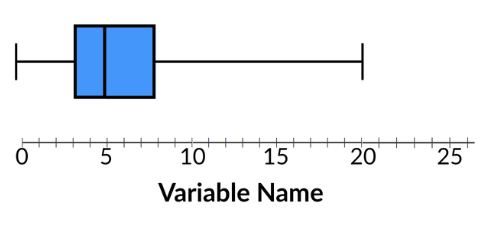

3. Ask students to list some visual features from the plot that stand out to them. ***Answers will likely vary by class, but some possible sample answers are provided here:*** 

    100. ***Sample Answer 1: There are clear identifiers for the lowest and highest values.***

    100. ***Sample Answer 2: There is a rectangle, or box, somewhere between the highest and lowest values.***

    100. ***Sample Answer 3: There is a vertical line inside of the box.***

    100. ***Sample Answer 4: There are horizontal lines that extend from the left and right side of the box that attach to the lowest and highest values.***

    
<h3>Concept Development</h3>

    <b><i>Part 1: Identifying Anchor Points</b></i>

4. Ask the class to identify the minimum and maximum values. Guide the discussion with the following questions:

    100. Which attraction had the fewest number of visitors? How many visitors went to this attraction? ***Answer: The Hot Air Balloon had the lowest attendance with only 5 visitors showing up.***

    100. Which attraction had the most number of visitors? How many visitors went to this attraction? ***Answer: The Duck Racing Game had the highest attendance with 114 total visitors.***

5. Distribute the MINIMUM ([LMR_U1_L16_A](../MSDS_Curriculum/2_MSDS_LMRs/MSDS_LMR_Unit_1/LMR_U1_L16_A.pdf), page 1) and MAXIMUM ([LMR_U1_L16_A](../MSDS_Curriculum/2_MSDS_LMRs/MSDS_LMR_Unit_1/LMR_U1_L16_A.pdf), page 2) signs to their respective card-holders so the entire class has a visual reference for their positions.

6. Lead a discussion for finding the median. In [Lesson 15](lesson15.md), there were 5 values (an ODD number of data points), so it was easy to point out the exact middle volunteer. Ask students to explain what is different for the median now that there are 10 values (an EVEN number of data points). 

    100. Guide students to see that, with an even number of data points, there is not a single middle position. Instead, we have to decide a median value by using both of the remaining middle two attractions at position 5 (Pizza Pavilion – 99 visitors) and position 6 (Ferris Wheel, 100 visitors).

        
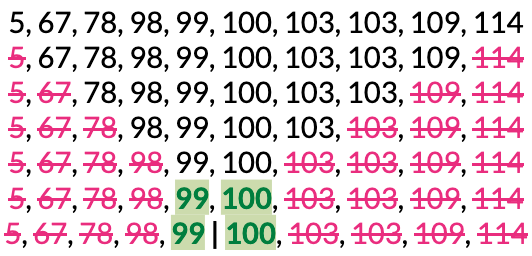

    100. Have the student volunteers with these two cards step forward and read their values aloud again. 

    100. Ask students what they think we should do with these two values to find the median. ***Answer: We should calculate their mean.**

    100. Let students calculate and report the median value. Then, explain that because the median falls between these two values, neither student “is” the median, but together they show us exactly where the center of the data is.

        
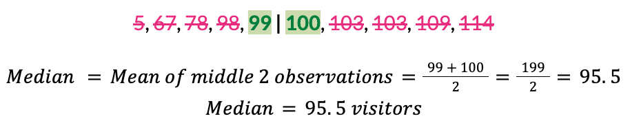

    100. Ask for a new volunteer. Give them the MEDIAN ([LMR_U1_L16_A](../MSDS_Curriculum/2_MSDS_LMRs/MSDS_LMR_Unit_1/LMR_U1_L16_A.pdf), page 3) sign and ask them to stand on the tape number line at the median value of 99.5.  
    ***NOTE***: The MINIMUM and MAXIMUM labels have been shortened to MIN and MAX in the visual to save space.
        
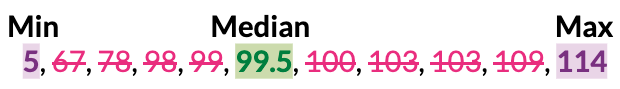

    
    <table class="ta" style="width:75%;margin:0 auto;">
    <tr>
    <th class="ta-88im" style="width:15%;">
    </th>
    <th class="ta-88nc" style="width:65%;"><b>ADDITIONAL SUPPORT: 
    <i>Visual Resources for Diverse Learners</i></b> <ul>
    <li><i>Visual Guide on Board</i>: Circle the minimum, maximum, and median values of the written list of numbers. Since the median is between two values, you can start by circling both and then draw a vertical line between them to note the actual median value, or add the new value to the list.</li></ul></th>
    </tr>
    </table>

    <b><i>Part 2: Quartering the Data - Finding Q1 & Q3</b></i>

7. So far, we have identified three distinct values from the Carnival data: the minimum, the maximum, and the median. They will serve as anchor points when we start making our boxplot.

8. Ask the standing volunteers to split themselves in half based on whether their card value is above or below the median value.

    100. How many groups did they create? ***Answer: 2 groups.***

    100. How many students/attractions are in each group? ***Answer: 5 students/attractions.***
        
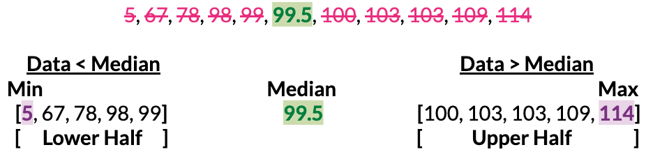

9. Explain that splitting the data in half does not tell us a lot of information about the overall shape of a distribution, so let’s split each group in half again. How might we do that? Lead the discussion using the following questions:

    100. How many groups will be created by splitting each of the halves in half? ***Answer: 4 groups.***

    100. What is another term we can use to describe splitting something into four equal parts? ***Answer: Quarter(s). One part out of four equal parts is one quarter.***

    100. How might we determine where to split the data for each group? ***Answer: We already know how to calculate medians, so we can simply calculate a median for the lower group and a median for the higher group.*** 

    100. Allow students time to calculate the medians for each group and have them report their findings.
        
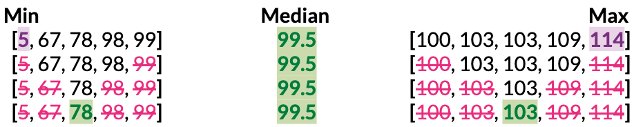

10. Once identified, share that these anchor points are called **quartiles**. The quartile in the lower half is called **Quartile 1**, which data scientists usually shorten to **Q1**; the quartile in the upper half is called **Quartile 3**, or **Q3** for short. 

    100. Students should notice that there are TWO attractions in the upper group that have values of 103 (Merry-Go-Round and the Drinks Tent). 
        
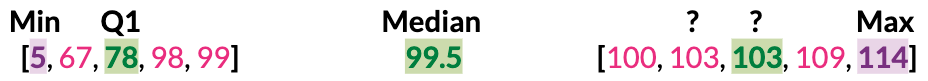

    100. Explain that it does not matter which attraction holds the sign since the values are the same, but the sign does need to be held by whoever is standing at the middle position of the group.
        
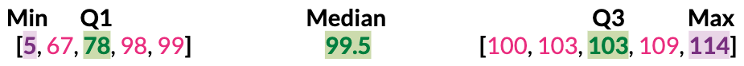

    100. Give the student standing at the Q1 value (Balloon Stand – 78 visitors) one of the following quartile signs:
        100. QUARTILE 1 [Q1] sign ([LMR_U1_L16_A](../MSDS_Curriculum/2_MSDS_LMRs/MSDS_LMR_Unit_1/LMR_U1_L16_A.pdf), page 4) 

        100. QUARTILE 1 sign ([LMR_U1_L16_A](../MSDS_Curriculum/2_MSDS_LMRs/MSDS_LMR_Unit_1/LMR_U1_L16_A.pdf), page 5) 

        100. Q1 sign ([LMR_U1_L16_A](../MSDS_Curriculum/2_MSDS_LMRs/MSDS_LMR_Unit_1/LMR_U1_L16_A.pdf), page 6) 

    100. Give one of the students with a value of 103 one of the following quartile signs, but make sure that they end in the middle position for the upper half of points:
        100. QUARTILE 3 [Q3] sign ([LMR_U1_L16_A](../MSDS_Curriculum/2_MSDS_LMRs/MSDS_LMR_Unit_1/LMR_U1_L16_A.pdf), page 7) 
        
        100. QUARTILE 3 sign ([LMR_U1_L16_A](../MSDS_Curriculum/2_MSDS_LMRs/MSDS_LMR_Unit_1/LMR_U1_L16_A.pdf), page 8) 

        100. Q3 sign ([LMR_U1_L16_A](../MSDS_Curriculum/2_MSDS_LMRs/MSDS_LMR_Unit_1/LMR_U1_L16_A.pdf), page 9) 

    
    <table class="ta" style="width:75%;margin:0 auto;">
    <tr>
    <th class="ta-88im" style="width:15%;">
    </th>
    <th class="ta-88nc" style="width:65%;"><b>ADDITIONAL SUPPORT: 
    <i>Real World Connection for Diverse Learners</i></b> <ul>
    <li><i>Visual Guide on Board</i>: If students are confused by the tie at Q3, use an analogy: Imagine two students tied for 3rd place in a race. Both are equally "3rd." The same is true here -> both the Merry-Go-Round and the Drinks Tent are tied at the Q3 position.</li></ul></th>
    </tr>
    </table>

    
    <table class="te" style="width:75%;margin:0 auto;">
    <tr>
    <th class="te-88im" style="width:15%;"></th>
    <th class="te-88nc" style="width:65%;"><b>Enrichment or Extension: 
    <i>Connect the Median to Quartiles</i></b>  
    Ask: Why do we go from Quartile 1 (Q1) to Quartile 3 (Q3)? What about Quartile 2 (Q2)?<ul>
    <li><i>Answer: Q2 is actually the median! They are the same (Q2 = median)!</i></li></ul>
    </th>
    </tr>
    </table>

11. With the five signs in place, have students recognize that we have split the data into 4 groups of equal size. Essentially, we have “quartered the data.”

    
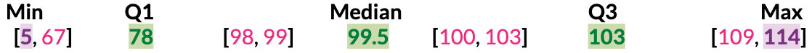

12. Ask students what “quartering the data” means in terms of percentages. ***Answer:*** 1/4 = 0.25 = 25%.

    
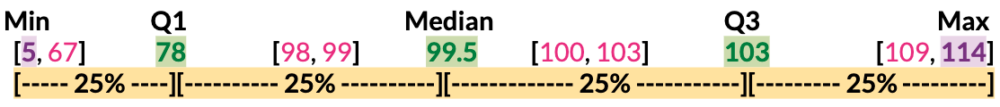

13. Instruct the standing students to return to their desks. 

14. Introduce the **interquartile range**, also known as the **IQR**. Allow students to reason through what this term means based on their current knowledge of data science vocabulary. 

    100. *Range*: The numerical difference between a minimum and maximum value.

    100. *Quartiles*: Values that divide an ordered dataset into four equal parts

    100. Based on these two terms, guide students to understand that the **interquartile range (IQR)** is simply a numerical difference between two quartile values, specifically Q3 and Q1. 

    100. Students should calculate the value.  
        &nbsp;&nbsp;&nbsp;&nbsp;&nbsp;&nbsp;&nbsp;&nbsp;<i>IQR = Q3 - Q1  
        &nbsp;&nbsp;&nbsp;&nbsp;&nbsp;&nbsp;&nbsp;&nbsp;IQR = 103 - 78  
        &nbsp;&nbsp;&nbsp;&nbsp;&nbsp;&nbsp;&nbsp;&nbsp;IQR = 25 </i>

    100. You can also continue the number line visual by combining the space between Q1 and Q3 into one big chunk so students can see that the IQR also represents the <u><i>middle 50% of the data</u></i>.
        
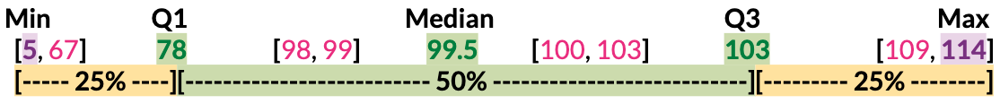

15. Connect IQR to prior learning: Have students recall that the MAD is one measure of spread, and explain that the IQR is an alternative measure we can use to describe a distribution’s spread. 

    100. What percent of the data is included in the IQR calculation? ***Answer: 50%.***

    100. What percent of the data is included in the MAD calculation? ***Answer: 100%.***

    100. Which measure of spread do you think will be more affected by the extreme value of 5? ***Answer: The MAD since it would have to include that value. In the IQR, the extreme value would not be part of the calculation.***

16. Connect IQR to context: The middle 50% (half) of the Carnival attractions had a spread of 25 visitors since the counts ranged from 78 visitors to 103 visitors.

17. Connect IQR to extreme values: Just like the median, the IQR is not affected by the Hot Air Balloon’s extremely low value of 5 visitors. Encourage further discussion with the following questions:

    100. If the Hot Air Balloon had only 1 visitor instead of 5, would the IQR change? ***Answer: No! The Hot Air Balloon is far below Q1 and would not be included in the calculation.*** 

    100. In the same scenario, would the MAD change? ***Answer: Yes! All values are included in the MAD calculation, so an even more extreme low value would increase the MAD even more.*** 

18. Summarize the learning so far by explaining that the five anchor points we identified are called the **five-number summary**, and that these five values are all we need to draw a boxplot, so we can ignore the other values when we transition to paper.
    
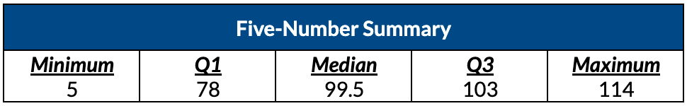

    <b><i>Part 3: Building a Boxplot by Hand</b></i>

19. Draw a number line on the board from 0 to 120, with tick marks at every 10 units. Students should draw the same thing in their notebooks.

    
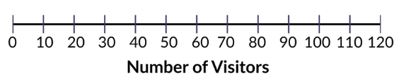

20. Distribute the Building Boxplots handout ([LMR_U1_L16_B](../MSDS_Curriculum/2_MSDS_LMRs/MSDS_LMR_Unit_1/LMR_U1_L16_B.pdf)) and guide students through Part 2 on how to draw a boxplot on paper using the five-number summary.
    
<iframe src="https://docs.google.com/viewerng/viewer?url=https://mscurriculum.thinkdataed.org/MSDS_Curriculum/2_MSDS_LMRs/MSDS_LMR_Unit_1/LMR_U1_L16_B.pdf&embedded=true" style=" width:420px;height:400px;" frameborder="0"></iframe> [LMR_U1_L16_B](../MSDS_Curriculum/2_MSDS_LMRs/MSDS_LMR_Unit_1/LMR_U1_L16_B.pdf)

    100. <u><b>Step 1</u></b>: Mark a dot above the number line at each of the five anchor values: 5, 78, 99.5, 103, and 114.
        
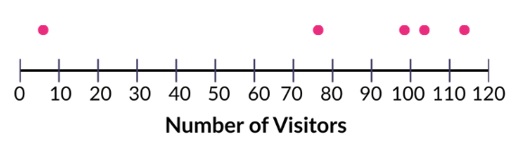

    100. <u><b>Step 2</u></b>: Draw a rectangular box using Q1 (78) as the left edge and Q3 (103) as the right edge. This box is the visual representation of the IQR. 50% of the attractions lie within the box.
        
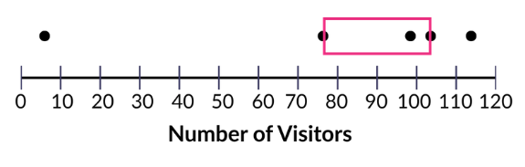

    100. <u><b>Step 3</u></b>: Draw a vertical line inside the box at the median (99.5). This divides the box into the lower-middle 25% and the upper-middle 25%.
        
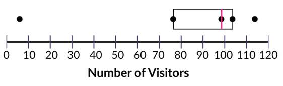

    100. <u><b>Step 4</u></b>: Draw a horizontal line to connect the left edge of the box to the minimum (5). Draw a horizontal line to connect the right edge of the box to the maximum (114). Sometimes, data scientists refer to these lines as the *whiskers* of the boxplot. 
        
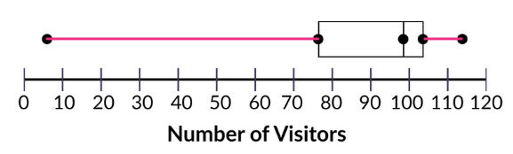

    100. Here are two examples of what the final boxplot might look like:
        
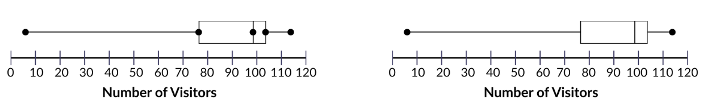

    
    <table class="ta" style="width:75%;margin:0 auto;">
    <tr>
    <th class="ta-88im" style="width:15%;">
    </th>
    <th class="ta-88nc" style="width:65%;"><b>ADDITIONAL SUPPORT: 
    <i>Color-Coding for Diverse Learners</i></b> 
    Consider having students color-code their boxplots: <ul>
    <li>one color for the box (middle 50%)</li>
    <li>a second color for the whiskers</li>
    <li>a third color for the median line</li></ul>
    This reinforces the structural distinction between the IQR and the full range.</th>
    </tr>
    </table>

21. Once students have completed their boxplot drawings, ask them to complete Part 3 of the handout on their own so they can practice their skills in finding the five-number summary, drawing a boxplot, and calculating and interpreting the IQR for new data. ***See answers below:*** 
    

    

    
<h3>Closing</h3>

22. Recap: Today, we became Boxplot Builders! We learned about the Five-Number Summary (Min, Q1, Median, Q3, Max) and how to use these values to draw a boxplot. We also calculated the IQR and described its similarities/differences to MAD.

23. Exit Ticket (if time allows): Display the following five-number summary and ask students to answer the two questions below before leaving.

    
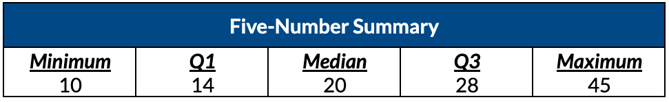

    (1) Calculate the IQR. Show your work. ***Answer: IQR = Q3 - Q1 = 28 - 14 = 14.***

    (2) Use the five-number summary to draw a boxplot for the data. ***Answer:***
    

24. Key Takeaways: Boxplots summarize a distribution using just five values. The IQR is a measure of spread that is not affected by extreme values, unlike the MAD.

25. Transition: In the next lesson, the data detectives will use what they know about boxplots to describe a distribution’s shape, center, and spread and learn to choose the right measures based on shape. 

