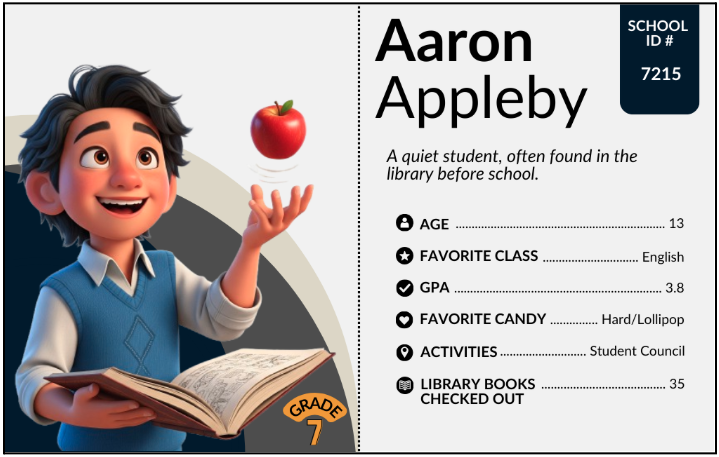
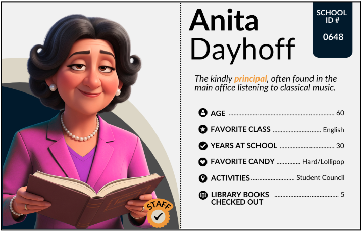

##**<u>Lesson 5: Structuring the Evidence</u>**

###**Objective:**
Students will be able to transfer unstructured data into a structured data table, identify variables as column headers, understand the importance of consistent data entry, and begin to critically assess missing values in the context of investigative clues.

###**Materials:**
1. Suspect Data Cards (**FULL**)

    100. **Print Option(s)** ([LMR_U1_L03_A_Suspect_Data_Cards_FULL](../MSDS_Curriculum/2_MSDS_LMRs/MSDS_LMR_Unit_1/LMR_U1_L03_A.pdf))

    100. **Digital Option(s)** ([LMR_U1_L03_D_DIGITAL_Suspect_Data_Cards_FULL](https://canva.link/0igwvovn65h3985 "https://canva.link/0igwvovn65h3985"))

2. Team poster displays from [Lesson 4](lesson4.md)

3. Candy Culprit Clues [Clue #2] ([LMR_U1_L02_A_Candy_Culprit_Clues](../MSDS_Curriculum/2_MSDS_LMRs/MSDS_LMR_Unit_1/LMR_U1_L02_A.pdf))

4. Data Table Template ([LMR_U1_L05_A_Data_Table_Template](../MSDS_Curriculum/2_MSDS_LMRs/MSDS_LMR_Unit_1/LMR_U1_L05_A.pdf))

5. Candy Culprit Suspect Tracker ([LMR_U1_L05_B_Suspect_Tracker](../MSDS_Curriculum/2_MSDS_LMRs/MSDS_LMR_Unit_1/LMR_U1_L05_B.pdf))

###**Vocabulary:**
[data table](../../vocabulary/unit1/#data-table "a structured arrangement of data in rows and columns"){ .md-button }
[case](../../vocabulary/unit1/#case "an individual person, thing, or event we are observing and collecting data about"){ .md-button }
[attributes](../../vocabulary/unit1/#attributes "a characteristic about an observation; in data science, we call this a variable"){ .md-button }
[variable](../../vocabulary/unit1/#variable "a characteristic that can change or vary for each individual or object"){ .md-button }
[missing value](../../vocabulary/unit1/#data-cycle "a place where information should be, but isn't"){ .md-button }
[numerical variable](../../vocabulary/unit1/#numerical-variable "data that can be expressed as numbers that come from a measurement or count"){ .md-button }
[categorical variable](../../vocabulary/unit1/#categorical-variable "data that can be expressed in distinct, non-numerical categories/ groupings; instead of numbers, we see labels or categories"){ .md-button }

###**Essential Concepts:**

!!! note "Essential Concepts: "
    Organizing data into a structured data table, with rows and columns, is a powerful way to make information easy to search for and analyze. Each column in a data table represents a variable, which is a characteristic that can change or vary for each individual. In real-world data, missing values are common and must be handled carefully. An absence of information does not necessarily provide evidence in one direction or the other.

###**Lesson:**

<h3>Opening</h3>

1. Have all of the poster displays from the previous lesson visible at the front of the classroom. Lead a brief discussion reflecting on the activity and Gallery Walk. Pose these questions:

    100. Which of the displays made it easiest to quickly find a suspect’s information? Why do you think so?

    100. If needed: What organizational structure did the most efficient displays share with each other? 

    100. Which of the displays would be easier for a computer to understand and interpret? What are some characteristics of these displays?

2. Introduce the SECOND CLUE of the Candy Culprit investigation. All of the clues can be found in the Candy Culprit Clues document ([LMR_U1_L02_A](../MSDS_Curriculum/2_MSDS_LMRs/MSDS_LMR_Unit_1/LMR_U1_L02_A.pdf)).

    
<iframe src="https://docs.google.com/viewerng/viewer?url=https://mscurriculum.thinkdataed.org/MSDS_Curriculum/2_MSDS_LMRs/MSDS_LMR_Unit_1/LMR_U1_L02_A.pdf&embedded=true" style=" width:420px;height:400px;" frameborder="0"></iframe> [LMR_U1_L02_A](../MSDS_Curriculum/2_MSDS_LMRs/MSDS_LMR_Unit_1/LMR_U1_L02_A.pdf)

3. Initial Discussion for Clue #2:

    100. What new piece of evidence does this note force us to look at? *Sample answer: GPA.*

    100. What might this mean for our investigation? *Sample answer: The culprit could be a student, or a staff member trying to throw us off the trail by mentioning a student-specific data point.* 

        
        <table class="ta" style="width:75%;margin:0 auto;">
        <tr>
        <th class="ta-88im" style="width:15%;"></th>
        <th class="ta-88nc" style="width:65%;"><b>ADDITIONAL SUPPORT: <i>Prompting Question for Diverse Learners</i></b>  
        Based on what we know about the suspects from the cards, who even has a GPA?  
        *Sample answer: Only the students have GPAs listed. Staff members do not.*
        </th>
        </tr>
        </table>

    
<h3>Concept Development</h3>

    <b><i>Part 1: Data Tables, Cases, and Variables</b></i>

4. Explain to the student detectives that they are going to continue exploring the Suspect Data Cards, but need to level up how they organize the data. Instead of creating abstract representations, we now want to consider a more standardized and universal way to look at data. This is a crucial step for evidence management during any data investigation.

5. Draw the following diagram on the board and ask students how it might have been used to organize our Suspect Card data in a standard way. If any of the team displays from Lesson 4 resemble a table with rows and columns, use that as an example of what a standardized display could look like. 

    
        <table class="tt" style="margin-right: auto; margin-left: auto";>
        <tr>
        <th class="tt-88nd"> </th>
        <th class="tt-88nd"> </th>
        <th class="tt-88nd"> </th>
        <th class="tt-88nd"> </th>
        </tr>
        <tr>
        <td class="tt-yj5z"> </td>
        <td class="tt-yj5z"> </td>
        <td class="tt-yj5z"> </td>
        <td class="tt-yj5z"> </td>
        </tr>
        <tr>
        <td class="tt-yj5z"> </td>
        <td class="tt-yj5z"> </td>
        <td class="tt-yj5z"> </td>
        <td class="tt-yj5z"> </td>
        </tr>
        <tr>
        <td class="tt-yj5z"> </td>
        <td class="tt-yj5z"> </td>
        <td class="tt-yj5z"> </td>
        <td class="tt-yj5z"> </td>
        </tr>
        </table>

6. Introduce the terms **data table**, **case**, **attributes**, and **variable** one at a time. For each term, students should record the term, its definition, and its corresponding diagram. 

    100. **Data Table**: A collection of organized information presented in rows and columns. Rows are organized horizontally and columns are organized vertically.

        
        <table class="tt" style="margin-right: auto; margin-left: auto";>
        <tr>
        <th class="tt-88nd"> </th>
        <th class="tt-88nd"> Column #1</th>
        <th class="tt-88nd"> Column #2</th>
        <th class="tt-88nd"> Column #3</th>
        </tr>
        <tr>
        <td class="tt-yj5z"> Row #1</td>
        <td class="tt-yj5z"> </td>
        <td class="tt-yj5z"> </td>
        <td class="tt-yj5z"> </td>
        </tr>
        <tr>
        <td class="tt-yj5z"> Row #2</td>
        <td class="tt-yj5z"> </td>
        <td class="tt-yj5z"> </td>
        <td class="tt-yj5z"> </td>
        </tr>
        <tr>
        <td class="tt-yj5z"> Row #3</td>
        <td class="tt-yj5z"> </td>
        <td class="tt-yj5z"> </td>
        <td class="tt-yj5z"> </td>
        </tr>
        </table>

    100. What goes in each row? A **case**. A case is an individual person, thing, or event we are observing and collecting data about. In a data table, every row represents one case. So, in our Candy Culprit investigation, each suspect is a case. 

        
        <table class="tt" style="margin-right: auto; margin-left: auto";>
        <tr>
        <th class="tt-88nd"> </th>
        <th class="tt-88nd"> Column #1</th>
        <th class="tt-88nd"> Column #2</th>
        <th class="tt-88nd"> Column #3</th>
        </tr>
        <tr>
        <td class="tt-zj5z"> Case #1</td>
        <td class="tt-zj5z"> </td>
        <td class="tt-zj5z"> </td>
        <td class="tt-zj5z"> </td>
        </tr>
        <tr>
        <td class="tt-yk5z"> Case #2</td>
        <td class="tt-yk5z"> </td>
        <td class="tt-yk5z"> </td>
        <td class="tt-yk5z"> </td>
        </tr>
        <tr>
        <td class="tt-zj5z"> Case #3</td>
        <td class="tt-zj5z"> </td>
        <td class="tt-zj5z"> </td>
        <td class="tt-zj5z"> </td>
        </tr>
        </table>
    
    100. What goes in each column? **Attributes**, or characteristics, about the suspects, like their "Favorite Candy." In data science, we call these attributes **variables**. Point out that the root word of **variable** is "**vary**". Ask a volunteer to share what they think this term means. You can guide the discussion with the following questions:

        100. What does it mean for something to vary? *Sample answer: When a value can change from one observation to the next.*

        100. Did the observations you recorded for the Suspect Data Cards vary? Give an example. *Sample answer: Yes, students wore different colored shirts, so it changed from person to person.*

        100. What are some synonyms for vary? *Sample answer: different, differ, change, contrast, alter, etc.*

        100. Next, explain that **variables** are what we call those groups of characteristics, or **attributes**, that can change from person to person. We call them **variables** because their values **vary** from row to row.

        
        <table class="tt" style="margin-right: auto; margin-left: auto";>
        <tr>
        <th class="tt-88nd"> </th>
        <th class="tt-zj6z"> Variable #1</th>
        <th class="tt-yk6z"> Variable #2</th>
        <th class="tt-zj6z"> Variable #3</th>
        </tr>
        <tr>
        <td class="tt-88nd"> Row #1</td>
        <td class="tt-zj6z"> </td>
        <td class="tt-yk6z"> </td>
        <td class="tt-zj6z"> </td>
        </tr>
        <tr>
        <td class="tt-88nd"> Row #2</td>
        <td class="tt-zj6z"> </td>
        <td class="tt-yk6z"> </td>
        <td class="tt-zj6z"> </td>
        </tr>
        <tr>
        <td class="tt-88nd"> Row #3</td>
        <td class="tt-zj6z"> </td>
        <td class="tt-yk6z"> </td>
        <td class="tt-zj6z"> </td>
        </tr>
        </table>

7. Using the same student teams from [Lesson 4](lesson4.md), engage students in a Variable Brainstorm activity.

    100. Ask a student volunteer to suggest one variable their team might have observed from the data cards, and list the different values the variable could take. *Sample answers: (1) “Favorite Candy” could be a variable because each person’s favorite candy can vary among Chocolate, Chewy/Gummy, or Hard/Lollipop. (2) “Age” could be a variable because the values vary between 11 and 60.*

    100. Team Task: In their groups, ask students to come up with and record a list of possible variables that they collected from the Data Cards. Guide students back to their observations from [Lessons 3](lesson3.md) and [4](lesson4.md) if they need extra support.  
    ***NOTE***: Teams do not need to find every possible variable, but they should identify at least 3 different ones.

    100. Once each team has written down their list of variables, ask them to decide on one variable that is of interest to them. Record the choices on the board for easy reference.

8. Distribute the Data Table Template ([LMR_U1_L05_A](../MSDS_Curriculum/2_MSDS_LMRs/MSDS_LMR_Unit_1/LMR_U1_L05_A.pdf)) to students and guide them through how to set up the first column of the Suspect Data Table using the variable they chose in Step 6. Then, have them select 6 Suspect Data Cards and record the values for their chosen variable.

    
<iframe src="https://docs.google.com/viewerng/viewer?url=https://mscurriculum.thinkdataed.org/MSDS_Curriculum/2_MSDS_LMRs/MSDS_LMR_Unit_1/LMR_U1_L05_A.pdf&embedded=true" style=" width:420px;height:400px;" frameborder="0"></iframe> [LMR_U1_L05_A](../MSDS_Curriculum/2_MSDS_LMRs/MSDS_LMR_Unit_1/LMR_U1_L05_A.pdf)

9. Using the list of variables that other teams came up with, ask students to add more columns to their data table. As a hint, you can tell them that the final data table will include 11 variables. Can they name them all? 

    100. Name

    100. School ID #

    100. Grade

    100. Age

    100. Favorite Class

    100. GPA

    100. Favorite Candy

    100. Activities

    100. Library Books Checked Out – This is a good opportunity to discuss the idea of concise labels in a data table; we might shorten this variable name to just “Books.”

    100. Years at School

    100. Role (student or staff) – This variable might not be as obvious, but it makes sense to include so we can distinguish between students and staff members.

    
        <table class="te" style="width:75%;margin:0 auto;">
        <tr>
        <th class="te-88im" style="width:15%;"></th>
        <th class="te-88nc" style="width:65%;"><b>Enrichment or Extension: <i>Common Guidelines for Assigning Variable Names in Datasets</i></b>  
        <ul>
        <li>Avoid using spaces. Instead, use an underscore symbol (`_`) or mixed-case capitals.  
        AVOID: `Student Name`, `student name`  
        TRY: `Student_Name`, `student_name`, `studentName`, `StudentName`</li>
        <li>Include units of measurement when appropriate.  
        AVOID: `distance`, `height`  
        TRY: `distance_km`, `distanceMiles`, `height_cm`, `heightInches`</li>
        <li>Aim for clarity over brevity.  
        AVOID: `years`
        TRY: `yearsInSchool`, `yearsWorking`</li></ul></th>
        </tr>
        </table>

10. Have students complete the entire row of data for Aaron Appleby.

    
    <table class="tc" style="width:80%;margin:0 auto;">
    <tr>
    <th style="width:50%;">
    a. Name: Aaron Appleby  
    b. School ID #: 7215  
    c. Grade: 7th  
    d. Age: 13  
    e. Favorite Class: English  
    f. GPA: 3.8  
    g. Favorite Candy: Hard/Lollipop  
    h. Activities: Student Council  
    i. Books: 35  
    j. Years at School: [leave blank]  
    k. Role: Student</th>
    <th style="width:50%;">  
    </th>
    </tr>
    </table>

11. Then, have students complete the entire row of data for Anita Dayhoff.

    
    <table class="tc" style="width:80%;margin:0 auto;">
    <tr>
    <th style="width:50%;">
    a. Name: Anita Dayhoff  
    b. School ID #: 0648  
    c. Grade: [leave blank]  
    d. Age: 60  
    e. Favorite Class: English  
    f. GPA: [leave blank]  
    g. Favorite Candy: Hard/Lollipop  
    h. Activities: Student Council  
    i. Books: 5  
    j. Years at School: 30  
    k. Role: Staff</th>
    <th style="width:50%;">  
    </th>
    </tr>
    </table>

    <b><i>Part 2: What To Do When Evidence is Missing</b></i>

12. Engage students in a discussion about the places in the data table that they left blank. 

    100. Are there any variables in the student cards that are NOT in the staff cards? What are they? *Sample answer:  Yes. Students have Grade and GPA, but the staff do not.*

    100. Are there any variables in the staff cards that are not in the student cards? What are they? *Sample answer: Yes. Staff have Years at School, but the students do not.* 

13. Formally introduce the concept of **missing values**. In real investigations, detectives often encounter missing values, or places where information should be, but isn't. It could mean that this data does not exist, or simply was not collected.

    100. Refer students back to our newest clue that mentions a “high GPA” and ask: 

        100. Can we complete all 30 rows of our data table using the variable GPA? Why or why not? *Sample answer: No, we can only complete GPA values for students.*

        100. If a suspect doesn’t have a GPA value, what should we write in that cell of the data table? *Sample answer: We can just leave it blank, or we can maybe put a “–” symbol in its place.* 

        100. How does a real-life detective handle missing information when investigating a crime? *Sample answer: They look for other clues, but keep people on the suspect list until a new piece of information comes to light.*

        100. Does the absence of a GPA for staff members mean they are automatically innocent and we can eliminate them from our suspect list? *Sample answer: No! This is a crucial point in real investigations.*

14. Explain that, in the context of the Candy Culprit investigation, when a piece of data about one of the suspects is missing, it doesn't automatically mean that suspect is innocent. It just means we don't have that specific piece of evidence for them. This is a crucial concept in real investigations. We can’t eliminate any staff suspects based on Clue #2 because missing data, in this case, does not equal innocence.

15. Distribute the Candy Culprit Suspect Tracker ([LMR_U1_L05_B](../MSDS_Curriculum/2_MSDS_LMRs/MSDS_LMR_Unit_1/LMR_U1_L05_B.pdf)) and explain that we will be using this handout for the rest of the unit to keep track of who we think might be the Candy Culprit. Ask:

    100. Who can be eliminated at this point in our investigation? Answers will vary, but this is a great opportunity to discuss the ambiguity behind the phrase “high GPA.” 

    
<iframe src="https://docs.google.com/viewerng/viewer?url=https://mscurriculum.thinkdataed.org/MSDS_Curriculum/2_MSDS_LMRs/MSDS_LMR_Unit_1/LMR_U1_L05_B.pdf&embedded=true" style=" width:420px;height:400px;" frameborder="0"></iframe> [LMR_U1_L05_B](../MSDS_Curriculum/2_MSDS_LMRs/MSDS_LMR_Unit_1/LMR_U1_L05_B.pdf)

    <b><i>Part 3: Classifying Variables as Categorical or Numerical</b></i>

16. Direct students back to the data table and ask them to participate in a Think-Pair-Share activity about the actual values they see for each variable. They should answer the following questions in their notebooks:

    100. What type of information did you input in Column #1? Was it words or text? Was it a numerical value?

    100. What values did you observe for the Favorite Class variable? *Sample answer: Words like English, Math, and Social Studies.*

    100. What values did you observe for the Books variable? *Sample answer: Numbers like 1, 5, and 35.*

17. Next, explain that in data science, variables are classified into 2 groups based on their values. Write the following terms on the board and ask student volunteers to add their own definitions to them.

    100. **Numerical Variables**: data that can be expressed as numbers that come from a measurement or count.

        100. Another way to think about it: we can use arithmetic operations on these numbers and the results make sense (ex. Adding up all the values from the Books variable tells us there were #X of books read).

        100. **FUN FACT!**

            100. Not all numbers are numerical! Sometimes, numbers can act as codes that translate to categories. For example, the Grade variable from earlier could have used “sixth” or “6th” instead of the number “6” to denote that a student was in the sixth grade.
            
            100. It typically would not make sense to do arithmetic operations with this variable. Adding up all the 6’s in the Grade column wouldn’t mean that there are 36 Grade levels.
            
        100. **Categorical Variables**: data that can be expressed in distinct, non-numerical categories. Instead of numbers, we see labels or categories.

            100. Another way to think about it: we can use words to describe specific characteristics or qualities about something.

        
        <table class="ta" style="width:75%;margin:0 auto;">
        <tr>
        <th class="ta-88im" style="width:15%;"></th>
        <th class="ta-88nc" style="width:65%;"><b>ADDITIONAL SUPPORT: 
        <i>Create an Anchor Chart for Vocabulary Terms</i></b>  
        Keep the Numerical and Categorial variable definitions displayed. 
        Use icons or letters to help students distinguish between the two variable types:  
        &nbsp;&nbsp;&nbsp;&nbsp;&nbsp;Ex. Use a number sign (#️⃣ or #) or the letter N for Numerical.  
        &nbsp;&nbsp;&nbsp;&nbsp;&nbsp;Ex. Use an ABC block (🔠) or the letter C for categorical
        </th>
        </tr>
        </table>

18. Based on these new definitions, ask students to place the letter N or C above each variable name in the data table based on which variable type they think it is. After they have made their decisions for all 11 variables, share the actual classifications.

    100. Numerical Variables: Age, GPA, Books, Years at School 

    100. Categorical Variables: Name, School ID #, Grade, Favorite Class, Favorite Candy, Activities, Role

    
<h3>Closing</h3>

19. Final Task: Students must input all of the data from the 30 Suspect Cards into their data tables.

20. Key Takeaway: Review that the data table is the official DSU format for all evidence. It standardizes the cases (rows) and variables (columns) and immediately highlights where missing values exist, which prevents false assumptions.

21. Exit Ticket: Students will submit their answers to the question, “If the next Candy Culprit clue is about the variable Years at School, will we be able to eliminate any students? Why or why not? Use the vocabulary words **case**, **variable**, and **missing value** in your answer.”

22. Transition: Announce that in the next lesson, the detectives will learn how to enter this neatly structured data into a digital Detective Toolkit (a specialized computer program) to begin the actual statistical analysis.

