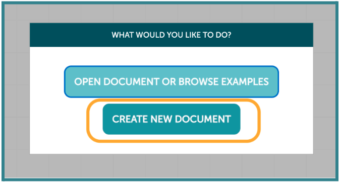
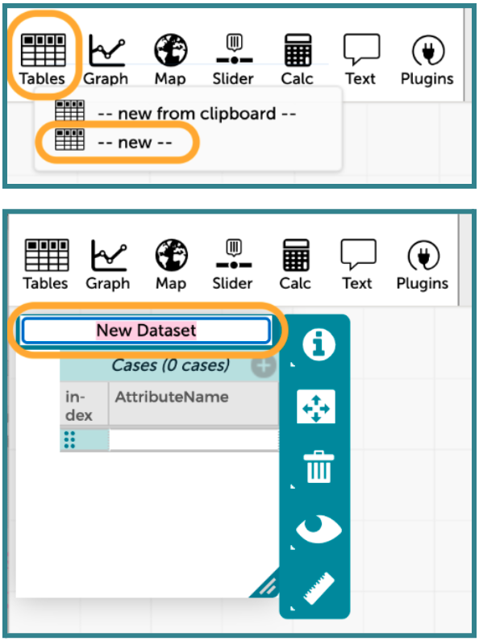
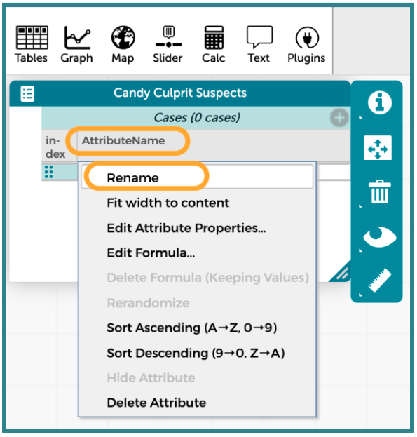
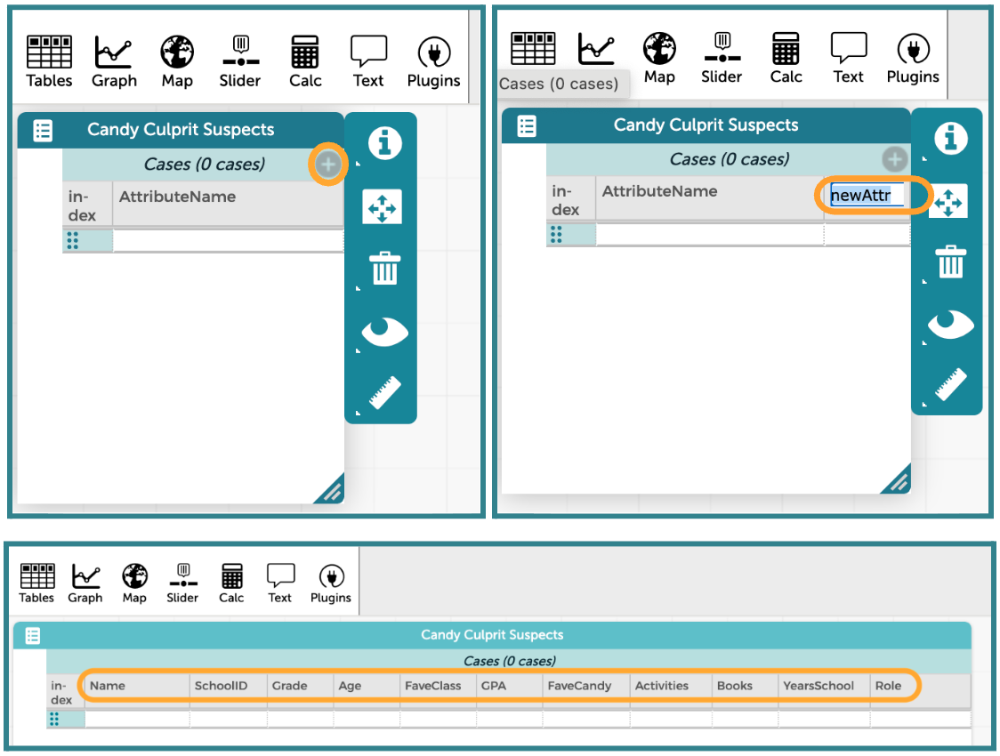

##**<u>Lesson 6: Our Detective Toolkit - CODAP</u>**

###**Objective:**
Students will be able to navigate the CODAP environment, create variables (columns) and enter cases (rows), and understand the difference between the case-card view and the case-table view. They will also be able to verify that CODAP correctly recognizes categorical and numerical variables.

###**Materials:**
1. Computers/tablets with internet access

2. Data Table Template ([LMR_U1_L05_A_Data_Table_Template](../MSDS_Curriculum/2_MSDS_LMRs/MSDS_LMR_Unit_1/LMR_U1_L05_A.pdf)) - completed during [Lesson 5](lesson5.md)

3. [CODAP website](https://codap.concord.org/ "https://codap.concord.org/"){:target="_blank"}

4. Link to a [Blank CODAP File](https://codap.concord.org/app/static/dg/en/cert/index.html "https://codap.concord.org/app/static/dg/en/cert/index.html"){:target="_blank"} (optional)

5. Link to the [CODAP Candy Culprit Suspect Data File](https://codap.concord.org/app/static/dg/en/cert/index.html#shared=https%3A%2F%2Fcfm-shared.concord.org%2FTtznsLR5Tw98ENyde2PN%2Ffile.json "https://codap.concord.org/app/static/dg/en/cert/index.html#shared=https%3A%2F%2Fcfm-shared.concord.org%2FTtznsLR5Tw98ENyde2PN%2Ffile.json"){:target="_blank"}

###**Vocabulary:**
[CODAP](../../vocabulary/unit1/#codap "Common Online Data Analysis Platform"){ .md-button }
[case card](../../vocabulary/unit1/#case-card "a view within CODAP that shows all the data values for an individual observation in our data"){ .md-button }
[case table](../../vocabulary/unit1/#case-table "a view within CODAP that shows all observations and their data values as a table"){ .md-button }

###**Essential Concepts:**

!!! note "Essential Concepts: "
    Data analysis software tools expect data in a particular format, usually the case-attribute format discussed in the previous lesson. However, these tools often make mistakes when reading a data file, and so we must ensure the tool correctly identifies variable types (categorical vs. numerical) to prevent errors in subsequent analysis. 

###**Lesson:**

<h3>Opening</h3>

1. Review: Briefly recap the importance of data tables from the previous lesson. 

    100. **Case tables** are standardized ways to view datasets. We sometimes refer to them as simply data tables.

    100. The rows represent **cases**.

    100. The columns represent **variables**.

2. Lesson Hook: Transitioning from Paper to Pixels

    100. Using the case tables they created by hand during Lesson 5, ask students to determine the answer to the question, “How many suspects have Chocolate listed as their favorite candy type?” *Answer: 9 suspects.*

    100. Point out that humans can be quite slow to answer the question because it takes time to scan through all the rows and columns by hand. Ask: 

        100. Our data table only had 30 total cases, but what if there were 1000 cases? How long do you think it would take to answer the same question? *Sample answer: Much longer, especially if the values were not sorted alphabetically.*

        100. What tool could we use to find the answer faster? *Sample answer: A computer.*

        100. How might moving the data into a computer program make solving cases easier? *Sample answer: It can help us sort, filter, and count cases quickly.*  

3. Explain that the DSU needs to solve cases quickly and efficiently since resources are limited, so today the detectives will learn how to use **CODAP** (Common Online Data Analysis Platform) as part of our detective toolkit.

    
<h3>Concept Development</h3>

    <b><i>Part 1: Hands-On Data Entry</b></i>

4. Introduce students to the CODAP website and its interface.

    100. Guide students to the [CODAP website](https://codap.concord.org/ "https://codap.concord.org/"){:target="_blank"} and briefly explain that it will become an essential part of our detective toolkit. 

        

    100. Direct students to open a [Blank CODAP File](https://codap.concord.org/app/static/dg/en/cert/index.html "https://codap.concord.org/app/static/dg/en/cert/index.html"){:target="_blank"} or have them click on the orange "Launch CODAP" button in the top-right corner of the screen.

        

    100. Instruct students to select the "CREATE NEW DOCUMENT" button in the middle of the screen. This will create an empty workspace in CODAP.

        

    100. Instruct them to click the "Tables" icon in the top-left corner of the toolbar to create a New Data Set. Then, select "--new--" from the dropdown menu. Once an empty data table opens, rename it to "Candy Culprit Suspects." Note that CODAP typically refers to a data table as a **case table**.

        

5. Next, guide students to start building the structure of the data table by adding columns for each variable.

    100. Rename the first column by clicking on the label "AttributeName" and then selecting the "Rename" option from the dropdown menu. Type in a short and precise variable name, such as "Name".

        

    100. Once all students have successfully renamed the first column, instruct them to use the grey plus icon in the top-right corner to add and then rename the other 10 columns with appropriate variable names.

        

6. Guide students to continue building the structure of the data table by adding their first case in row 1. They should use their hand-written data table from the previous lesson as a guide.

7. Allow students to enter the data from 5 of the suspects into the data table. They should aim to include one student per grade level and at least one staff member An example is provided here:

8. Once students have 5 suspects, lead a whole-class discussion about the differences they noticed between writing the data into the paper data table versus typing the data into the digital data table. Guide the discussion with the following questions:

    100. What challenges did you face when trying to set up your variables (columns)? *Sample answer: Making sure I typed the names correctly; making sure I didn't mix my numerical data with my categorical data.

    100. If a suspect did not have a value for a particular variable, what did you type into the data table? *Sample answer: If a piece of data was missing for a particular suspect, I did not type anything into that cell of the data table. I just left it blank.

        
        <table class="ta" style="width:75%;margin:0 auto;">
        <tr>
        <th class="ta-88im" style="width:15%;"></th>
        <th class="ta-88nc" style="width:65%;"><b>ADDITIONAL SUPPORT: <i>Scribe Support for Diverse Learners</i></b>  
        For students who have difficulty with typing speed or fine motor control, pair them with another student for support. Designate one student as the “Coder” (types on the keyboard) and the other as the “Data Caller” (reads the paper data aloud). 
        </th>
        </tr>
        </table>

    <b><i>Part 2: Variable Integrity Check</b></i>

9. Introduce the importance of data integrity when entering values into a data table. Explain that CODAP is smart, but it can make mistakes when classifying variables. It is the detective's job to ensure that each column is correctly marked as categorical or numerical.

    100. Show students how to check the variable classification for at least one of the columns. Click on the label for one of the variables, and then select the “Edit Attribute Properties…” option from the dropdown menu.

    100. When the new pop-up window appears, click on the dropdown menu for “type” and select the appropriate classification. 2 examples are included below (1 categorical, 1 numerical).

10. Give students time to check and modify the variable type for all 11 columns. 

    <b><i>Part 3: Navigating the Full Dossier</b></i>

11. The Official Data File: Tell the students they have just demonstrated their ability to structure and organize data, so the DSU is now trusting them with the full, standardized file of all 30 suspects.

    100. Have students save and close their 5-suspect CODAP files. 

    100. Share the link to the Official [CODAP Suspect Data File](https://codap.concord.org/app/static/dg/en/cert/index.html#shared=https%3A%2F%2Fcfm-shared.concord.org%2FTtznsLR5Tw98ENyde2PN%2Ffile.json "https://codap.concord.org/app/static/dg/en/cert/index.html#shared=https%3A%2F%2Fcfm-shared.concord.org%2FTtznsLR5Tw98ENyde2PN%2Ffile.json"){:target="_blank"} and instruct students to open and save it to their computer or Google Drive account.

    100. The data table (or case table) should automatically load in the CODAP window.

    100. Show students that CODAP offers 2 different ways to view data. The first is the case table view, and the second is the case card view. 
        100. In order to switch between the views, click the white menu button in the top left corner of the case table.

        100. A prompt will pop up that says “Switch to case card view of the data.” Click the prompt.

        100. The case card view is now visible. The very first card is a bit different from the actual suspect cards, so allow students to explore this view by using the left and right arrow buttons next to the “add case” button to navigate through the cards. Students should record how the first case card differs from the case card for Aaron Appleby.

12. Allow students to partner up for a Think-Ink-Pair-Share activity to discuss the following questions:

    100. If you needed to check every single variable for one suspect, which view is better? *Answer: The Case Card view because it shows one suspect, or case, at a time.* 

    100. If you needed to compare all 30 suspects’ GPAs at once, which view is better? *Answer: The Case Table view because we can see many of the cases at once.*

13. Revisit the question posed during Step 2 of the Opening section of this lesson (“How many suspects have Chocolate listed as their favorite candy type?”). Can we answer this question easily with CODAP? Which view would make it easier to answer this question?

    100. Explain that CODAP makes organizing our data very easy by allowing us to sort by one variable at a time. 

    100. In the case table view, click the variable name “FaveCandy” and have students observe the drop-down options. What option(s) would help us find the chocolate lovers quickly? *Answer: Sort Ascending (A -> Z, 0 -> 9) or Sort Descending (9 -> 0, Z -> A). Ascending might be best here, though, because “Chocolate” starts with the letter C and is near the beginning of the alphabet.* 

    100. The screenshot below shows the top of the sorted data table. 
        100. Ask students to quickly determine how many suspects chose “Chocolate” as their favorite candy. Does this answer match what they found during our opening activity? *Answer: There are 9 suspects whose favorite candy is Chocolate, which matches what we said earlier.* 
        
        100. Which method made finding the total number of chocolate lovers easier – counting by hand or sorting in CODAP? *Sample answer: Sorting in CODAP is easier and faster because it groups all of the suspects with a value of “Chocolate” together.*  

14. Quick Practice: Direct students to review Clue #2 from Lesson 5 and allow them to use their new CODAP skills to reexamine the GPA variable. They should record how the results either confirm or dispute their findings from Lesson 4. *Sample answer: When GPA is sorted in ascending order, the first 9 cases have missing values, and we can see that those cases are all of the staff members. We still cannot eliminate any staff members based on their GPAs because missing data does not imply innocence.* 

    
<h3>Closing</h3>

15. Key Takeaway: CODAP is a powerful tool that helps us view and organize data quickly.

16. Transition: Announce that in the next lesson, students will learn how to use data tables to help us ask better investigative questions.

17. Exit Ticket: Explain one thing the Case Table view is better for, and one thing the Case Card view is better for.

