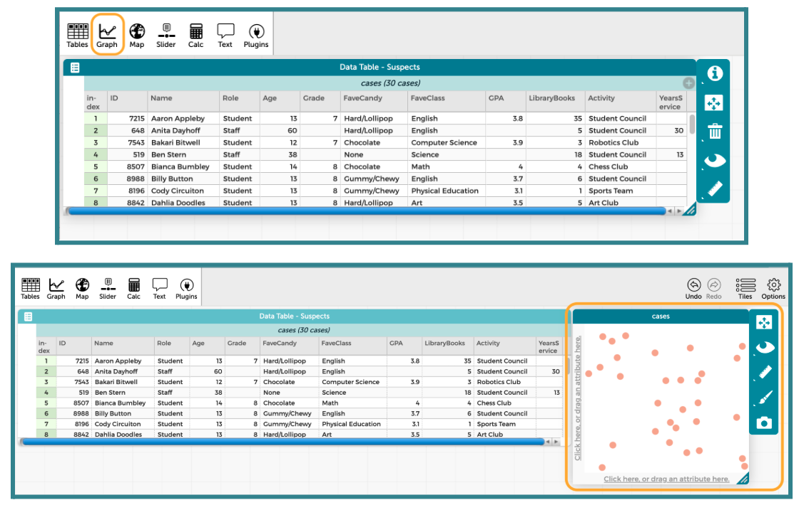
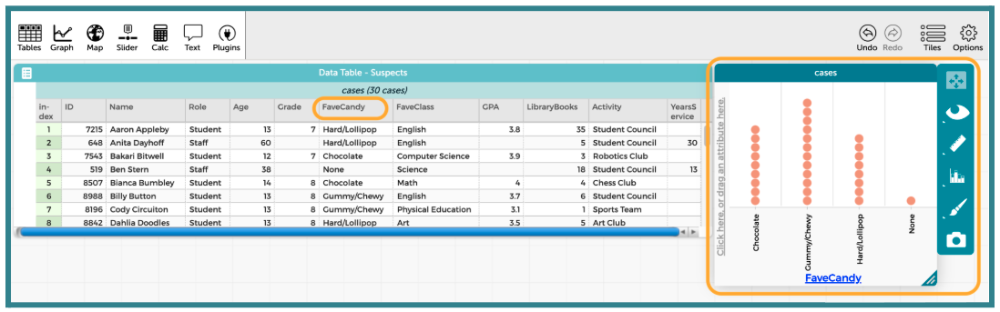
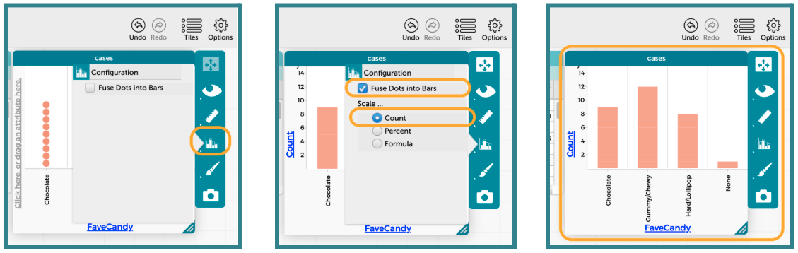
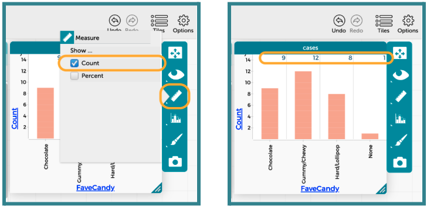
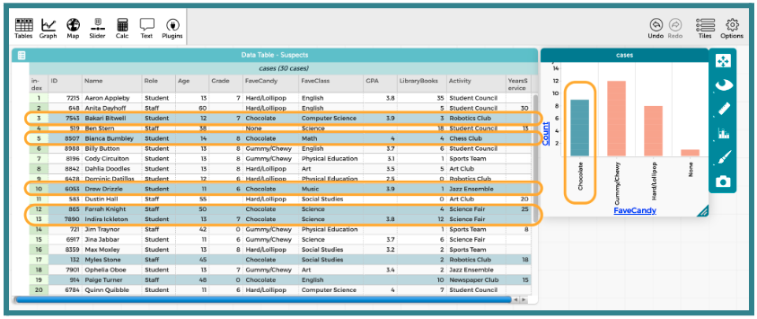

##**<u>Lesson 9: Placing Categorical Evidence Behind Bars </u>**

###**Objective:**
Students will be able to distinguish categorical data from numerical data by physically organizing themselves into groups and creating digital bar graphs in CODAP. They will use this skill to eliminate suspects based on categorical evidence.

###**Materials:**
1. Classroom corner labels

    ***Advanced preparation required.*** *See Class Setup section for additional details.*
    
2. Suspect-Candy Pairs ([LMR_U1_L09_A_Suspect_Candy_Pairs](../MSDS_Curriculum/2_MSDS_LMRs/MSDS_LMR_Unit_1/LMR_U1_L09_A.pdf))

    ***Advanced preparation required.*** *See Class Setup section for additional details.*

3. Data Cycle poster [page 4 & 5] ([LMR_U1_L01_B_The_Data_Cycle](../MSDS_Curriculum/2_MSDS_LMRs/MSDS_LMR_Unit_1/LMR_U1_L01_B.pdf))

4. Candy Culprit Clues [Clue #3] ([LMR_U1_L02_A_Candy_Culprit_Clues](../MSDS_Curriculum/2_MSDS_LMRs/MSDS_LMR_Unit_1/LMR_U1_L02_A.pdf))

5. CODAP Handout for Clue #3 ([LMR_U1_L09_B_Clue3_CODAP_Analysis](../MSDS_Curriculum/2_MSDS_LMRs/MSDS_LMR_Unit_1/LMR_U1_L09_B.pdf))

6. Candy Culprit Suspect Tracker ([LMR_U1_L05_B_Suspect_Tracker](../MSDS_Curriculum/2_MSDS_LMRs/MSDS_LMR_Unit_1/LMR_U1_L05_B.pdf))

7. Saved student CODAP files of the Suspect data OR link to the original [CODAP Suspect Data File](https://codap.concord.org/app/static/dg/en/cert/index.html#shared=https%3A%2F%2Fcfm-shared.concord.org%2FTtznsLR5Tw98ENyde2PN%2Ffile.json "https://codap.concord.org/app/static/dg/en/cert/index.html#shared=https%3A%2F%2Fcfm-shared.concord.org%2FTtznsLR5Tw98ENyde2PN%2Ffile.json"){:target="_blank"}

###**Vocabulary:**
n/a

###**Essential Concepts:**

!!! note "Essential Concepts: "
    Categorical data places individuals into groups (categories). We visualize this using bar graphs. In a bar graph, the order of the bars does not matter, and the bars have spaces between them.

###**Lesson:**

<h3>Class Setup</h3>

- ***Advanced preparation required.***

     - Prior to class starting, place labels at each corner of the classroom with the 4 categories of the Favorite Candy variable from our Suspect Data.

        &nbsp;&nbsp;&nbsp;&nbsp;&nbsp;❏  Corner 1: Chocolate 
        &nbsp;&nbsp;&nbsp;&nbsp;&nbsp;❏  Corner 2: Hard/Lollipop 
        &nbsp;&nbsp;&nbsp;&nbsp;&nbsp;❏  Corner 3: Gummy/Chewy 
        &nbsp;&nbsp;&nbsp;&nbsp;&nbsp;❏  Corner 4: None 

    - Pre-cut the strips of paper from the Suspect-Candy Pairs handout ([LMR_U1_L09_A](../MSDS_Curriculum/2_MSDS_LMRs/MSDS_LMR_Unit_1/LMR_U1_L09_A.pdf)). There are 30 strips that simplify the Suspect Data Card information into just suspect names and their favorite type of candy. Teachers are welcome to use the original Suspect Data Cards if they prefer.

        
<iframe src="https://docs.google.com/viewerng/viewer?url=https://mscurriculum.thinkdataed.org/MSDS_Curriculum/2_MSDS_LMRs/MSDS_LMR_Unit_1/LMR_U1_L09_A.pdf&embedded=true" style=" width:420px;height:400px;" frameborder="0"></iframe> [LMR_U1_L09_A](../MSDS_Curriculum/2_MSDS_LMRs/MSDS_LMR_Unit_1/LMR_U1_L09_A.pdf)

    - Hand out 1 to 2 strips of the Suspect-Candy Pairs to students as they walk in.  
    ***NOTE***: All 30 pairings need to be distributed, so if you have a small class, students may need to take multiple strips. If this is the case, ensure that they are given suspects with the same favorite type of candy.

<table class="ta" style="width:75%;margin:0 auto;">
  <tr>
    <th class="ta-88im" style="width:15%;">
</th>
    <th class="ta-88nc" style="width:65%;"><b>ADDITIONAL SUPPORT: 
    <i>Color-Coded Strips for Diverse Learners</i></b>  
    For students who need a visual cue or for English Language Learners, you can use the color-coded version of the Suspect-Candy Pairs handout (LMR_U1_L09_A, page 2).</th>
  </tr>
</table>

<h3>Opening</h3>

1. As mentioned in the Class Setup section, pass out the Suspect-Candy strips as students walk into class.

2. Once class begins, have students identify that favorite candy is a categorical variable. Then, ask them to recall what plots are typically used for categorical variables. *Answer: bar graphs and pictograms.*

3. Explain that they are going to “build” a physical bar graph using themselves to fill up the bars. Instruct students to physically move to the corner of the room that corresponds to the favorite candy type listed on their Suspect-Candy strip(s). 

4. Once students are grouped, ask them to stand in a single file line extending out from the wall. 

5. Then, ask them to look around the room and observe the “bars” for each group. 

    100. Students should determine which group is the largest (which group would have the tallest bar) and which group is the smallest (which group would have the shortest bar). *Answer: the tallest “bar” is Gummy/Chewy candy, and the shortest “bar” is None.* 

    100. Does it matter if the Chocolate group stands next to the Gummy/Chewy group, or could we swap places? *Answer: It doesn't matter because categorical data has no specific order.* 

6. Wrap up this portion of the lesson by bringing back the current Data Cycle graphic that was introduced in Lesson 8 with the Analyze Data phase shown ([LMR_U1_L01_B](../MSDS_Curriculum/2_MSDS_LMRs/MSDS_LMR_Unit_1/LMR_U1_L01_B.pdf), page 4). Have students share what typically happens during this phase. Sample answers: We create plots and summaries of data, and try to identify patterns and trends. This is the phase where we gather evidence that might be able to answer our statistical questions.

    
<iframe src="https://docs.google.com/viewerng/viewer?url=https://mscurriculum.thinkdataed.org/MSDS_Curriculum/2_MSDS_LMRs/MSDS_LMR_Unit_1/LMR_U1_L01_B.pdf&embedded=true" style=" width:420px;height:400px;" frameborder="0"></iframe> [LMR_U1_L01_B](../MSDS_Curriculum/2_MSDS_LMRs/MSDS_LMR_Unit_1/LMR_U1_L01_B.pdf)

    
<h3>Concept Development</h3>

    <b><i>Part 1: Introducing the "Interpret Data" Phase of the Data Cycle & Transitioning to CODAP</b></i>

7. Explain that once we start interpreting the graphs that we created during the Analyze Data phase and begin making conclusions that answer our statistical questions, we have officially made it to the last phase of the Data Cycle: **Interpret Data** ([LMR_U1_L01_B](../MSDS_Curriculum/2_MSDS_LMRs/MSDS_LMR_Unit_1/LMR_U1_L01_B.pdf), page 5). 

8. Reveal the completed Data Cycle poster with all phases in place.

9. Explain what typically happens during the **Interpret Data** phase of the Data Cycle.

    100. This is where data detectives answer their original statistical questions.

    100. They must use **evidence** from their analysis (the graphs as well as descriptions of shape, center, and spread) to support their answer.

    100. The goal is to tell the story of the data and communicate their findings in a report, letter, presentation, or other final product.

10. Now that our detectives have seen bar graphs on paper (during Lesson 8) and physically created them with their bodies (during the opening section of this lesson), tell students that we will be transitioning to our digital toolkit, CODAP, to see how easily it can plot categorical data.

11. Pose the following statistical question: Do staff and students have similar tastes in candy? 

    100. Starting with the Pose Questions phase of the Data Cycle, use the provided statistical question to demonstrate how to navigate through all four cycles. 

    100. Review data collection and analysis as you proceed. 

    100. Then, following the CODAP instructions below, use the analyses to interpret the data and answer the statistical question.

12. Lead students through guided instructions in CODAP to create a bar graph for the “Favorite Candy” variable.

    100. Instruct students to open their saved CODAP files of the Suspect data OR provide them with the link to the original [CODAP Suspect Data File](https://codap.concord.org/app/static/dg/en/cert/index.html#shared=https%3A%2F%2Fcfm-shared.concord.org%2FTtznsLR5Tw98ENyde2PN%2Ffile.json "https://codap.concord.org/app/static/dg/en/cert/index.html#shared=https%3A%2F%2Fcfm-shared.concord.org%2FTtznsLR5Tw98ENyde2PN%2Ffile.json"){:target="_blank"}.

    100. Next, click on the “Graph” icon in the top left menu. It will automatically add a graph window into the CODAP workspace.

        

    100. Then tell students to click and drag the column label for “FaveCandy” into the x-axis of the plot. It should highlight yellow when they have it in the correct spot.

        

    100. We want to change the plot to resemble more of what we think a bar graph should look like. To do this, click on the Bar Graph icon on the right side of the graph window. Then, select the option to “Fuse Data Into Bars” and “Scale” the bars by “Count.” The progression is shown below.

        

    100. Explain that we can also display the exact counts or percents of each of the bars by changing the settings under the Ruler icon.

        

    100. Lastly, show that we can identify specific cases in the dataset by clicking the bar that we’re interested in. CODAP will change the color of the bar to teal and also highlight every case that falls within that bar.

        

    <b><i>Part 2: Using CODAP to Examine New Categorical Evidence</b></i>

13. Introduce the THIRD CLUE of the Candy Culprit investigation. All of the clues can be found in the Candy Culprit Clues document ([LMR_U1_L02_A](../MSDS_Curriculum/2_MSDS_LMRs/MSDS_LMR_Unit_1/LMR_U1_L02_A.pdf)).

    
<iframe src="https://docs.google.com/viewerng/viewer?url=https://mscurriculum.thinkdataed.org/MSDS_Curriculum/2_MSDS_LMRs/MSDS_LMR_Unit_1/LMR_U1_L02_A.pdf&embedded=true" style=" width:420px;height:400px;" frameborder="0"></iframe> [LMR_U1_L02_A](../MSDS_Curriculum/2_MSDS_LMRs/MSDS_LMR_Unit_1/LMR_U1_L02_A.pdf)

14. Have one student read out the newest clue, and then ask:

    100. Which variable in the Candy Culprit dataset should we analyze in order to use Clue #3? *Answer: “Activity”.* 

    100. What specific outcome of that variable should we look for? *Answer: “Art Club”.*

15. Distribute the Clue 3 CODAP Analysis handout ([LMR_U1_L09_B](../MSDS_Curriculum/2_MSDS_LMRs/MSDS_LMR_Unit_1/LMR_U1_L09_B.pdf)) and instruct students to complete each step to determine which suspects they can eliminate from our list.

    
<iframe src="https://docs.google.com/viewerng/viewer?url=https://mscurriculum.thinkdataed.org/MSDS_Curriculum/2_MSDS_LMRs/MSDS_LMR_Unit_1/LMR_U1_L09_B.pdf&embedded=true" style=" width:420px;height:400px;" frameborder="0"></iframe> [LMR_U1_L09_B](../MSDS_Curriculum/2_MSDS_LMRs/MSDS_LMR_Unit_1/LMR_U1_L09_B.pdf)

    
    <table class="ta" style="width:75%;margin:0 auto;">
    <tr>
    <th class="ta-88im" style="width:15%;">
    </th>
    <th class="ta-88nc" style="width:65%;"><b>ADDITIONAL SUPPORT: 
    <i>Partner Support for Diverse Learners</i></b>  
    Have students work in pairs. One student can be the “driver” (controlling the mouse) and the other can be the “navigator” (reading the steps). They can switch roles halfway through.</th>
    </tr>
    </table>

16. Circulate around the room to provide guidance and support as students work in CODAP. 

17. Once all students have completed their analysis, engage in a whole class discussion about the results.

    100. Which variable did you choose to analyze? *Answer: “Activity” or “Extracurricular Activity”.* 

    100. What type of variable is “Activity”? *Answer: Categorical.*

    100. What is an appropriate plot for that type of variable? *Answer: Bar graph or pictogram, but CODAP allows us to create a bar graph.*

    100. How many suspects identified “Art Club” as their “Activity”? *Answer: 3 suspects.*

    100. Who are the suspects in the Art Club? *Answer: Dahlia Doodles, Dustin Hall, and Yvonne Yodel. We can eliminate them as suspects! We know that these suspects are definitely NOT the Candy Culprit.*

18. Have students take out their Candy Culprit Suspect Tracker ([LMR_U1_L05_B](../MSDS_Curriculum/2_MSDS_LMRs/MSDS_LMR_Unit_1/LMR_U1_L05_B.pdf)) sheet so they can cross off the eliminated suspects. An example of the updated suspect tracker is provided below. 

    
<iframe src="https://docs.google.com/viewerng/viewer?url=https://mscurriculum.thinkdataed.org/MSDS_Curriculum/2_MSDS_LMRs/MSDS_LMR_Unit_1/LMR_U1_L05_B.pdf&embedded=true" style=" width:420px;height:400px;" frameborder="0"></iframe> [LMR_U1_L05_B](../MSDS_Curriculum/2_MSDS_LMRs/MSDS_LMR_Unit_1/LMR_U1_L05_B.pdf)

    
<h3>Closing</h3>

19. Revisit the idea of ordering with categorical plots: 

    100. Project your computer screen and display the CODAP bar graph for the “Activity” variable. 

    100. Ask students how CODAP ordered the bars for this variable automatically. *Answer: CODAP placed the bars in alphabetical order (A → Z) from left to right.*

    100. Drag the “Sports Team” bar to the left of the "Art Club" bar by clicking and holding the x-axis label. Then, ask students if this movement changes the underlying data; in other words, did it change the facts of the case?

20. Discussion: Guide them to the realization that for Categorical Data, the order does not matter. The “Art Club” bar is still 3 units tall regardless of where it is placed.

21. Exit Ticket: Students should answer the following 2 questions and turn in their responses on a small sheet of paper. 

    100. Why did we choose a Bar Graph instead of a Dot Plot to analyze the “Activity” variable? *Sample answer: Because “Activity” is a category (words), not a number. You can't put “Art Club” on a number line.*

    100. If a new suspect joined the “Robotics Club,” how would your bar graph change? *Sample answer: The bar for Robotics would get taller by one.*

22. Transition: Congratulate the data detectives for mastering plots of categorical variables. We will expand our knowledge using numerical variables during our next lesson. 

