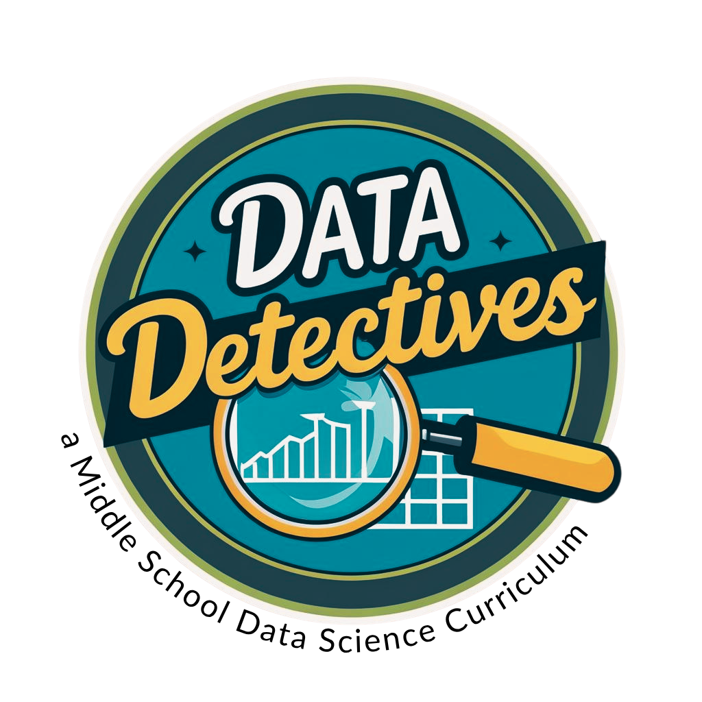

#Unit 1: Table of Contents

<table class="tg">
  <tr>
    <th class="tg-7klg" colspan="6"></th>
  </tr>
  <tr>
    <th class="tg-7klg" colspan="6">Unit 1: Table of Contents</th>
  </tr>
  <tr>
    <td class="tg-km2t" colspan="3">Content</td>
    <td class="tg-km2t"></td>
    <td class="tg-km2t"></td>
    <td class="tg-aw21">Page</td>
  </tr>
  <tr>
    <td class="tg-km2t" colspan="3"><a href="../unit1/overview">Table of Contents</a></td>
    <td class="tg-km2t"></td>
    <td class="tg-km2t"></td>
    <td class="tg-aw21"><a href="../unit1/overview">2</a></td>
  </tr>
  <tr>
    <td class="tg-zv4m"></td>
    <td class="tg-zv4m" colspan="2">Section 1: <a href="../unit1/section1">Setting the Scene</a></td>
    <td class="tg-zv4m"></td>
    <td class="tg-zv4m"></td>
    <td class="tg-aw21"><a href="../unit1/section1">3</a></td>
  </tr>
  <tr>
    <td class="tg-zv4m"></td>
    <td class="tg-zv4m"></td>
    <td class="tg-zv4m">Lesson 1: <a href="../unit1/lesson1">Meet the DSU Squad (DSU = Data Science Unit)</a></td>
    <td class="tg-zv4m"></td>
    <td class="tg-zv4m"></td>
    <td class="tg-8jgo"><a href="../unit1/lesson1">4</a></td>
  </tr>
  <tr>
    <td class="tg-zv4m"></td>
    <td class="tg-zv4m"></td>
    <td class="tg-zv4m">Lesson 2: <a href="../unit1/lesson2">Reconstructing the Scene</a></td>
    <td class="tg-zv4m"></td>
    <td class="tg-zv4m"></td>
    <td class="tg-8jgo"><a href="../unit1/lesson2">10</a></td>
  </tr>
  <tr>
    <td class="tg-zv4m"></td>
    <td class="tg-zv4m"></td>
    <td class="tg-zv4m">Lesson 3: <a href="../unit1/lesson3">Compiling the Suspect Dossiers</a></td>
    <td class="tg-zv4m"></td>
    <td class="tg-zv4m"></td>
    <td class="tg-8jgo"><a href="../unit1/lesson3">18</a></td>
  </tr>
  <tr>
    <td class="tg-zv4m"></td>
    <td class="tg-zv4m"></td>
    <td class="tg-zv4m">Lesson 4: <a href="../unit1/lesson4">Acquiring &amp; Organizing Additional Evidence</a></td>
    <td class="tg-zv4m"></td>
    <td class="tg-zv4m"></td>
    <td class="tg-8jgo"><a href="../unit1/lesson4">28</a></td>
  </tr>
  <tr>
    <td class="tg-zv4m"></td>
    <td class="tg-zv4m"></td>
    <td class="tg-zv4m">Lesson 5: <a href="../unit1/lesson5">Structuring the Evidence</a></td>
    <td class="tg-zv4m"></td>
    <td class="tg-zv4m"></td>
    <td class="tg-8jgo"><a href="../unit1/lesson5">32</a></td>
  </tr>
  <tr>
    <td class="tg-zv4m"></td>
    <td class="tg-zv4m"></td>
    <td class="tg-zv4m">Lesson 6: <a href="../unit1/lesson6">Our Detective Toolkit - CODAP</a></td>
    <td class="tg-zv4m"></td>
    <td class="tg-zv4m"></td>
    <td class="tg-8jgo"><a href="../unit1/lesson6">40</a></td>
  </tr>
  <tr>
    <td class="tg-zv4m"></td>
    <td class="tg-zv4m"></td>
    <td class="tg-zv4m">Lesson 7: <a href="../unit1/lesson7">What's in a Question?</a></td>
    <td class="tg-zv4m"></td>
    <td class="tg-zv4m"></td>
    <td class="tg-8jgo"><a href="../unit1/lesson7">50</a></td>
  </tr>
    <tr>
    <td class="tg-zv4m"></td>
    <td class="tg-zv4m"></td>
    <td class="tg-zv4m">Progress Check 1: <a href="../unit1/progresscheck1">Can You Read Evidence?</a></td>
    <td class="tg-zv4m"></td>
    <td class="tg-zv4m"></td>
    <td class="tg-8jgo"><a href="../unit1/progresscheck1">57</a></td>
  </tr>
  <tr>
    <td class="tg-zv4m"></td>
    <td class="tg-zv4m" colspan="2">Section 2: <a href="../unit1/section2">Plotting the Clues</a></td>
    <td class="tg-zv4m"></td>
    <td class="tg-zv4m"></td>
    <td class="tg-aw21"><a href="../unit1/section2">59</a></td>
  </tr>
  <tr>
    <td class="tg-zv4m"></td>
    <td class="tg-zv4m"></td>
    <td class="tg-zv4m">Lesson 8: <a href="../unit1/lesson8">Spot the Plot</a></td>
    <td class="tg-zv4m"></td>
    <td class="tg-zv4m"></td>
    <td class="tg-8jgo"><a href="../unit1/lesson8">60</a></td>
  </tr>
  <tr>
    <td class="tg-zv4m"></td>
    <td class="tg-zv4m"></td>
    <td class="tg-zv4m">Lesson 9: <a href="../unit1/lesson9">Placing Categorical Evidence Behind Bars</a></td>
    <td class="tg-zv4m"></td>
    <td class="tg-zv4m"></td>
    <td class="tg-8jgo"><a href="../unit1/lesson9">66</a></td>
  </tr>
  <tr>
    <td class="tg-zv4m"></td>
    <td class="tg-zv4m"></td>
    <td class="tg-zv4m">Lesson 10: <a href="../unit1/lesson10">Connecting the Dots</a></td>
    <td class="tg-zv4m"></td>
    <td class="tg-zv4m"></td>
    <td class="tg-8jgo"><a href="../unit1/lesson10">74</a></td>
  </tr>
  <tr>
    <td class="tg-zv4m"></td>
    <td class="tg-zv4m"></td>
    <td class="tg-zv4m">Lesson 11: <a href="../unit1/lesson11">The Plot Thickens</a></td>
    <td class="tg-zv4m"></td>
    <td class="tg-zv4m"></td>
    <td class="tg-8jgo"><a href="../unit1/lesson11">80</a></td>
  </tr>
  <tr>
    <td class="tg-zv4m"></td>
    <td class="tg-zv4m"></td>
    <td class="tg-zv4m">Lesson 12: <a href="../unit1/lesson12">The Shape of Data</a></td>
    <td class="tg-zv4m"></td>
    <td class="tg-zv4m"></td>
    <td class="tg-8jgo"><a href="../unit1/lesson12">89</a></td>
  </tr>
  <tr>
    <td class="tg-zv4m"></td>
    <td class="tg-zv4m"></td>
    <td class="tg-zv4m">Progress Check 2: <a href="../unit1/progresscheck2">Can You Analyze Evidence?</a></td>
    <td class="tg-zv4m"></td>
    <td class="tg-zv4m"></td>
    <td class="tg-8jgo"><a href="../unit1/progresscheck2">98</a></td>
  </tr>

  <tr>
    <td class="tg-zv4m"></td>
    <td class="tg-zv4m" colspan="2">Section 3: <a href="../unit1/section3">Wrapping Up the Case</a></td>
    <td class="tg-zv4m"></td>
    <td class="tg-zv4m"></td>
    <td class="tg-aw21"><a href="../unit1/section3">102</a></td>
  </tr>
  <tr>
    <td class="tg-zv4m"></td>
    <td class="tg-zv4m"></td>
    <td class="tg-zv4m">Lesson 13: <a href="../unit1/lesson13">The Average Suspect</a></td>
    <td class="tg-zv4m"></td>
    <td class="tg-zv4m"></td>
    <td class="tg-8jgo"><a href="../unit1/lesson13">103</a></td>
  </tr>
  <tr>
    <td class="tg-zv4m"></td>
    <td class="tg-zv4m"></td>
    <td class="tg-zv4m">Lesson 14: <a href="../unit1/lesson14">Getting MAD About It</a></td>
    <td class="tg-zv4m"></td>
    <td class="tg-zv4m"></td>
    <td class="tg-8jgo"><a href="../unit1/lesson14">113</a></td>
  </tr>
  <tr>
    <td class="tg-zv4m"></td>
    <td class="tg-zv4m"></td>
    <td class="tg-zv4m">Lesson 15: <a href="../unit1/lesson15">When the Mean is Unfair - Introducing the Median</a></td>
    <td class="tg-zv4m"></td>
    <td class="tg-zv4m"></td>
    <td class="tg-8jgo"><a href="../unit1/lesson15">124</a></td>
  </tr>
  <tr>
    <td class="tg-zv4m"></td>
    <td class="tg-zv4m"></td>
    <td class="tg-zv4m">Lesson 16: <a href="../unit1/lesson16">Boxing Up the Evidence</a></td>
    <td class="tg-zv4m"></td>
    <td class="tg-zv4m"></td>
    <td class="tg-8jgo"><a href="../unit1/lesson16">130</a></td>
  </tr>
  <tr>
    <td class="tg-zv4m"></td>
    <td class="tg-zv4m"></td>
    <td class="tg-zv4m">Lesson 17: <a href="../unit1/lesson17">Choosing the Right Tools for Center and Spread</a></td>
    <td class="tg-zv4m"></td>
    <td class="tg-zv4m"></td>
    <td class="tg-8jgo"><a href="../unit1/lesson17">141</a></td>
  </tr>
  <tr>
    <td class="tg-zv4m"></td>
    <td class="tg-zv4m"></td>
    <td class="tg-zv4m">Lesson 17: <a href="../unit1/lesson18">Wrapping Up the Case of the Candy Culprit</a></td>
    <td class="tg-zv4m"></td>
    <td class="tg-zv4m"></td>
    <td class="tg-8jgo"><a href="../unit1/lesson18">149</a></td>
  </tr>
  <tr>
    <td class="tg-zv4m"></td>
    <td class="tg-zv4m"></td>
    <td class="tg-zv4m">Progress Check 3: <a href="../unit1/progresscheck3">Can You Interpret Evidence?</a></td>
    <td class="tg-zv4m"></td>
    <td class="tg-zv4m"></td>
    <td class="tg-8jgo"><a href="../unit1/progresscheck3">151</a></td>
  </tr>
  <tr>
    <td class="tg-zv4m"></td>
    <td class="tg-zv4m"></td>
    <td class="tg-zv4m">Additional Assessment: <a href="../unit1/assess1">Your Turn, Detective! A Full Data Cycle Investigation</a></td>
    <td class="tg-zv4m"></td>
    <td class="tg-zv4m"></td>
    <td class="tg-8jgo"><a href="../unit1/assess1">155</a></td>
  </tr>
  <tr>
    <td class="tg-km2t" colspan="3">Unit 1 Final Mission: <a href="../unit1/end">The Data Detective's Case Report</a></td>
    <td class="tg-zv4m"></td>
    <td class="tg-zv4m"></td>
    <td class="tg-aw21"><a href="../unit1/end">159</a></td>
  </tr>
  <tr>
    <td class="tg-km2t" colspan="3"><a href="../unit1/references">References</a></td>
    <td class="tg-zv4m"></td>
    <td class="tg-zv4m"></td>
    <td class="tg-8jgo"><a href="../unit1/references">160</a></td>
  </tr>
  <tr>
    <td class="tg-km2t" colspan="3"><a href="../unit1/strategies">Instructional Strategies</a></td>
    <td class="tg-zv4m"></td>
    <td class="tg-zv4m"></td>
    <td class="tg-8jgo"><a href="../unit1/strategies">161</a></td>
  </tr>

</table>
